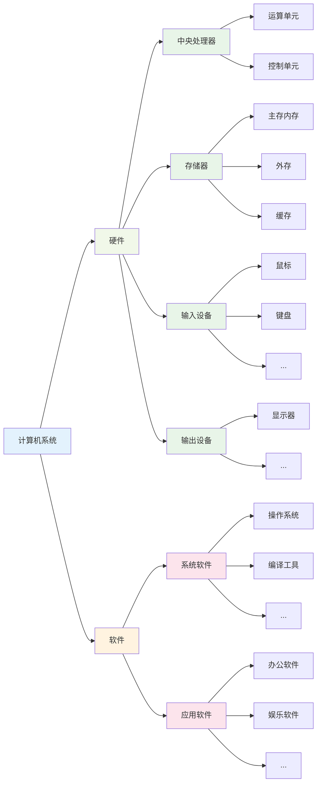
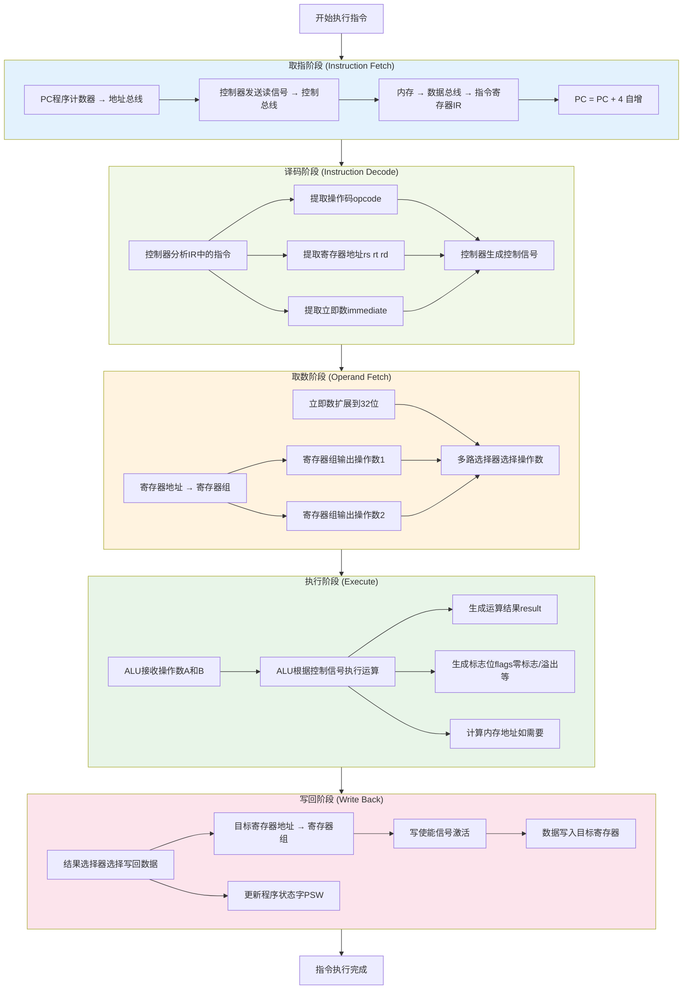
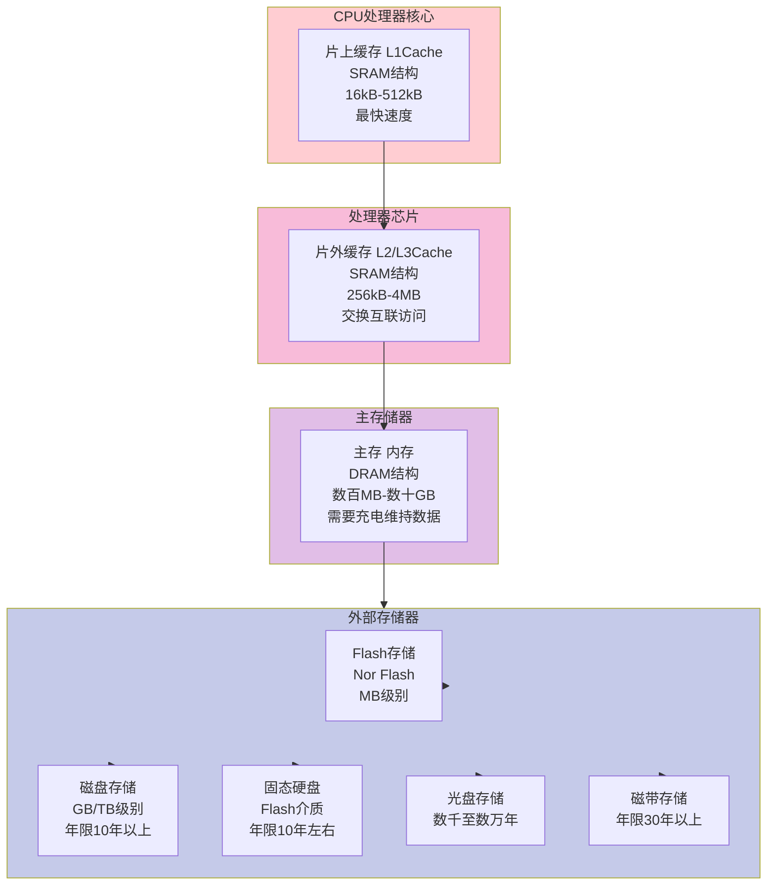

# 第二章 计算机系统基础知识

## 2.1 计算机系统概述

## 2.2 计算机硬件

### 2.2.1 计算机硬件组成

- 处理器（运算器和控制器）
- 存储器
- 接口
- 外部设备
- 总线

### 2.2.2 处理器

处理器指令集：精简指令集计算机（RISC）、复杂指令集计算机（CISC）

一个指令执行的流程：

常见处理器：
- 图形处理器（GPU：深度学习、图像处理）
- 中央处理器（CPU：通用计算）
- 数字信号处理器（DSP：音频处理）
- 专用集成电路（ASIC：特定应用）
- 现场可编程门阵列（FPGA：可编程逻辑）

### 2.2.3 存储器

定义：利用半导体、磁、光等介质用于存储的电子设备

存储器分类（按照距离CPU的物理距离）

### 2.2.3 总线

```mermaid
graph TD
    subgraph BusSystem ["总线系统 Bus System"]
        Bus["总线 Bus<br/>计算机部件间遵循特定协议<br/>实现数据交换的形式"]
    end
    
    Bus --> Internal["内总线<br/>芯片内部互连"]
    Bus --> System["系统总线<br/>CPU、主存、I/O接口"]
    Bus --> External["外部总线/通信总线<br/>计算机与外部设备间"]
    
    subgraph InternalBus ["内总线分类"]
        Internal --> OnChip["片上总线<br/>On-Chip Bus"]
        Internal --> IntraChip["片内总线<br/>芯片内部连接"]
    end
    
    subgraph SystemBus ["系统总线分类"]
        System --> NarrowSys["狭义系统总线<br/>CPU与主存、通信桥连接"]
        System --> BroadSys["广义系统总线<br/>系统内经总线级联"]
        BroadSys --> LocalBus["局部总线<br/>Local Bus"]
    end
    
    subgraph ExternalBus ["外部总线分类"]
        External --> Parallel["并行总线"]
        External --> Serial["串行总线"]
        External --> Professional["专业领域总线"]
        External --> Industrial["工业控制总线"]
    end
    
    subgraph ParallelTypes ["并行总线类型"]
        Parallel --> PCI1["PCI总线"]
        Parallel --> PCIe1["PCIe总线"]
        Parallel --> ATA1["ATA/IDE总线"]
    end
    
    subgraph SerialTypes ["串行总线类型"]
        Serial --> USB1["USB总线"]
        Serial --> SATA1["SATA总线"]
        Serial --> CAN1["CAN总线"]
        Serial --> RS232["RS-232总线"]
        Serial --> RS485["RS-485总线"]
        Serial --> RapidIO1["RapidIO总线"]
        Serial --> Ethernet1["以太网"]
    end
    
    subgraph ProfessionalTypes ["专业领域总线"]
        Professional --> ARINC429["ARINC429<br/>航空领域"]
        Professional --> ARINC659["ARINC659<br/>航空领域"]
        Professional --> ARINC664["ARINC664<br/>航空领域"]
        Professional --> MILSTD["MIL-STD-1553B<br/>军用标准"]
    end
    
    subgraph IndustrialTypes ["工业控制总线"]
        Industrial --> CAN2["CAN总线"]
        Industrial --> IEEE1394["IEEE1394总线"]
        Industrial --> PCI2["PCI总线"]
        Industrial --> PCIe2["PCIe总线"]
        Industrial --> VMI["VMI总线"]
    end
    
    subgraph Connection ["总线连接方式"]
        Bridge["桥 Bridge<br/>特殊外设<br/>实现总线协议转换"]
        Performance["总线性能指标<br/>• 总线带宽<br/>• 服务质量QoS<br/>• 总线时延<br/>• 总线时钟"]
    end
    
    System -.-> Bridge
    External -.-> Bridge
    Bridge -.-> Performance
    
    style BusSystem fill:#e3f2fd
    style InternalBus fill:#f1f8e9
    style SystemBus fill:#fff3e0
    style ExternalBus fill:#fce4ec
    style Connection fill:#e8f5e8
```

### 2.2.4 接口

接口是指同一计算机不同功能层之间的通信规则。

显示类接口：HDMI、DVI
音频输入输出接口：TRS、RCA、XLR

### 2.2.5 外部设备

## 2.3 计算机软件

### 2.3.1 计算机软件概述

软件系统是指在计算机硬件系统上运行的程序、相关的文档资料和数据的集合。

计算机软件分为系统软件和应用软件两大类

系统软件是为整个计算机系统配置的不依赖特定应用领域的**通用软件**。

应用软件是指为某类应用需要或解决某个特定问题而设计的软件，

### 2.3.2 操作系统

1. 操作系统的组成

```mermaid
graph TD
    subgraph OS ["操作系统 Operating System"]
        Kernel["操作系统内核<br/>Kernel<br/>最基本部分"]
        Software["配套软件<br/>Supporting Software"]
    end
    
    subgraph KernelFunc ["内核核心功能"]
        ProcessMgmt["进程管理<br/>任务管理"]
        MemoryMgmt["存储管理<br/>内存分配"]
        FileMgmt["文件管理<br/>文件系统"]
        DeviceMgmt["设备管理<br/>硬件抽象"]
    end
    
    subgraph KernelFeatures ["内核特性"]
        HighPrivilege["最高优先级运行<br/>CPU特权级"]
        DirectAccess["直接访问外设<br/>全部主存空间"]
        SystemCall["系统调用接口<br/>API接口"]
        ResourceMgmt["系统资源<br/>管理和分配"]
    end
    
    subgraph SupportingSW ["配套软件分类"]
        GUI["图形用户界面程序<br/>GUI Programs"]
        CommonApps["常用应用程序"]
        Utilities["实用程序"]
        DevTools["开发运行工具"]
    end
    
    subgraph CommonAppsDetail ["常用应用程序"]
        Calendar["日历"]
        Calculator["计算器"]
        FileManager["资源管理器"]
        Browser["网络浏览器"]
    end
    
    subgraph UtilitiesDetail ["实用程序"]
        TaskManager["任务管理器"]
        DiskCleanup["磁盘清理程序"]
        Antivirus["杀毒软件"]
        Firewall["防火墙"]
    end
    
    subgraph DevToolsDetail ["开发运行工具"]
        Framework["应用框架"]
        Compiler["编译器"]
        Libraries["程序库"]
    end
    
    subgraph Hardware ["计算机硬件"]
        HW["硬件设备<br/>Hardware Devices"]
    end
    
    subgraph Applications ["应用程序"]
        Apps["用户应用程序<br/>User Applications"]
    end
    
    Kernel --> ProcessMgmt
    Kernel --> MemoryMgmt
    Kernel --> FileMgmt
    Kernel --> DeviceMgmt
    
    Kernel --> HighPrivilege
    Kernel --> DirectAccess
    Kernel --> SystemCall
    Kernel --> ResourceMgmt
    
    Software --> GUI
    Software --> CommonApps
    Software --> Utilities
    Software --> DevTools
    
    CommonApps --> Calendar
    CommonApps --> Calculator
    CommonApps --> FileManager
    CommonApps --> Browser
    
    Utilities --> TaskManager
    Utilities --> DiskCleanup
    Utilities --> Antivirus
    Utilities --> Firewall
    
    DevTools --> Framework
    DevTools --> Compiler
    DevTools --> Libraries
    
    Kernel -.->|"硬件抽象<br/>驱动服务"| Hardware
    Apps -.->|"系统调用<br/>API接口"| Kernel
    
    style OS fill:#e3f2fd
    style KernelFunc fill:#ffcdd2
    style KernelFeatures fill:#f8bbd9
    style SupportingSW fill:#c8e6c9
    style Hardware fill:#fff3e0
    style Applications fill:#e1bee7
```

2. 操作系统的作用

3. 操作系统的特征

4. 操作系统的分类

### 2.3.3 数据库

数据库 (DataBase,DB) 是指长期存储在计算机内、有组织的、统一管理的相关数据的集合。

1. 关系数据库

关系可以理解为二维表。一个关系模型就是指用若干关系表示**实体**及其**联系**，用二维表的形式存储数据。

2. 分布式数据库

3. 常用数据库管理系统

