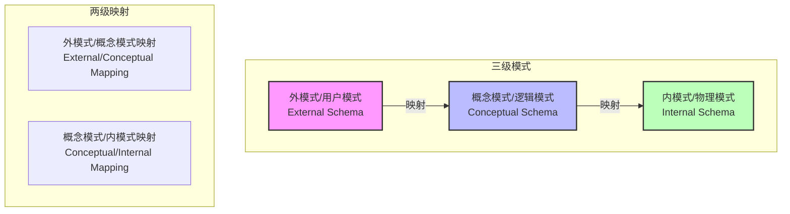
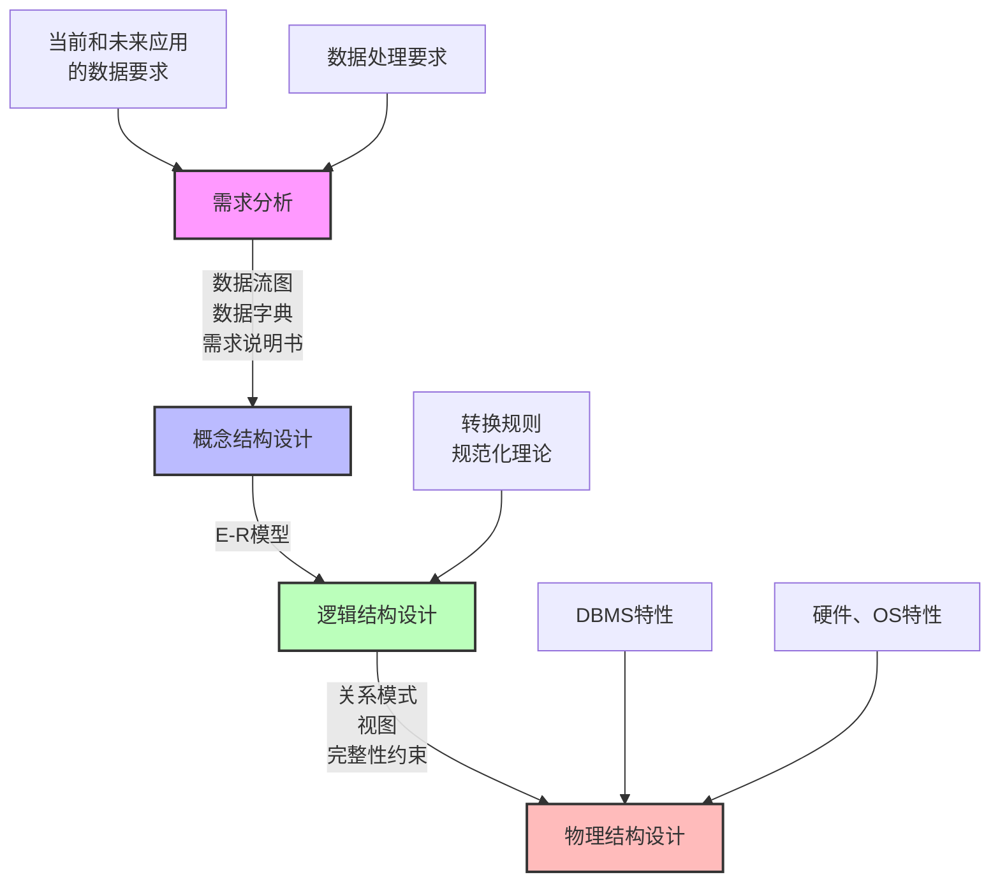
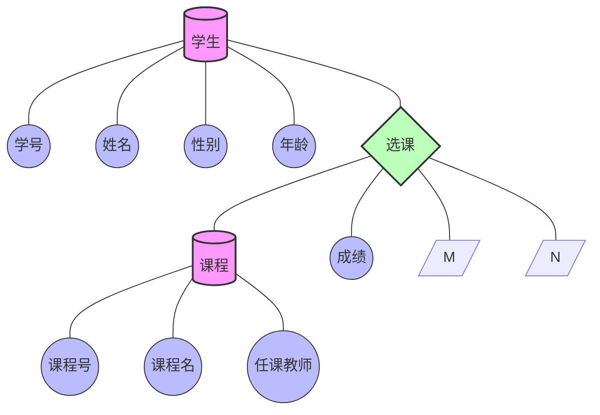

# 数据库

## 数据库三级模式两级映射

**三级模式解释**

1. 外模式（External Schema）/ 用户模式
- 也称为子模式或用户视图
- 描述数据库中局部数据的逻辑结构
- 是用户能看见和使用的局部数据的逻辑结构描述
- 一个数据库可以有多个外模式，一个应用程序只能使用一个外模式

2. 概念模式（Conceptual Schema）/ 逻辑模式

- 数据库中全体数据的逻辑结构和特征的描述
- 是所有用户的公共数据视图
- 与具体的存储设备和存取方法无关
- 一个数据库只有一个概念模式

3. 内模式（Internal Schema）/ 物理模式

- 数据物理结构和存储方式的描述
- 描述数据在存储设备上的存储方式和存取方法
- 一个数据库只有一个内模式

 **两级映射解释**

1. 外模式/概念模式映射

- 定义外模式与概念模式之间的对应关系
- 保证数据的逻辑独立性
- 当概念模式改变时，通过修改映射关系可以保持外模式不变

2. 概念模式/内模式映射

- 定义概念模式与内模式之间的对应关系
- 保证数据的物理独立性
- 当内模式改变时，通过修改映射关系可以保持概念模式不变

## 数据库的设计过程

## E-R模型

实体型转为关系模式？

1. 实体转表：每个实体转为独立表，主键保留。

2. 处理联系：按联系类型（1:1、1:N、M:N）合并或新建表。
> 1:1 合并
> 1:N 在1中添加N的属性
> M:N 新建表

3. 处理弱实体：添加依赖实体的主键作为外键。

4. 处理特殊属性：拆分复合属性，多值属性单独建表。

5. 优化冗余：合并可能冗余的表（如1:1联系）。

## 关系代数

并、交、差、笛卡尔积、投影、选择、联接

笛卡尔积：将两个关系（表）中的每个元组（行）与另一个关系的所有元组无条件组合，生成包含所有可能行排列的新关系。
（例如：若表A有m行，表B有n行，笛卡尔积结果为m×n行，列数为两表列数之和。）

投影：选列，保留所需字段；

选择：选行，按条件过滤数据；

联接：组合表，关联匹配的行。

**计算 R ⋈ S (自然连接) 的结果集**

自然连接 (Natural Join) 的操作步骤如下：

- 找出 R 和 S 中相同的属性名。在这个例子中，R 有属性 A1, A2, A3，S 有属性 A1, A2, A4。相同的属性是 A1 和 A2。
- 找出在这些共同属性 (A1, A2) 上取值都相同的元组。
- 将这些元组进行合并，合并时共同属性只保留一份，并加上各自关系中独有的属性。

**计算左外连：** 左外连接的元组总数 = 2 (来自自然连接) + 2 (来自R未匹配) = 4 个。

**计算右外连：** 右外连接的元组总数 = 2 (来自自然连接) + 2 (来自S未匹配) = 4 个。

**计算完全外连接：** |自然连接的元组| + |R中独有的元组| + |S中独有的元组| = 2 + 2 + 2 = 6

## 规范化理论- 函数依赖

函数依赖：

传递依赖：

## 规范化理论 - 模式分解

保持函数依赖分解

无损分解

表格法（行属性、列模式）、一分为二

## 规范化理论 - 价值与用途

## 规范化理论 - 键（求解候选键）

求解候选键：先找入度为0的节点，进行遍历

超键：包含候选键的任意集合

候选键：最小的超键

主键：任选一个候选键作为主键

外键：其他关系的主键

## 反规范化技术

问题：由于规范化技术不断的拆分，从而导致数据表过多。这样子虽然减少了数据冗余，提高了增、删、改、查的效率，但是会增加查询的工作量。系统需要进行多次连接，才能进行查询操作，使得系统效率大大降低。

解决方案：

1. 增加冗余列：在某些列上增加冗余列，从而减少连接次数
2. 增加派生列：在某些列上增加派生列，从而减少连接次数
3. 数据分片：将数据分成若干片，从而减少连接次数

## 数据库并发控制

事务：原子性、一致性、隔离性、持久性

并发存在问题：丢失更新、读脏数据、不可重复读

封锁协议：

一级封锁协议：事务T在修改数据R之前必须先对其加X锁，直到事务结束才释放。可防治丢失更新

二级封锁协议：在一级的基础上，要求读取数据R之前必须先对其加S锁，读完后释放S锁。可防治读脏数据

三级封锁协议：在二级的基础上，要求事务T在读取数据R之前必须先对其加S锁，直到事务结束才释放。可防治不可重复读

## 数据库完整性约束

实体完整性：主键不能为空

参照完整性：外键必须取值为被参照实体的主键值

用户定义完整性：根据业务规则设定

触发器：在特定事件发生时自动执行的程序

## 数据备份

冷备份（静态备份）：数据库关闭时进行备份

热备份（动态备份）：数据库运行时进行备份

完全备份：备份所有数据

差量备份：只备份自**上次完全备份**以来变化的数据

增量备份：只备份自**上次备份**以来变化的数据

转储：

静态转储：静态转储是数据库运行期间，数据库处于关闭状态，将数据库的结构和数据全部备份到磁盘上。

静态增量转储：静态增量转储是数据库运行期间，数据库处于关闭状态，将数据库的结构和数据实时备份到磁盘上。

动态转储：动态转储是数据库运行期间，数据库处于打开状态，将数据库的结构和数据实时备份到磁盘上。

动态增量转储：动态增量转储是数据库运行期间，数据库处于打开状态，将数据库的结构和数据实时备份到磁盘上。

日志文件：事务日志是针对数据库所做的任何修改操作记录，它可以记录对数据库的任何操作，并将其保存在独立的文件中。

## 数据库恢复

事务本身的可预期故障：

- 事务故障：事务在运行过程中由于故障而未能正确执行，导致数据不一致
- 系统故障：系统在运行过程中由于故障而未能正确执行，导致数据不一致
- 介质故障：介质故障是指存储介质（如磁盘、磁带）损坏，导致数据丢失

解决方案：

- 事务故障：在程序中预先设置Rollback语句，在事务失败时执行Rollback语句，回滚到事务开始前的状态
- 系统故障：在程序中预先设置Checkpoint，在系统故障时，执行Checkpoint，将数据库恢复到最近一次Checkpoint的状态
- 介质故障：在程序中预先设置Redo和Undo操作，在介质故障时，执行Redo和Undo操作，将数据库恢复到介质故障前的状态

## 数据仓库与数据挖掘

数据仓库：

- 数据仓库是面向主题的、集成的、不可更新的、随时间变化的数据集合

数据挖掘：

- 数据挖掘是从大量数据中通过算法提取出有价值的信息的过程

常见方法：决策树、神经网络、关联规则、聚类分析、遗传算法

常见分类：

- 关联分析：发现数据之间的关联关系
- 序列模式：发现数据之间的序列关系（前后关系）
- 分类：根据已知样本的某些特征，判断一个新的样本属于哪种已知的样本类
- 聚类：将数据分成若干类，使得类内数据相似度最大，类间数据相似度最小
- 预测：根据已知样本的某些特征，预测新的样本的值

## 数据库安全

安全措施：

- 用户标识和鉴定：最外层的安全保护措施
- 存取控制：对用户进行授权，包括操作类型和数据对象的权限
- 密码的存储和传输：对远程终端信息用密码传输
- 视图机制：对不同的用户定义不同的视图，从而对不同用户隐藏实际数据
- 审计：对用户操作进行记录和监控
- 数据加密：对敏感数据进行加密存储和传输

## 大数据

数据量（Volume）：数据量是指数据的大小，通常以字节（Byte）为单位。

多样性（Variety）：数据种类是指数据的类型，通常有结构化数据和非结构化数据。

数据速度（Velocity）：数据速度是指数据的增长速度，通常以每秒多少条记录为单位。

价值密度（Value）：价值密度是指数据的价值，通常以每条记录的价值为单位。
