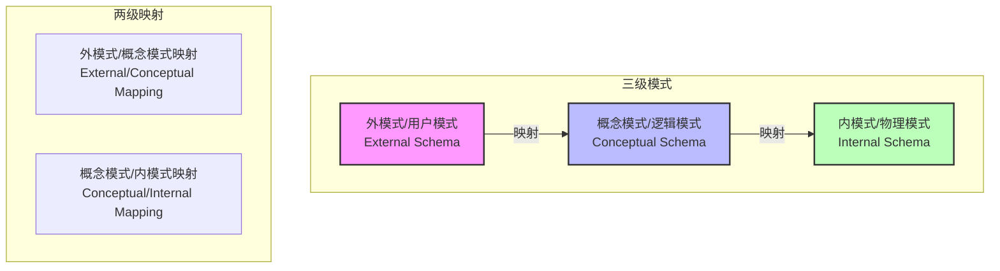
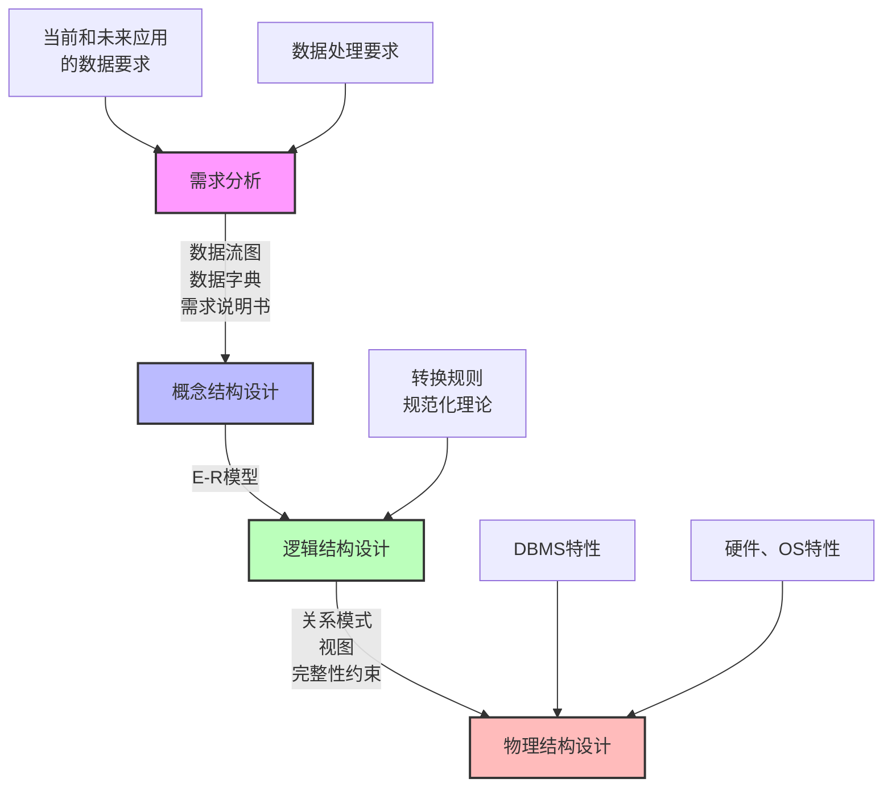
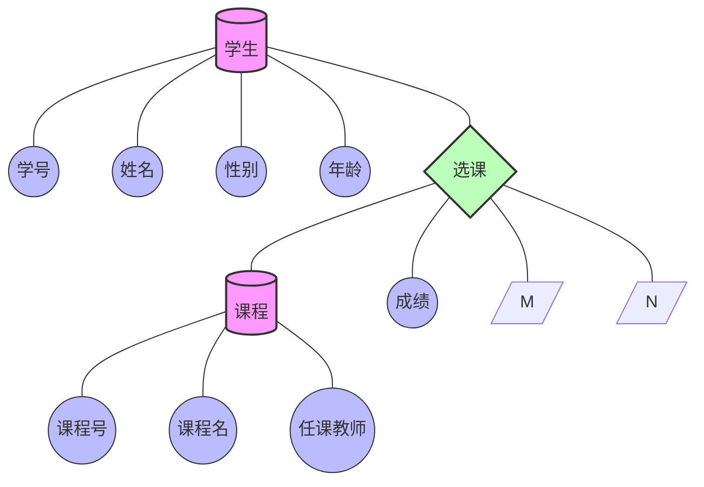

# 数据库

## 数据库三级模式两级映射

**三级模式解释**

1. 外模式（External Schema）/ 用户模式
- 也称为子模式或用户视图
- 描述数据库中局部数据的逻辑结构
- 是用户能看见和使用的局部数据的逻辑结构描述
- 一个数据库可以有多个外模式，一个应用程序只能使用一个外模式

2. 概念模式（Conceptual Schema）/ 逻辑模式

- 数据库中全体数据的逻辑结构和特征的描述
- 是所有用户的公共数据视图
- 与具体的存储设备和存取方法无关
- 一个数据库只有一个概念模式

3. 内模式（Internal Schema）/ 物理模式

- 数据物理结构和存储方式的描述
- 描述数据在存储设备上的存储方式和存取方法
- 一个数据库只有一个内模式

 **两级映射解释**

1. 外模式/概念模式映射

- 定义外模式与概念模式之间的对应关系
- 保证数据的逻辑独立性
- 当概念模式改变时，通过修改映射关系可以保持外模式不变

2. 概念模式/内模式映射

- 定义概念模式与内模式之间的对应关系
- 保证数据的物理独立性
- 当内模式改变时，通过修改映射关系可以保持概念模式不变

## 数据库的设计过程

## E-R模型

实体型转为关系模式？

## 关系代数

并、交、差、笛卡尔积、投影、选择、联接

笛卡尔积：将两个关系（表）中的每个元组（行）与另一个关系的所有元组无条件组合，生成包含所有可能行排列的新关系。
（例如：若表A有m行，表B有n行，笛卡尔积结果为m×n行，列数为两表列数之和。）

投影：选列，保留所需字段；

选择：选行，按条件过滤数据；

联接：组合表，关联匹配的行。

## 规范化理论- 函数依赖

## 规范化理论 - 价值与用途

## 规范化理论 - 键（求解候选键）

先找入度为0的节点，进行遍历

## 数据备份

冷备份、热备份

完全备份、差量备份、增量备份

## 数据库安全

