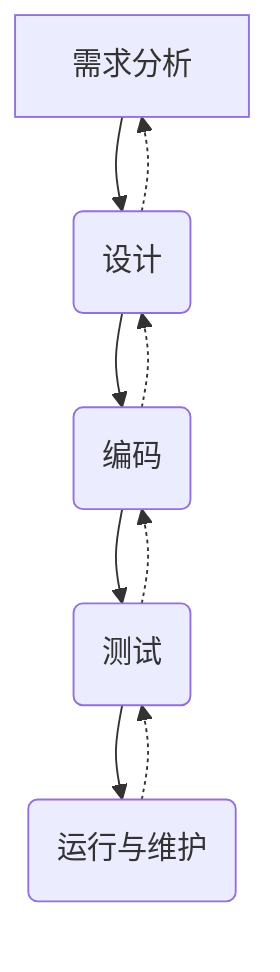
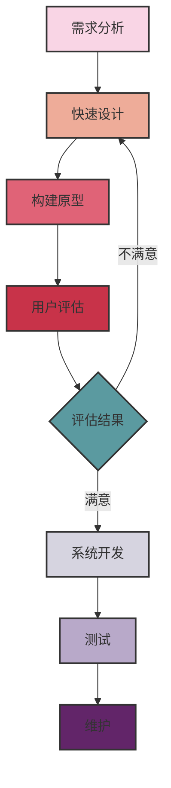
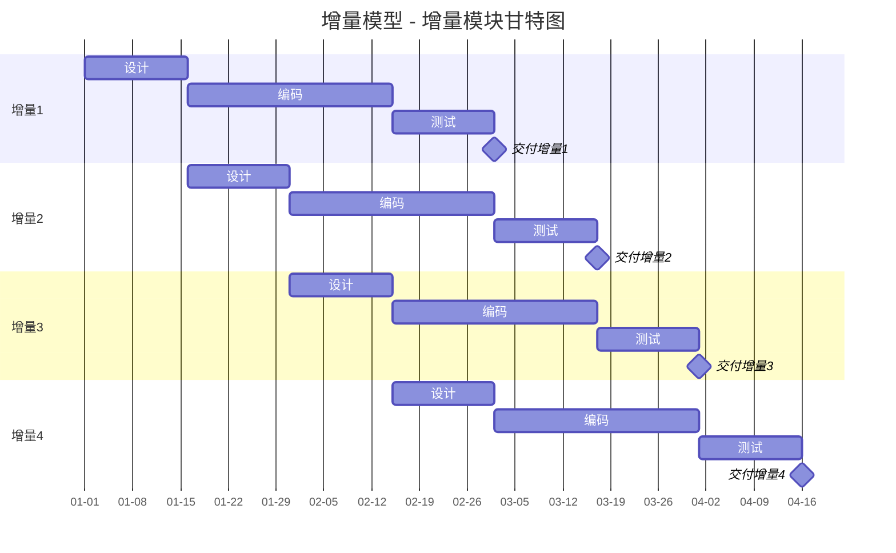
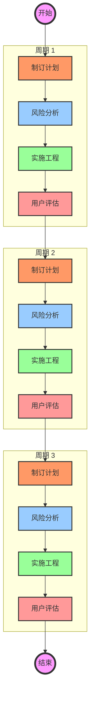
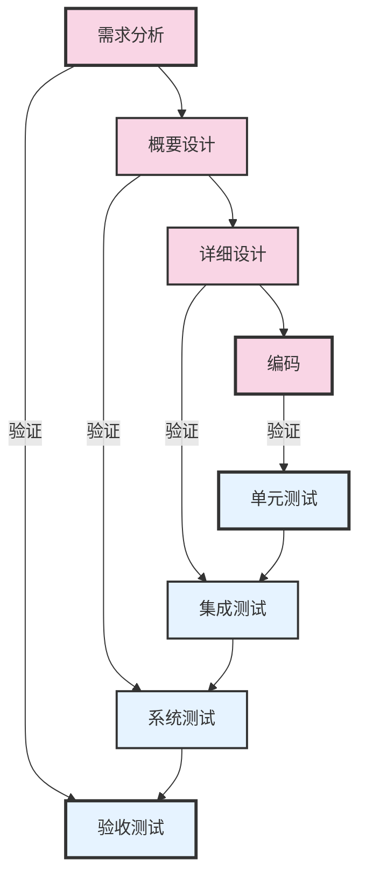
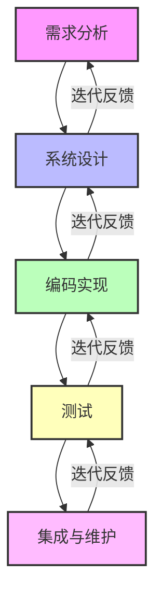
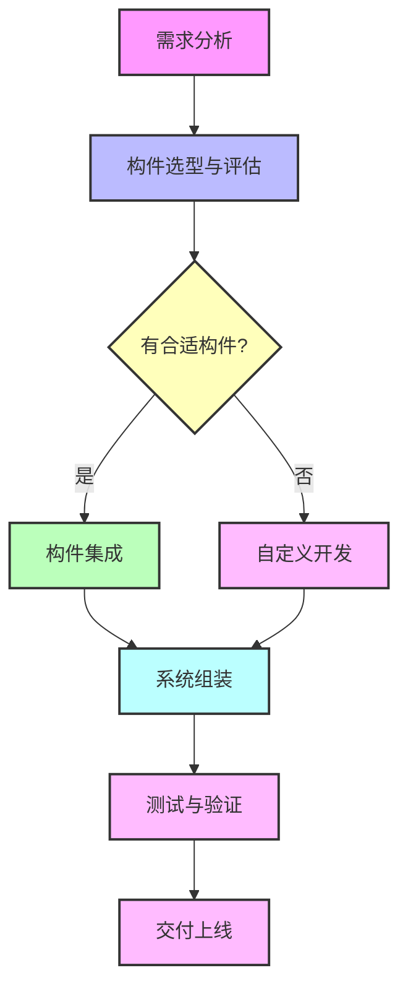
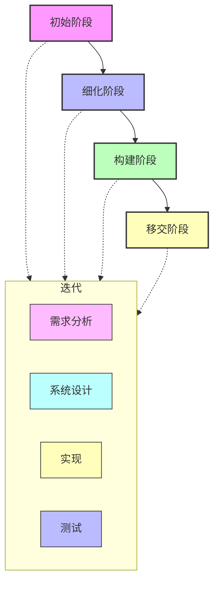
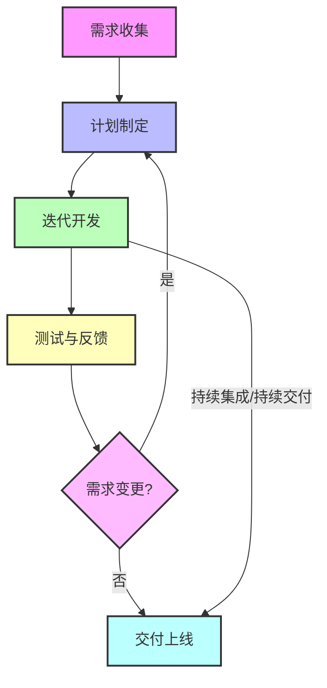

# 软件工程

## 软件过程模型

### 瀑布模型

优点：

- 阶段划分清晰，便于管理
- 每个阶段都有明确的输出物
- 有利于软件需求分析和系统设计

缺点：

- 需求分析和系统设计在项目初期进行，风险较大
- 需求变更困难，修改成本高
- **适合需求稳定**、规模较小的项目

### 原型模型

定义：原型模型是一种快速构建软件原型的方法，它可以帮助开发人员更好地理解用户需求，从而快速构建出符合用户需求的软件原型。

优点：

- 快速构建软件原型，帮助开发人员更好地理解用户需求
- 有利于软件需求分析和系统设计
- **适合需求不明确**、规模较小的项目

缺点：

- 原型可能与最终产品有很大差异，导致开发成本增加
- 原型可能无法满足用户需求，导致开发失败
- 原型可能无法满足用户需求，导致开发失败

### 增量模型

定义：增量模型是一种迭代开发模型，它将软件开发过程分为多个增量，每个增量都包含需求分析、设计、编码、测试和维护等阶段。

优点：

- 适合需求不明确、规模较大的项目
- 有利于软件需求分析和系统设计

缺点：

- 增量可能与最终产品有很大差异，导致开发成本增加
- 增量可能无法满足用户需求，导致开发失败
- 增量可能无法满足用户需求，导致开发失败

### 螺旋模型

定义：螺旋模型是一种迭代开发模型，结合了瀑布模型和增量模型的优点，将软件开发过程分为多个螺旋，每个螺旋都包含需求分析、设计、编码、测试和维护等阶段。并且引入了风险评估和风险管理，从而降低了开发风险。

优点：

- 适合需求不明确、规模较大的项目
- 有利于软件需求分析和系统设计

缺点：

- 螺旋模型需要花费更多的时间

### V模型

定义：V模型是一个强调测试的模型，它将软件开发过程分为需求分析、设计、编码、测试和维护等阶段。提早进行测试，从而降低了开发风险。

优点：

- 适合需求明确、规模较小的项目
- 有利于软件需求分析和系统设计

缺点：

- 测试可能会在项目后期进行，导致开发成本增加

### 喷泉模型

定义：喷泉模型是一种面向对象的软件开发过程模型，也称为“喷泉式模型”或“Fountain Process Model”。它强调软件开发过程中各阶段的高度迭代和重叠，适用于面向对象开发方法。与传统的瀑布模型不同，喷泉模型认为需求、设计、实现等活动可以并行、交错进行，开发过程像喷泉水流一样循环上升。

优点：

- 高度迭代：各阶段可以反复迭代，便于需求变更和持续优化。
- 阶段重叠：需求、设计、实现等活动可以并行，缩短开发周期，提高效率。
- 适应性强：适合面向对象开发，支持增量开发和持续集成。
- 风险降低：早期发现和修正问题，减少后期返工。

缺点：

- 管理复杂：阶段重叠、活动并行，项目管理和进度控制难度较大。
- 文档不规范：过度迭代可能导致文档不完整或不规范。
- 对团队要求高：需要团队成员具备较强的沟通与协作能力。
- 不适合需求极为明确的项目：对于需求非常清晰、变更少的项目，喷泉模型的灵活性反而可能带来不必要的复杂度。

### 快速开发模型（RAD）

定义：快速开发模型（Rapid Application Development, RAD）是一种以快速原型和迭代开发为核心的软件开发过程模型。它强调在较短时间内通过用户参与、原型构建和多次迭代，快速交付可用系统。RAD通常适用于需求易变、开发周期要求短的项目。

业务建模、数据建模、过程建模、应用生成、测试与交付

### 构件组装模型

定义：构件组装模型（Component-Based Software Development, CBSD）是一种以“软件构件”为核心的软件开发过程模型。它强调通过复用已有的、标准化的软件构件（组件），将系统像搭积木一样组装起来，减少从零开发的工作量，提高开发效率和软件质量。CBSD适用于需求明确、可复用性强、对开发效率和质量有较高要求的项目。

优点

- 高复用性：通过复用成熟构件，减少重复开发，提高开发效率。
- 高可靠性：采用经过验证的构件，提升系统整体质量和稳定性。
- 易于维护和扩展：系统由多个独立构件组成，便于后期维护和功能扩展。
- 缩短开发周期：构件复用大幅减少开发和测试时间。

缺点

- 构件获取难度：高质量、合适的构件难以获取，构件库建设成本高。
- 集成复杂性：不同构件之间的接口、兼容性、集成测试等问题较多。
- 需求适配性有限：现有构件可能无法完全满足个性化需求，需二次开发或适配。
- 依赖第三方风险：过度依赖外部构件，可能带来安全、维护等风险。

### 统一过程模型UP

定义：统一过程模型（Unified Process, UP）是一种以用例驱动、以架构为中心、迭代和增量式的软件开发过程模型。它将软件开发划分为多个阶段（初始、细化、构建、移交），每个阶段都包含若干迭代，每次迭代都能交付可运行的软件产品。UP强调需求、设计、实现、测试等活动的并行和反复，适用于中大型、需求复杂的软件项目。

优点

- 用例驱动：以用户需求为核心，确保开发目标明确、产品贴合实际需求。
- 架构为中心：重视系统架构设计，保证系统的可扩展性和高质量。
- 迭代增量：每次迭代都能交付可用产品，便于风险控制和持续改进。
- 过程灵活：支持需求变更，适应性强，适合复杂项目。

缺点

- 过程复杂：阶段多、活动多，过程管理和文档工作量大。
- 对团队要求高：需要团队具备良好的建模、架构设计和项目管理能力。
- 初期投入大：前期架构和用例分析投入较多，短期内难见成效。
- 不适合小型项目：对于小型、需求简单的项目，UP可能显得过于繁琐。

### 敏捷开发方法

定义：敏捷开发方法是一类以人为核心、迭代式、增量式的软件开发方法论。它强调快速响应变化、持续交付高质量软件、团队协作和客户参与。常见的敏捷方法有Scrum、XP（极限编程）、Kanban等。敏捷开发通过短周期的迭代（如Sprint），不断交付可用的软件，并根据反馈持续优化产品。

优点

- 快速响应变化：能够灵活应对需求变更，适应市场和用户的快速变化。
- 持续交付价值：每个迭代都能交付可用的软件，持续为客户创造价值。
- 高客户参与度：客户全程参与开发过程，需求反馈及时，产品更贴合实际需求。
- 团队协作强：强调团队沟通与协作，提升开发效率和团队凝聚力。
- 风险可控：通过频繁交付和反馈，早期发现并解决问题，降低项目风险。

缺点

- 对团队要求高：需要团队具备自组织能力和高度协作精神。
- 文档相对较少：过于关注交付，可能导致文档不完善，后期维护有难度。
- 不适合大型、分布式团队：大规模项目或分布式团队实施敏捷难度较大。
- 需求不稳定风险：频繁变更需求可能导致项目目标不清晰，影响进度和质量。

## 信息系统的开发方法

结构化法：

- 用户至上
- 严格区分工作阶段，每阶段有任务与成果
- 强调系统开发过程的整体性和全局性 
- 系統开发过程工程化，文档资料标准化
- 自顶向下，逐步分解（求精）

原型法：

- 适用于需求不明确的开发
- 包括抛弃式原型和演化式原型

面向对象方法：

- 以对象为中心，对象是信息系统的基本构造块
- 强调对象的封装性、继承性和多态性
- 通过对象的组合来构建系统

面向服务方法：

- 以服务为中心，服务是信息系统的基本构造块
- 强调服务的可重用性、可扩展性和可维护性
- 通过服务的组合来构建系统

## 需求工程

主要是确定要“做什么”

1. 需求的获取

- 收集资料
- 联合需求计划
- 用户访谈
- 书面调查
- 情节串联板
- 现场观摩
- 参加业务实践
- 阅读历史文档
- 抽样调查

2. 需求的分类

业务需求、用户需求、系统需求

功能需求、性能需求、设计约束

基本需求、期望需求、兴奋需求

## 系统设计（结果化设计）

需求确定之后，进行系统设计，也就是说再搞清楚“什么之后”的逻辑模型之后，转换为“怎么做”的物理模型。
分为概要设计和详细设计

设计要点：

- 自顶向下、逐步求精
- 信息隐蔽
- 模块独立（高内聚、低耦合、复杂度）

设计原则：

- 保持模块的大小适中
- 尽可能减少调用 的深度
- 多扇入、少扇出
- 单入口、单出口
- 模块的作用域应该在模块内部
- 功能应该是可预测的

## 系统测试

### 测试原则与类型

原则： 

- 尽早、不断的测试
- 程序员避免测试自己设计的程序
- 既要选择有效、合理的数据，也要选择无效、不合理的数据
- 修改后应进行回归测试
- 尚未发现的错误数量与该程序已发现的错误数量成正比

类型：

- 动态测试：黑盒测试、白盒测试和灰盒测试
- 静态测试：桌前检查、代码走查、代码评审

### 测试用例设计

黑盒测试法：

- 等价类划分
- 边界值分析
- 错误推测
- 因果图

白盒测试：

- 基本路径测试
- 循环覆盖测试
- 逻辑覆盖测试

### 测试阶段

- 单元测试：模块级别测试，局部功能，模块相关接口
- 集成测试
- 确认测试
- 系统测试：
- 冒烟测试

### McCabe复杂度

计算有向图的环路复杂度公式：V(G) = m - n + 2

(其中：V(G)是有向图G中的环路个数，m是G中的有向弧数，n是G中的节点数)

### 软件成熟度模型集成（CMMI）

组织能力成熟度：

1. 一级：混乱
2. 二级-已管理级：需求管理、项目计划、配置管理、项目监督与控制、供应商合同管理
3. 三级-已定义级：需求开发、技术解决方案、产品集成、验证、确认等
4. 四级-定量管理级：组织级过程性能、定量项目管理
5. 五级-优化级：组织级改革与实施、因果分析和解决方案

### 项目管理基础知识

事件最晚开始时间计算

松弛度

风险：项目风险、技术风险、商业风险，关心未来、关心变化、关心选择

