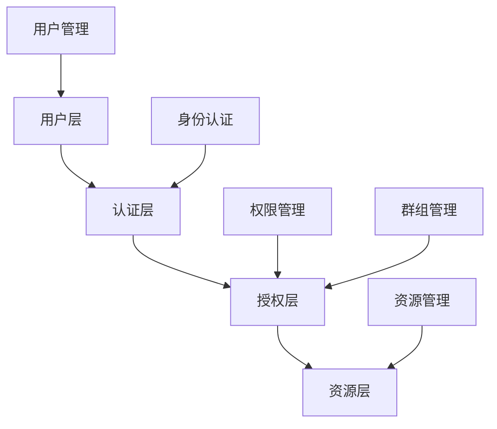
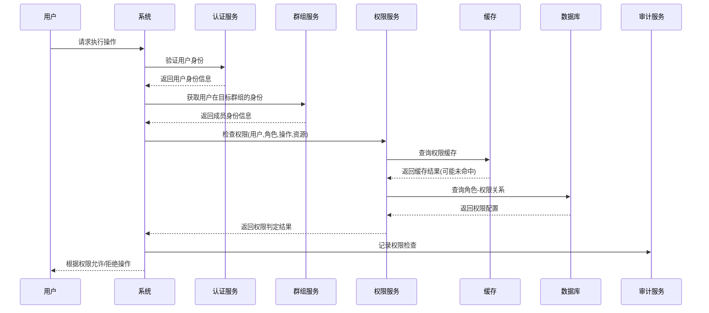

# 基于RBAC模型的群组权限体系设计与实现

## 一、 RBAC权限模型基础

### 1.1 RBAC模型概述

RBAC（Role-Based Access Control，基于角色的访问控制）是一种广泛应用的权限管理模型，它通过引入"角色"作为用户与权限之间的中间层，有效解决了权限分配与管理的复杂性问题。RBAC的核心理念是：不直接将权限赋予用户，而是将用户分配到不同角色，再由角色关联具体权限。

RBAC模型的基本组成部分包括：

- 用户（User）：系统的实际使用者
- 角色（Role）：用户的分类，如管理员、普通成员等
- 权限（Permission）：执行特定操作的能力
- 会话（Session）：用户登录系统后建立的临时关联

### 1.2 RBAC模型的四种类型

RBAC模型根据复杂度和功能可划分为四种类型：

- RBAC0（核心RBAC）：提供基本的用户-角色-权限关系
- RBAC1（层次RBAC）：在RBAC0基础上增加角色继承关系
- RBAC2（约束RBAC）：在RBAC0基础上增加职责分离约束
- RBAC3（统一RBAC）：结合RBAC1和RBAC2，同时支持角色继承和约束

## 二、群组场景下RBAC模型的特殊性

### 2.1 群组权限的特殊需求

在群组应用场景（如IM群聊、协作平台、社区论坛等）中，RBAC模型需要满足一些特殊需求：

- 多级群组结构：支持群组、子群组的嵌套层级关系
- 群组间隔离：不同群组的权限配置相互独立
- 动态权限变更：群组内角色和权限需要支持实时变更
- 批量权限操作：支持对群组成员的批量角色分配
- 个性化权限：支持对特定成员的权限覆盖设置

### 2.2 群组RBAC模型的拓展设计

基于标准RBAC模型，我们需要进行以下拓展以适应群组场景：

- 群组实体（Group）：作为权限上下文的容器
- 群组角色（Group Role）：与群组绑定的角色定义
- 成员身份（Membership）：用户在特定群组中的身份关联
- 操作对象（Resource）：细化群组内可操作的资源类型
- 环境条件（Context）：考虑时间、位置等外部条件的权限约束

## 三、群组RBAC权限体系设计原则

最小原则、职责分离原则、层次结构原则、灵活定制原则

## 四、群组RBAC权限体系架构设计

### 4.1 整体架构



### 4.2 权限检查流程



## 五、群组RBAC权限体系实现要点

### 5.1 预设角色设计

典型群组应包含的基础角色设计：

角色名称	权限等级	典型权限
群主	100	全部权限，包括解散群组、转让群主
管理员	80	管理成员、审核内容、设置群规则
特殊成员	50	发布公告、邀请成员、管理部分内容
普通成员	10	浏览内容、发送消息、上传文件
受限成员	5	仅浏览内容、有限制的互动
游客	1	仅查看公开内容

### 5.2 权限代码设计

使用位掩码（Bitmask）方式高效存储和检查权限：
```ts
// 使用二进制位表示不同权限
const GroupPermissions = {
  VIEW: 1 << 0,            // 0000000001 - 查看内容
  POST: 1 << 1,            // 0000000010 - 发布内容
  COMMENT: 1 << 2,         // 0000000100 - 评论
  UPLOAD: 1 << 3,          // 0000001000 - 上传文件
  INVITE: 1 << 4,          // 0000010000 - 邀请成员
  REMOVE_MEMBER: 1 << 5,   // 0000100000 - 移除成员
  MANAGE_CONTENT: 1 << 6,  // 0001000000 - 管理内容
  MANAGE_SETTING: 1 << 7,  // 0010000000 - 管理设置
  ASSIGN_ROLES: 1 << 8,    // 0100000000 - 分配角色
  OWNER: 1 << 9            // 1000000000 - 群主权限
};

// 角色权限组合示例
const RolePermissions = {
  OWNER: 0b1111111111,     // 群主拥有所有权限
  ADMIN: 0b0111111111,     // 管理员除了群主特权外的所有权限
  SPECIAL: 0b0000111111,   // 特殊成员的权限组合
  MEMBER: 0b0000011111,    // 普通成员的权限组合
  RESTRICTED: 0b0000000011,// 受限成员的权限组合
  GUEST: 0b0000000001      // 游客只有查看权限
};
```


### 5.3 权限验证实现

权限检查核心逻辑实现：
```ts
/**
 * 检查用户在群组中是否拥有指定权限
 * @param userId 用户ID
 * @param groupId 群组ID
 * @param permission 待检查权限
 * @returns 是否拥有权限
 */
async function hasPermission(userId: string, groupId: string, permission: number): Promise<boolean> {
  // 1. 检查权限缓存
  const cacheKey = `${userId}:${groupId}:perm`;
  let userPermissions = await cache.get(cacheKey);
  
  if (!userPermissions) {
    // 2. 获取用户在群组中的成员身份
    const membership = await getMembership(userId, groupId);
    if (!membership) return false; // 非群组成员
    
    // 3. 获取角色权限
    let rolePermissions = await getRolePermissions(membership.roleId);
    
    // 4. 应用个人权限覆盖
    if (membership.permissionOverrides) {
      // 合并基础权限和覆盖权限
      rolePermissions = applyPermissionOverrides(rolePermissions, membership.permissionOverrides);
    }
    
    // 5. 缓存权限结果
    userPermissions = rolePermissions;
    await cache.set(cacheKey, userPermissions, 3600); // 缓存1小时
  }
  
  // 6. 使用位运算检查权限
  return (userPermissions & permission) === permission;
}

/**
 * 应用权限覆盖
 * @param basePermissions 基础权限
 * @param overrides 覆盖配置 {add: 权限集合, remove: 权限集合}
 */
function applyPermissionOverrides(basePermissions: number, overrides: {add?: number, remove?: number}): number {
  let result = basePermissions;
  
  if (overrides.add) {
    result |= overrides.add; // 添加权限
  }
  
  if (overrides.remove) {
    result &= ~overrides.remove; // 移除权限
  }
  
  return result;
}
```
### 角色继承实现

```ts
/**
 * 获取角色的有效权限（包含继承的权限）
 * @param roleId 角色ID
 * @returns 有效权限位掩码
 */
async function getRolePermissions(roleId: string): Promise<number> {
  // 1. 获取角色基本信息
  const role = await getRole(roleId);
  if (!role) return 0;
  
  // 2. 获取直接分配给角色的权限
  let permissions = await getDirectRolePermissions(roleId);
  
  // 3. 如果角色有父角色，递归获取继承的权限
  if (role.parentRoleId) {
    const parentPermissions = await getRolePermissions(role.parentRoleId);
    // 合并权限（位或操作）
    permissions |= parentPermissions;
  }
  
  return permissions;
}
```


