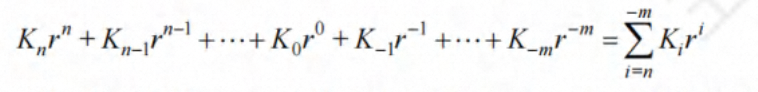
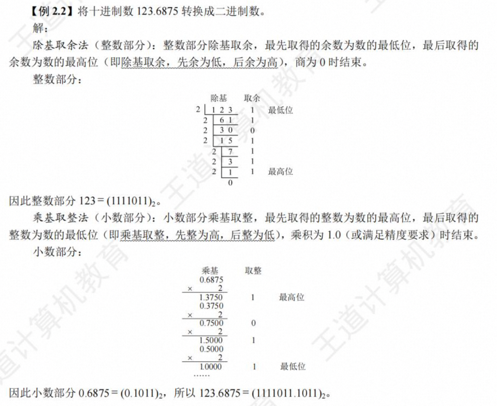

# 第 2 章 数据的表示和运算

## 数制和编码

#### 信息的二进制编码

1）二进制只有两种状态，使用有两个稳定状态的物理器件就可以表示 二进制数的每一位，制造成本比较低，例如用高低电平或电荷的正负极性都可以很方便地表示 0 和 1

2）二进制位 1 和 0 正好与逻辑值“真”和“假”相对应 ，计算机实现逻辑运算和程序中 的逻辑判断提供了便利条件。

3）二进制的编码和运算规则都很简单，通过逻辑门电路能方便地实现算术运算。

#### 进位记数制及其相互转换

1. **进位计数法**

每个数位所用到的不同数码的个数称为**基数**。

每个数码所表示的数值等于该数码本身乘以一个与它所在数位有关的常数，这个常数称为**位权**

一个进位数的数值大小就是它的各位数码**按权相加**

r 是基数 r^j 是第 i 位的位权
用 B 表示二进制，用 O 表示八进制，用 D 表示十 进制(通常直接省略)，用 H 表示十六进制，有时也用前缀 Ox 表示十六进制数
R 进制转十进制

2. **不同进制数之间的相互转换**

按权展开：数位 i\*该位上的权 R^i 再进行累加 R 称为基数

- 十进制 R 进制相互转化

要将整数和小数分别进行转换。
(1) 整数部分的转换
“除基取余，上右下左”

(2)小数部分的转换
“乘基取整，上左下右”

(3)含整数和小数部分的数转换
分别对整数和小数进行转换，再组合起来

- 二、八、十六进制数的相互转换

(1) 八进制转二进制
将八进制的每一位改成等值的 3 位二进制数

(2) 十六进制转二进制
将十六进制的每一位改成等值的 4 位二进制数

(3) 二进制转八进制
整数部分：从低位到高位每 3 位用等值的八进制数来替换，最后高位不满 3 位时补 0 凑满 3 位
小数：从高位向低位每 3 位用等值的八进制数来替换，最后低位不满 3 位时补 0 凑满 3 位

(4) 二进制转十六进制
整数部分：从低位到高位每 4 位用等值的八进制数来替换，最后高位不满 4 位时补 0 凑满 4 位
小数：从高位向低位每 4 位用等值的八进制数来替换，最后低位不满 4 位时补 0 凑满 4 位

#### 定点与浮点表示

小数点位置约定在固定位置的数称为定点数，小数点位置约定为可浮动的数称为浮点数

1. **定点表示**

定点表示法用来对定点小数和定点整数进行表示。
定点小数：小数点总是固定在数的最左边，一般用来表示浮点数的尾数部分。
定点整数：小数点总是固定在数的最右边，因此可以用"定点整数"来表示整数。

2. **浮点表示**

X = (-1)^S ✖️ M ✖️ R^E
S:取值为 0 或 1 M:二进制定点小数 反应 X 的有效位数 R:基数 E:二进制定点整数，称为数 X 的阶或指数 其位数决定 X 的表示范围，其值确定了小数点的位置

#### 定点数的编码表示

1. **真值和机器数**
   真值：机器数所代表的实际值。
   机器数：常用的有原码、补码和 反码表示法。如 0，101 (这里的逗号“，” 仅为区分符号位与数值位)表示+5

2. **机器数的定点表示**
   通常用补码整数表示整数，用原码小数表示浮点数的尾数部分，用移码表示浮点数的阶码部分，

3. **原码、补码、反码、移码**
   定点数的编码表示方法有 4 种：原码、补码、反码和移码。
   机器数：数值数据在计算机内部编码表示的数称为机器数。
   真值：机器数真正的值(现实世界带有正负号的数)称为机器数的真值。 1.原码表示法
   定义：由符号位直接后跟数值位构成，也称为“符号-数值”表示法。正数和负数的编码表示仅符号位不同，数值位完全相同
   [ +0 ]原 = 000...0
   [ -0 ]原 = 100...0

   优点：与真值的对应关系直观、方便 实现乘除运算比较简便
   缺点：0 的表示不唯一，原码加减运算规则复杂 2.补码表示法

   实现加减运算的统一，即用加法来实现减法运算。也称为“2-补码”表示法，由符号位后跟真值的模 2^n 补码构成

   (1) 模运算
   A = B + K ✖️ M 记为 A = B (mod M)
   A、B 各除以 M 后的余数相同，故称为 B 和 A 为模 M 同余，也就是说 一个数与它除以“模”后得到的余数是等价的
   时钟 ：

   (2) 补码的定义

   真值->补码：各位取反，末位加 1 （写出二进制 从右向左找到第一个 1，1 左边的数按位取反，符号位不参与）

   补码->真值：各位取反，末位加 1

   正数的补码：符号位取 0，其余不变
   负数的补码等于模与该负数绝对值之差-> 写出二进制 从右向左找到第一个 1，1 左边的数按位取反，符号位不参与。

   使用 10...000 表示最大负数
   使用 01...111 表示最大正数
   正数和负数的数量相同，一个正零 00000 和一个负零 111111

   (3) 特殊数据的补码表示
   补码 0 的表示是唯一的
   减少了 +0 和-0 之间的转换

   (4)补码与真值之间的转换方法
   正数：正号转换位 0，数值部分不变
   负数：做减法运算，“各位取反，末位加 1”。
   注意：最小负数取负后的补码表示是不存在的

4. **反码表示法**
   各位取反
   优点：
   缺点：

5. **移码表示法**
   浮点数的指数都是用一种移码表示
   指数的阶：真值
   阶码：机器数
   定义：[E]移 = 2^n-1 + E (2^n-1 为偏置常数)
   主要用来表示浮点数的指数，移码只能用来表示定点整数

补码的符号位取反

## 运算方法和运算电路

#### 基本运算部件

运算器由算术逻辑单元(ArithmeticLogicUnit,ALU)、移位器、状态寄存器(PSW)和通用寄存器组等组成。运算器的基本功能包括加、减、乘、除四则运算，与、或、非、异或等逻辑运算，以及移位、求补等操作。ALU 的核心部件是加法器。

无符号数加法器只能用于两个无符号数相加，不能进行有符号整数的加/减运算

OF（溢出位）：**有符号数**的加减运算是否发生了溢出。`OF = Cn 异或 Cn-1`。OF = 1 ，说明发生了溢出

SF（符号位）：**有符号数**加减运算结果的正负性。SF = 0 ，表示运算结果为正

ZF（零标志位）：加减运算结果是否为 0。ZF = 1 表示运算结果为 0， 对于无符号数和有符号数的运算，ZF 都有意义

CF（进位/借位）：**无符号数**加减法是否发生了溢出。`CF = Sub 异或 Cout`当 CF = 1 说明发生了溢出

1. **带标志位的加法器**

2. **算数逻辑单元（ALU）**

#### 定点数的移位运算

当计算机中没有乘/除法运算电路时，可以通过加法和移位相结合的方法来实现乘/除法运算。 对于任意二进制整数，左移一位，若不产生溢出，相当于乘以 2(与十进制数的左移一位相当于乘以 10 类似);右移一位，若不考虑因移出而舍去的末位尾数，相当于除以 2。

1. 逻辑移位
   逻辑移位将操作数视为无符号整数。逻辑移位的规则:左移时，高位移出，低位补 0;右移时，低位移出，高位补 0 。对于无符号整数的逻辑左移，若高位的 1 移出，则发生溢出。

2. 算数移位
   算术移位需要考虑符号位的问题，即将操作数视为有符号整数
   算术移位的规则:左移时，高位移出，低位补 0，若移出的高位不同于移位后的符号位，即左移前后的符号位不同，则发生溢出;右移时，低位移出，高位补符号位，若低位的 1 移出，则影响精度。例如，补码 1001 和 0101 左移时会发生溢出，右移时会丢失精度。

#### 定点数的加减运算

1. 补码的加减法运算

1）按二进制运算规则运算，逢二进一。
2）若做加法，两个数的补码直接相加;若做减法，则将被减数与减数的负数补码相加。
3）符号位与数值位一起参与运算，加、减运算结果的符号位也在运算中直接得出。
4）最终运算结果的高位丢弃，保留 nt 1 位，运算结果亦为补码。

2. 溢出判别方法

仅当两个符号**相同的数相加**或两个符号**相异的数相减**才可能产生溢出。

溢出判断方法：
（1）采用一位符号位
由于减法运算在机器中是用加法器实现的，因此无论是加法还是减法，只要参加操作的两个数的符号相同， 结果又与原操作数的符号不同，则表示 结果溢出

（2）采用双符号位
双符号位法也称模 4 补码。运算结果的两个符号位 Ss1, Ss2 相同，表示未溢出;运算结果的两个符号位 Ss1Ss2 不同，表示溢出，此时最高位符号位代表真正的符号

（3）采用一位符号位根据数值位的进位情况判断溢出
若符号位 (最高位)的进位 Cn，与最高数位 (次高位)的进位 Cn-1s 相同，说明无溢出，否则说明有溢出

3. 加减运算电路

## 整数的表示

#### 无符号整数的表示

#### 带符号整数的表示

补码的优点：

#### C 语言中的整数类型

c 语言中，一个运算同时有无符号数和有符号整数参加，C 编译器会隐含地将带符号整数强制类型转换为无符号数。
-2147483648 二进制 真值：1 1000……000 补码：1 1000……000
-2147483647 二进制 真值：1 0111……111 补码：1 1000……001
-2147483648 < -2147483647

### 实数的表示

计算机中用专门用浮点数来表示实数

#### 浮点数的表示格式

X = (-1)^S ✖️ M ✖️ R^E
S：取值为 0 或 1 0 为正数 1 为负数
M：表示定点小数 称为 X 的尾数 原码小数表示
E：是一个二进制定点整数，称为数 X 的阶或指数 用移码表示
R：基数 2、4、16

**IBM370**

#### 浮点数的规格化

浮点数尾数的位数决定浮点数的有效位数，有效位数越多，数据的精度越高。
规格化操作：“左归”和“右归”，当有效位进到小数点前面时，需要进行右归，右归时，尾数每右移一位，阶码加 1，直到尾数变成规格化的形式，形如 0.0000bbb✖️2^E，需要左归，尾数每前进一位，阶码减 1，直到尾数变成规格化的形式为止。

#### IEEE 754 浮点数标准

几乎所有计算机都采用 IEEE754 标准制定浮点数。这个标准提供了两种基本浮点格式：32 位单精度和 64 位双精度格式。
32 位单精度：1 位 8 位 23 位
符号位 阶码 尾数
64 位双精度：1 位 11 位 52 位
符号位 阶码 尾数
32 位单精度包含 1 位符号位 s，8 位阶码 e 和 23 位尾数 f；
64 位双精度格式包含 1 位符号位 s，11 位阶码和 52 位尾数 f;
尾数用**原码**表示，第一位总为 1，因此可在尾数中省略第一位的 1，称为隐藏位，使得单精度格式的 23 位尾数实际上表示了 24 位有效数字，双精度格式的 52 位尾数实际上表示了 53 位有效数字。隐藏位 1 的位置在小数点之前
指数用**移码**表示，偏置常数并不是通常 n 位移码所用的 2^n-1，而是**2^n-1 - 1**,因此单精度和双精度的偏执常数分别位 127 和 1023
优点：
（1）尾数可表示的位数多一位，因而使浮点数的精度更高
（2）指数的可表示范围更大，因而使浮点数范围更大。

1.全 0 阶码全 0 尾数：+0 / -0
IEEE754 的零有两种表示：+0 和 -0 零的符号取决于数符 s。一般情况下+0 和-0 是等效的 2.全 0 阶码非 0 尾数：非规格化数
非规格化数的特点：阶码全为 0，尾数高位有一个或几个连续的 0，但不全为 0，非规格化数的隐藏位位 0，并且单精度和双精度浮点数的指数分别为-126 和-1022 (-1)^s ✖️ 0.f ✖️2^-126 和(-1)^s ✖️ 0.f ✖️ 2^-1022 3.全 1 阶码全 0 尾数：+∞ / -∞ 4.全 1 阶码非 0 尾数：NAN 5.阶码非全 0 且非全 1:规格化非 0 数

例题：

IEEE754 标准的单精度和双精度格式的特征参数：

#### 浮点数的加减运算

1. 对阶
   小阶向大阶看齐

2. 尾数加减

3. 尾数规格化
   右归：1x.xxxx -> 1.xxxxx 指数加 1
   左归：0.001xx -> 1.xxxx 指数减 1
4. 舍入
   就近舍入：尾数全部保留，运算后，超出部分四舍五入
   正向舍入：取右边最近的表示数
   负向舍入：取左边最近的表示数
   截断法：直接截取所需部分，丢弃后面的所有位
5. 溢出判断
   指数上溢 11110 变为 11111
   指数下溢 00001 变为 00000

### C 语言中的浮点数类型

整数数据类型：
char：通常是 8 位，但可能是 16 位或 32 位。
short：通常是 16 位。
int：通常是 32 位。
long：通常是 32 位，但有时也可能是 64 位。
long long：通常是 64 位。

浮点数类型：
float：通常是 32 位，其中 1 位表示符号，8 位表示指数，23 位表示尾数。
double：通常是 64 位，其中 1 位表示符号，11 位表示指数，52 位表示尾数。
long double：位数因编译器和操作系统而异，通常是 80 位或 128 位。

C 语言中有 float 和 double 两种不同的浮点数类型，分别对应 IEEE754 单精度浮点数格式和双精度格式，相应的十进制有效数字分别为 7 位和 17 位
int、float 和 double 类型转换
（1）从 int 转换为 float，不会发生溢出，但可能有数据被舍入
（2）从 int 或 float 转换为 double，因为 double 的有效位更多，故能保留精确值
（3）从 double 转为 float，因为 float 表示范围更小，故可能发生溢出，此外，有效位数表少，故可能被舍入
（4）从 float 或 double 转位 int 时，因为 int 没有小数部分，所以数据有可能会向 0 方向截断，例如 1.99999999 截断为 1 因为 int 的表示范围更小，故可能发生溢出

### 十进制数的表示

#### 用 ASCII 码字符表示

#### 用 BCD 码表示

### 非数值数据的编码表示

#### 逻辑值

逻辑数据只能参加逻辑运算，并且是按位进行的，如按位“与”，按位“或”，逻辑左移，逻辑右移等。

### 西文字符

### 数据的宽度和存储

#### 数据的宽度和单位

二进制数据的每一位（0 或 1）是组成二进制信息的最小单位，称为一个比特（bit），或称为位元，简称位。比特是计算机处理、存储后劲儿传输信息的最小单位。
西文字符需用 8 个 bit 表示，汉字需用 16 个比特才能表示。在计算机内部，二进制信息的计量单位是字节（byte），也称为位组，一个字节等于 8 个比特。
还经常使用字（word）作为单位，不同的计算机，字的长度和组成不完全相同，一个字可能由 2 个字节，4 个字节，8 个字节甚至 16 个字节组成
机器字长：指 CPU 内部用于整数运算的数据通路的宽度。
CPU 数据通路：指 CPU 内部数据流经的路径以及路径上的部件，主要是 CPU 内部进行数据运算、存储和传送的部件，这些部件的宽度基本一致，才能互相匹配，因此 CPU 内部用于整数运算的运算器位数和通用寄存器宽度一致。

表示容量：
1KB = 2^10B = 1024B
1MB = 2^20B = 1058576B
1GB = 2^30B = 1073741824B
1TB = 2^40B
1PB = 2^50B
1EB = 2^60B
1ZB = 2^70B
1YB = 2^80B

表示距离、频率 速率 ：
比特/秒(b/s) bps
1kb/s = 10^3b/s = 1000b/s
1Mb/s = 10^6b/s
1Gb/s = 10^9b/s
1Tb/s = 10^12b/s

C 语言数值类型的宽度

#### 数据的存储和排列顺序

最低有效位：LSB 最高位
最高有效位：MSB 最低位
带符号数：最高位就是符号位
现代计算机采用**字节编址方式**，即对存储空间上的存储单元进行编号时，每个地址编号中存放一个字节。换而言之，采用字节编址，对存储空间进行按字节分组，并对每个分组进行编号。

假定 int 型变量 i 的地址为 0800H,i 的机器数为 01 23 45 67H
大端方式： 0800H 0801H 0802H 0803H
01H 23H 45H 67H
小端方式： 0800H 0801H 0802H 0803H
67H 45H 23H 01H

大端方式将数据的最高有效字节 MSB 存放在低地址单元中，将最低有效字节 LSB 存放在最高地址单元中，即数据的地址就是 MSB 所在的地址
小端方式将数据的最高有效字节 MSB 放在高地址中，将最低有效字节 LSB 放在低地址中，即数据的地址就是 LSB 所在地址。

##### 边界对齐

### 数据校验码

#### 奇偶校验码

只能发现奇数位的错位，不能发现偶数位的错位。不提供纠错功能

#### 海明码

将数据按某种规律分成若干组，对每组进行相应的奇偶检测，以提供多位校验信息，从而可对错误位置进行定位，并将其纠正。实质上就是一种多重奇偶校验码 1.校验位的位数的确定 2.分组方式的确定 3.校验位的生成和检错、纠错

#### 循环冗余码(CRC)

具有较强检错、纠错能力的校验码，常用于外存储器的数据校验。
1.CRC 码的检错方式
一个 CRC 码一定能被生成多项式整除，所以当数据和校验位一起送到接收端后，只要接受到的数据和校验位用同样的生成多项式相除，如果正好除尽，表示没有发生错误，若除不尽，则表示某些数据位发生了错误。 2.校验位的生成

3.CRC 码的纠错
余数是否为 0

## 总结

1. 二进制、八进制和十六进制相互转换

常见的二进制和十进制数：

- (2^{10} = 1024) ⚠️
- (2^{11} = 2048)
- (2^{12} = 4096)
- (2^{13} = 8192)
- (2^{14} = 16,384)
- (2^{15} = 32,768)
- (2^{16} = 65,536) ⚠️
- (2^{17} = 131,072)
- (2^{18} = 262,144)
- (2^{19} = 524,288)
- (2^{20} = 1,048,576)

注意带小数的计算：整数部分除基取余法，小数部分乘基取整法

2. 原码、补码、反码、移码

表示范围（对称性）、0表示（是否唯一）、相互转换、

3. 无符号整数和有符号整数的转换

采用补码表示

char、short、int、long的位数

char默认是无符号数，其他默认带符号数，相互类型转换

大转小（截断），小转大（补位-> 零拓展和符号拓展）

4. 运算器部件和加法器的组成

ALU、移位器、状态寄存器（PSW）、通用寄存器

5. 逻辑移位和算术移位

各自的移位规则？

带符号数和无符号数分别采用哪种移位？

移位操作的溢出判断和精度丢失问题

6. 加减运算

注意题目中给的是真值还是机器数

减法变加法

7. 溢出判断

溢出的前提：符号相同相加、符号相异相减、

溢出判断的3种方法：一位符号位、双符号位、

8. OF、SF、ZF、CF所表示的含义 

OF：溢出标志，对无符号数无意义，用于有符号数的溢出判断 OF = Cn 异或 Cn-1 符号位进位和最高数位进位异或

CF：进位标志，对有符号数无意义，用于无符号数的溢出判断 CF = Sub 异或 Cout

ZF：零标志位，均适用。

SF：符号位，对无符号数无意义

9.  无符号数和有符号数加减运算后CF和OF的值

10. 乘除法运算 error❌

乘法实现原理

乘法指令溢出判断

