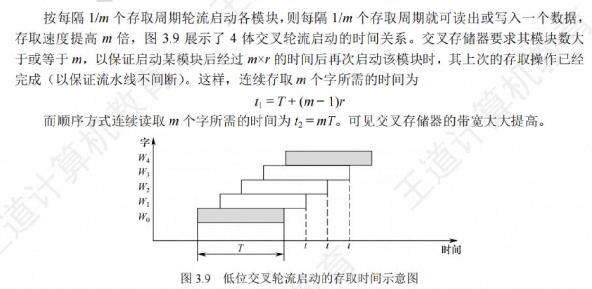
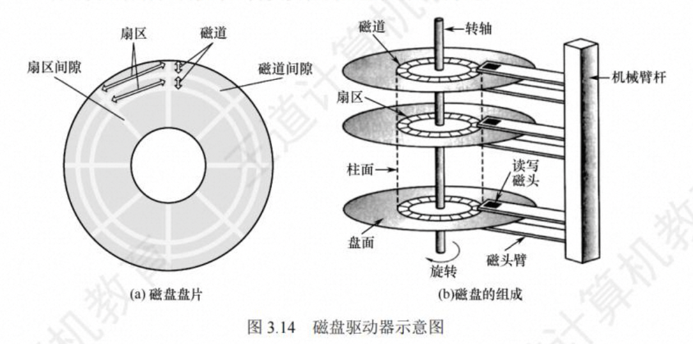
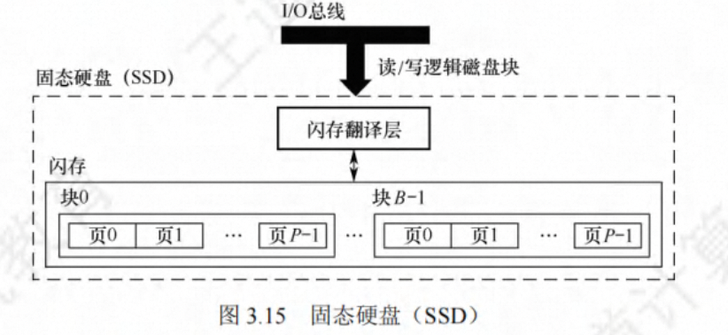
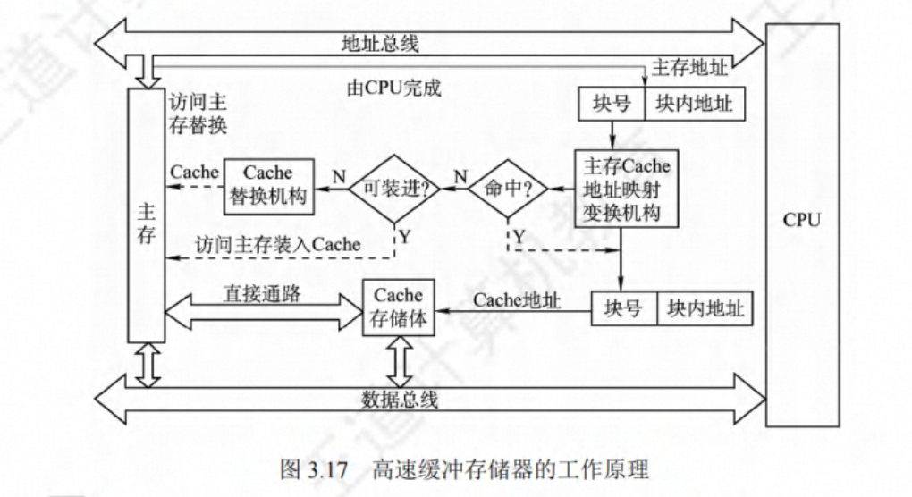
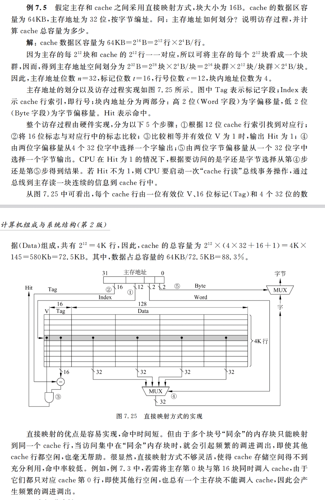

# 存储系统

## 存储器概述

### 存储器的分类

1. **按存储元件分类**

   存储元件必须具有两个截然不同的物理状态，才能被用来表示二进制 0 和 1.目前使用的存储元件主要有半导体器件、磁性材料和光介质。用半导体器件构成的存储器称为半导体存储器；磁性材料存储器主要是磁表面存储器，如磁盘存储器和磁带存储器；光介质存储器称为光盘存储器

2. **按存取方式分类**

   1）随机存取存储器

   随机存取存储器的特点是按地址访问存储单元，因为每个地址译码时间相同，所以，在不考虑内部缓冲的前提下，每个单元的访问时间是一个常数，与地址无关。丹半导体存储器属于随机存取存储器，可用作 cache 和主存储器。

   2）顺序存取存储器

   特点是信息按顺序存放和读出，其存取时间取决于信息存放位置，以纪录块单位编址。磁带存储器就是一种顺序存取存储器，其存储容量大，但存取速度慢。

   3）直接存取存储器

   兼有随机访问和顺序访问的特点。首先可直接选取所需信息所在区域，然后按顺序方式存取，磁盘存储器就是如此。

   4）相联存储器

   按内容检索到存储位置进行读写。例如快表

3. **按信息的可更改性分类**

   按信息的可更改性分类分为读写存储器和只读存储器。
   读写存储器的信息可以读出和写入，RAM 芯片是一种读写存储器；只读存储器用 ROM 表示，ROM 芯片中的信息一旦确定，通常情况下只读不写，但在某些情况下可以重新写入。
   RAM 芯片和 ROM 芯片都采用随机存取访问方式进行信息的访问

4. **按断电后信息的可保存性分类**

   按断电后信息的可保存性分成非易失性（不挥发）存储器和易失性存储器。非易失性存储器的信息一直可保留，不需要电源维持。如 ROM、磁表面存储器、光存储器；易失性存储器在电源关闭时信息自动丢失。如 RAM，cache 等。

5. **按功能分类**

   1）高速缓冲存储器

   目前高速缓存由静态 RAM 芯片组成，位于主存和 CPU 之间，存取速度接近 CPU 的工作速度，用来存放当前 CPU 经常使用到的指令和数据。

   2）主存储器

   指令直接面向的存储器时主存储器，简称主存。CPU 执行指令时给出的存储器地址是主存地址（在虚拟存储系统中，需要将指令给出逻辑地址转换成主存地址）。主存是存储器分层体系结构中的核心存储器，用来存放系统中被启动后运行的程序及其数据，主存目前一般用 MOS 管半导体存储器构成。

   3）辅助存储器

   系统运行时直接和主存交换信息的存储器称为辅助存储器，简称辅存。磁盘存储器相对于磁带和光盘存储器速度快，因此，目前大多用磁盘存储器作为辅存，辅存的内容需要调入主存后才能被 CPU 访问。

   4）海量后备存储器

   磁带存储器和光盘存储器的容量大、速度快，主要用于信息的备份和脱机存档，因此被用作海量后备存储器。
   辅存和海量后备存储器统称为外部存储器，简称外存。

### 主存储器的组成和基本操作

其中由一个个存储 0 或 1 的记忆单元构成的存储阵列是存储器的核心部分。这种**记忆单元也称为存储元、位元，它是具有两个稳态的能表示二进制 0 和 1 的物理器件**。存储阵列也称为存储体、存储矩阵。为了存取存储体中的信息，必须对存储单元编号，所以编码号码就是地址。编址单元是字。对各存储单元进行编号的方式称为编址方式，可以按字节编址，也可以按字编址。大多数采用字节编址方式，此时，存储体内一个地址中有一个字节。

指令执行过程中需要访问主存时，CPU 首先把被访问单元的地址送到主存地址寄存器（MAR）中，然后通过地址线将主存地址送到主存中的地址寄存器，以便地址译码器进行译码选中相应的单元，同时 CPU 将读写信号通过控制线送到主存的读写控制电路。
如果是写操作，CPU 同时将要写的信息送到主存数据寄存器（MDR）中，在读写控制电路的控制下，经数据线将信息写入选中的单元；
如果是读操作，则主存读出选中单元的内容送数据线，然后被送到 MDR 中。
数据线的宽度与 MDR 的宽度相同，地址线的宽度和 MAR 的宽度相同。
64 位数据线，在字节编址方式下，每次最多可以存取 8 个单元的内容。
地址线的位数决定了主存地址空间的最大可寻址范围，例如 36 位地址的最大寻址范围位 0 ～ 2^36 - 1 即地址从 0 开始编号

### 存储器的主要性能指标

主要指标仍然是容量、价格和速度。
存储器容量指它能存放二进制位数或字（字节）数。
访问时间一般用读出时间 Ta 及写入时间 Tw 来描述。Ta 是指存储器接到读命令开始至信息被送到数据线上所需时间，Tw 是指存储器接到写命令开始至信息被写入存储器所需的时间。
存储周期是指存储器进行一次读写操作所需要的全部时间，也就是存储器进行连续读写操作所允许的最短间隔时间。
存储器的带宽 B 表示存储器被连续访问时可以提供的数据传送速率，通常用每秒钟传送的信息的位数来衡量。

**存储容量 = 存储字数 ✖️ 字长**

**单位成本 ： 每位价格 = 总成本 / 总容量**

**存储速度 ： 数据传输速率 = 数据宽度 / 存储周期**

### 存储器的层次化结构

速度快则容量小，越靠近 CPU。CPU 可以直接访问内存存储器，而外部存储器的信息则要先取到主存，然后才能被 CPU 访问。
数据一般只在相邻之间复制传送，而且总是从慢速存储器复制到快读存储器被使用。传送的单位时一个定长块，并在相邻两层之间建立块映射关系。
CPU 执行命令时，需要的操作数大部分来自寄存器。如果需要从存储器中取数据（或向其中存数据）时，先访问 cache；如果不在 cache，则访问主存；如果不在主存，则访问硬盘，操作数从硬盘中读出送到主存，然后从主存送到 cache。

## 半导体随机存取存储器

半导体读写存储器简称 RWM，习惯上多称为 RAM。半导体 RAM 具有体积小、存取速度快等优点，因而适合作为内部存储器使用。按工艺不同可将半导体 RAM 分为双极型 RAM 和 MOS 型 RAM 两大类，MOS 型 RAM 又分为静态 RAM（SRAM）和动态 RAM（DRAM）。

### 基本存储元件

基本存储元件用来存储一位二进制信息，是组成存储器的最基本的电路。

1. **六管静态 MOS 管存储元件**
   

1）信息的保持

2）读出

3）写入

2. **单管动态 MOS 管存储元件**

   动态 RAM 利用 MOS 管的栅极电容 Cs 来保存信息，在信息保持状态下，存储元件中没有电流流动，因而大大降低了功耗。
   
   （1）读出

   （2）写入

   （3）刷新。

   由于 MOS 管上存储的电荷会缓慢放电，超过一段时间，就会丢失信息。因此必须定时给栅极电容充电，这一过程称为刷新。

3. **静态存储元件和动态存储元件的比较**

   SRAM 存储元件所用 MOS 管多，占硅片面积大，因而功耗大，集成度低；但因为采用一个正负反馈触发器来存储信息，所以，只要直流供电电源一直加在电路上，就能一直保存记忆状态不变，所以无需刷新；也不会因为读操作而使状态发生改变，故无需读后再生；特别是它的读写速度快，其存储原理可看作是对带时钟的 RS 出发的读写过程，由于 SRAM 价格比较贵，适合做高速小容量的半导体存储器，如 cache。

   DRAM 存储元件所用 MOS 管少，占硅片面积小，因而功耗低，集成度高；但是因为采用电容储存电荷来存储信息，会发生漏电现象，所以要使状态保持不变，必须定时刷新；因为读操作会使状态发生改变，故需读后再生；特别是它的读写速度相对于 SRAM 元件要慢很多，其存储原理可看作是对电容重、放点的过程。相比较 SRAM、DRAM 价格较低，因而适合做慢速大容量的半导体存储器，如主存。

### SRAM 芯片和 DRAM 芯片

1. **存储器芯片的内部结构**

   存储芯片由存储体、I/O 读写电路、地址译码和控制电路等部分组成。

   （1）存储体（存储矩阵）。存储体是存储单元的集合。4096 个存储单元被排成 64✖️64 的存储阵列，称为位平面，这样 8 个位平面构成 4096 字节的存储体。由 X 选择线（行选择线）和 Y 选择线（列选择线）来选择所需单元，不同位平面的相同行、列上的位同时被读出或读入。

   （2）地址译码器。用来将地址转换为译码输出线上的高低平，以便驱动相应的读写电路。地址译码有一维译码和二维译码两种方式。一维方式也称为线选法或单译码法，适用于小容量的静态存储器；二维方式也称为重合法或双译码法，适用于较大的动态存储器
   

（3）驱动器：在双译码结构中，一条 X 方向的选择线要控制在其上的各个存储单元的字选择线，所以负载较大，因此需要控制在译码器输出后加驱动器。

（4）I/O 控制电路。用以控制被选中的单元的读出与写入，具有放大信息的作用。

（5）片选控制信号。单个芯片容量太小，往往满足不了计算机对存储器容量的要求，因此需将一定数量的芯片按特定方式连接成一个完成的存储器。芯片上除了有地址线和数据线，还应有片选控制信号。在地址选择时，由芯片外的地址译码器的输入信号以及控制信号来产生片选控制信号，选中要访问的存储字所在的芯片。

（6）读/写控制信号。根据 CPU 给出的是读命令还是写命令，控制被选中的存储单元进行读或写。

DRAM 芯片容量较大，因此地址位数较多，为了减少芯片的地址引脚数，从而减少体积，大多采用地址引脚服用技术，行地址和列地址通过相同的管脚分先后两次输入，这样地址引脚数可减少一半

2. **DRAM 芯片的刷新**

   DRAM 芯片的存储阵列中所有存储电容必须周期性地重新充电，这一过程称为刷新。刷新可以采用“读出”的方法进行，根据读出内容对相应单元进行“重写”，即读后再生。刷新时只给各芯片送行地址和 RAS 信号，这样芯片中一行的所有元素就被选中并进行“读出操作”，因此，刷新操作按行进行，一次可刷新一行所有元素。

   刷新不需要外部提供行地址信息，这是一个内部的自动操作。DRAM 芯片内部有一个行地址生成器（也称为刷新计数器），由它自动生成行地址。由于刷新时正对一行中所有存储单元进行，所以无需进行行列寻址。

   刷新周期定义为上次对整个存储器刷新结束时作为开始点到下次对整个存储器全部刷新一遍为止的时间间隔，也就是对某一个特定的行进行相邻两次刷新的时间间隔。

   有 3 种刷新方式：集中、分散和异步

   （1）集中刷新。在整个刷新间隔内，前一段时间用于正常的读写操作。而在后一段时间停止读写操作，集中逐行进行刷新。因为刷新操作同时对所有芯片进行，所以刷新期间整个存储器都不能进行正常的读写操作。由于集中刷新时间较长，因此处于这种非正常工作状态的时间较长，影响系统执行效率。

   （2）分散刷新。讲一个存储周期分为两段，前一段时间用于正常读写操作，后一段时间用于刷新。这样，不存在死时间区，但是每个存储周期的时间被加长。

   （3）异步刷新。结合以上两种方式，将一个刷新周期分配给所有行，使得在一个刷新周期内每一行都至少被刷新一次，且仅被刷新一次。

3. **DRAM 芯片读写周期**
   
   （1）行地址必须在 RAS 信号有效之前送到芯片的地址输入端。

   （2）CAS 信号应滞后 RAS 一段时间，并滞后列地址送到芯片地址输入端的时间。

   （3）RAS、CAS 的时延分别为 Tras 和 Tcas，它们应有足够的宽度。

   （4）WE 信号为高电平，并在 CAS 有效之前建立

   （5）每次读后要再生，即重新写入一次。
   写周期

### SDRAM 芯片技术

目前常用的是基于 SDRAM 芯片技术的内存条，包括 DDR SDRAM 、DDR2 SDRAM 和 DDR3 SDRAM。

SDRAM(同步 DRAM)芯片，其工作方式与传统 DRAM 的不同，传统 DRAM 与 CPU 采用异步方式交换数据，CPU 发出地址和控制信号后，经过一段延迟时间，数据才读出或写入，在读/写完成之前，CPU 不能做其他工作。而 SDRAM 与 CPU 采用同步方式交换数据，它将 CPU 发出的地址和控制信号锁存起来，CPU 在其读/写完成之前可进行其他操作。SDRAM 的每一步操作都在系统时钟的控制下进行，支持突发传输方式 ®。第一次存取时给出首地址，同一行的所有数据都被送到行缓冲器，因此，以后每个时钟都可以连续地从 SDRAM 输出一个数据。行缓冲器用来缓存指定行中整行的数据，其大小为“列数 x 位平面数”，通常用 SRAM 实现。

**突发传输方式是指在寻址阶段发送数据单元的首地址，在传输阶段传送多个连续单元的数据**

## 存储器芯片的拓展及其与 CPU 的连接

### 内存条和内存条插槽

CPU 通过其芯片内的总线接口部件（即总线控制逻辑）与系统总线相连，然后再通过总线之间的 I/O 桥接器、存储器总线连接到主存。
总线是连接其上的各部件共享的传输介质，通常总线由控制总线、数据线和地址线构成。
在 CPU 和主存之间交换信息时，CPU 通过总线接口部件把地址信息和总线控制信息分别送到地址线和控制线，CPU 和主存之间交换的数据则通过数据线传输，每根数据线传送一位数据，因为数据线的条数就是数据线位宽。

内存条插槽就是存储器总线，内存条中的信息通过内存条的引脚，再通过插槽内的引线连接到主板上，通过主板上的导线连接到北桥芯片或 CPU 芯片。
现在计算机中可以有多条存储器总线同时进行数据传输，支持两条总线同时进行传输的内存条插槽位双通道内存插槽，还有三通道、四通道内存插槽，其总线的传输带宽可以分别提高单通道的两倍、三倍和四倍。例如，内存条插槽支持双通道内存条，共可插入 4 个内存条，其中相同颜色的插槽可以并行传输，其带宽可以增加一倍。

### 存储器芯片的拓展

由若干存储器芯片可构成一个内存条，此时，需要在字方向上和位方向上进行拓展（**多模块交叉存储？**）。
高位交叉存储 & 低位交叉存储

1. 位拓展
   用若干片位数较少的存储器芯片构成给定字长的内存条时，需要进行位拓展。例如 8 片 4096✖️1 位的芯片构成 4K✖️8 位的内存条，需要在位方向上拓展 8 倍，而字方向上无需拓展。位拓展时，各芯片上的地址线及读写控制线对应相接，而数据线单独引出
2. 字拓展
   子拓展时容量的扩充，位数不变。例如用 16K✖️8 位的存储芯片在字方向上拓展 4 倍，可构成一个 64K✖️8 位的内存条。字拓展时，芯片的地址线、读写控制线等引脚对应相接，片选信号则分别与外部译码器的各个译码输出端相连。
3. 字、位同时拓展
   当芯片在容量和位数都不满足存储器要求的情况下，需要对字和位同时拓展。例如，用 16K✖️4 位的存储芯片在字方向上拓展 4 倍，位方向上拓展 2 倍，可构成一个 64K✖️8 位的内存条。

### 存储芯片的地址分配与片选

CPU 要实现对存储单元的访问，首先要选择存储芯片，即进行片选;

然后在选定的芯片中选择具体的存储单元，以进行数据的读/写，即进行字选;

片选信号的产生方法分为线选法和译码片选法

1. **线选法**

当某地址线信号为 0 时，就选中对应的存储芯片，每次寻址只允许一位有效，不允许同时有多位有效。
n 条线 n 个选片信号 地址空间不连续，

2. **译码片选法**

例如 8 片 8K✖️8 位组成 64K✖️8 位，16 位地址线，8 位数据线，需要 8 个片选信号，故高三位为片选信号位，低 13 位为地址线。

n 条线 2^n 选片信号 地址空间连续

16K x 4 位的存储芯片可以存储 16K 个 4 位的二进制数。其中，“16K”表示**存储器单元**（Memory Cell）的数目，即存储芯片中存储的二进制数的数量。K 是计算机存储容量的单位，等于 1024，因此 16K 等于 16 x 1024 = 16384。**由于每个存储器单元可以存储 4 位的二进制数**，因此该存储芯片的总存储容量为 16384 x 4 位 = 65536 位，或者 8192 个字节。

### 存储器与 CPU 的连接

1. **合理选择存储芯片**
2. **地址线的连接**
3. **数据线的连接**
4. **读/写命令线的连接**
5. **片选线的连接**

## 半导体只读存储器和 Flash 存储器

### 半导体只读存储器

半导体只读存储器根据只读存储器的工艺可分为 ROM、PROM、EPROM 和 EEPROM 等类型。

1. 掩膜只读存储器

   掩膜只读存储器（MROM）中存储的信息由生产厂家在掩膜工艺过程中“写入”，用户不能修改。MROM 有双极型和 MOS 型两种。MROM 存储内容固定，所以可靠性高；

2. 可编程只读存储器

   可编程只读存储器（PROM）芯片出厂时内容全部为 0，用户可用专门的 PROM 写入器将信息写入，所以称为可编程型 ROM，但写入不可逆，某位写入 1 后，就不能再变为 0，因此称为一次编程型只读存储器。
   PROM 有两种工艺：熔丝型和反向二极管型。

3. 可擦出可编程只读存储器（EPROM）

   允许用户通过某种编程器向 ROM 芯片中写入信息，并可擦除所有信息后重新写入。可反复擦除一次-写入多次。

4. 电擦除电改只读存储器（EEPROM）

   在读数据的方式上和 EPROM 完全一样，但它有一个明显优点，即可用电来擦除和重编程。因此，可以选择只删除个别字，而不像 EPROM 那样每次都要抹除芯片上的全部信息。

### 半导体 Flash 存储器

Flash 存储器也称为闪存，是高密度非易失性读写存储器，它兼有 RAM 和 ROM 的优点，而且功耗低、集成度高，不需要后备能源。目前广泛使用的 U 盘和存储卡都属于 Flash 存储器

1. Flash 存储元
   沿用了 EPROM 的简单结构和浮栅/热电子注入的编程写入方式。
2. Flash 存储器的基本操作
   编程（充电）、擦除（放电）、读取

## 并行存储器结构技术

盖上主存速度的方法从 3 个方面考虑

（1）提高 DRAM 芯片本身的速度，如前述的各种基于 SDRAM 技术。

（2）采用并行结构技术，本节介绍的双口存储器和多模块存储器就是利用事件并行和空间并行在结构上进行优化的技术

（3）在 CPU 和主存之间增加高速缓冲器

### 双口存储器

双口存储器在一个存储器中提供两组独立的读写控制电路和两个读写端口，因而可以同时提供两个数据的并行读写，是一种空间并行技术。

### 多模块存储器

多模块存储器是一种空间并行技术，利用多个结构完全相同的存储模块工作来提高存储器的吞吐率。每个存储模块具有相同的容量和存取速度，并各自具有独立的地址寄存器 MAR、数据存储器 MDR、地址译码器、驱动电路和读写电路。

根据不同的编址方式，多模块存储器分为**连续编址**和**交叉编址**两种结构。

1. **连续编址方式**

   连续编址的多模块主存储器，主存地址的高位表示模块号（或低位），低位表示模块内地址（体内地址），因此，也称为按高位地址划分方式，地址在模块内连续。
   
   对于连续编址的多模块主存储器，当访问一个连续主存块时，总是先在一个模块内访问，等到该模块全部单元访问完才赚到下一个模块访问。

   现代计算机采用层次化存储体系结构，在 CPU 和主存之间加入了高速缓存，因而 CPU 总是先访问 cache，在访问 cache 失效时，再去访问主存，将一个主存块内连续单元中的信息取到 cache。

2. **交叉编址方式**

   交叉编址存储器中，主存地址的低位表示模块号，高位表示模块内地址，因此，也称为按低位地址划分方式。每个模块按“模 m”交叉方式编址。为了减少存储器冲突，采用质数个模块。

交叉编址多模块存储器可以采用轮流启动或同时启动两种方式。

1）轮流启动

按每隔 1/m 个存储周期轮流启动各模块进行读写。如果**每个存储模块**一次读写的位数（即存储字）正好等于系统总线中的数据线数（即总线传输单位），则采用轮流启动方式。

在理想情况下，m 体交叉存储器每隔 1/m 存取周期可读写一个数据，若相邻的 m 次访问的访存地址出现在同一模块内，则会发生访存冲突

2）同时启动

同时启动所有模块进行读写。如果**所有存储模块**一次并行读写的总位数正好等于系统总线中的数据线数，则可采用同时启动方式。

高位交叉编址：
高位体号 低位体内地址

低位交叉编址：高位体内地址 低位体号

连续访问 低位访问时间 T+（n-1）r 低位性能更优

导致原因：DRAM 需要周期性刷新恢复

## 磁盘

### 磁盘存储器

（1）**磁盘存储器的组成**

由磁盘驱动器、磁盘控制器和盘片组成。

- 磁盘驱动器：驱动磁盘并在盘面上通过磁头进行读/写操作的装置
- 磁盘控制器：磁盘驱动器和主机的接口，负责接收并解释 CPU 发来的命令，向磁盘驱动器发出各种控制信号，并负责监测磁盘驱动器的状态。
- 磁头数：即记录面数，表示磁盘共有多少条磁头，磁头用于读写写入盘片上记录面的信息，一个记录面对应一个磁头
- 柱面数（磁道数）：表示磁盘每面盘片上有多少条磁道。在一个盘组中，不同记录面的相同编号的诸磁道构成一个圆柱面。
- 扇区数：表示每条磁道上有多少个扇区
- 磁盘高速缓存：在内存中开辟一部分区域，用于缓冲将被送到磁盘上的数据（按“簇”为单位）

  

（2）**磁记录原理**

磁头和磁性记录介质相对运动时，通过电磁转换完成读写操作。

（3）**磁盘的性能指标**

- 记录密度：记录密度是指盘片单位面积上记录的二进制信息量，通常以道密度、位密度和面密度表示
- 磁盘容量
- 存取时间：寻道时间（磁头移动到目的磁道的时间）、旋转延迟时间（磁头定位到要读写扇区的时间）和传输时间（传输数据所花费的时间）三部分组成。
- 数据传输速率：磁盘转数为 r 转/秒，每条磁道容量为 N 字节，则数据传输率为 D=r/N

（4）**磁盘地址**

柱面号（磁道号）+ 盘面（磁头）号 + 扇区号

若磁盘有 16 个盘面，每个盘面有 256 个磁道，每个磁道划分为 16 个扇区，则每个扇区地址要 16 位二进制代码，柱面号 8 位，盘面号 4 位，扇区号 4 位

### 磁盘阵列

RAID (独立冗余磁盘阵列)是指将多个独立的物理磁盘组成一个独立的逻辑盘，数据在多个物理盘上分割交叉存储、并行访问，具有更好的存储性能、可靠性和安全性。

- RAIDO：无冗余和无校验的磁盘阵列。
- RAIDI：镜像磁盘阵列。
- RAID2：采用纠错的海明码的磁盘阵列。
- RAID3：位交叉奇偶校验的磁盘阵列。
- RAID4：块交叉奇偶校验的磁盘阵列。
- RAID5：无独立校验的奇偶校验磁盘阵列。

RAID 通过同时使用多个磁盘，提高了传输速率;通过在多个磁盘上并行存取来大幅提高存储系统的数据吞吐量;通过镜像功能，提高安全可靠性;通过数据校验，提供容错能力

## 固态硬盘

### 固态硬盘的特性

固态硬盘（SSD）是一种基于闪存技术的存储器。如图所示，闪存芯片替代传统旋转磁盘中的机械驱动器，而闪存翻译层将来自 CPU 的逻辑块读写请求翻译成对底层物理设备的读写控制信号，因此闪存翻译层相当于替代了磁盘控制器的角色。

### 磨损均衡

固态硬盘也有缺点，闪存的擦写寿命是有限的，一般是几百次到几干次。
为了弥补 SSD 的寿命缺陷，引入了磨损均衡。SSD 磨损均衡技术大致分为两种:

1. 动态磨损均衡。写入数据时，自动选择较新的闪存块。老的闪存块先歇一歇。
2. 静态磨损均衡。这种技术更为先进，就算没有数据写入，SSD 也会监测并自动进行数据分配，让老的闪存块承担无须写数据的存储任务，同时让较新的闪存块腾出空间，平常的读/写操作在较新的闪存块中进行。如此一来，各个闪存块的寿命损耗就都差不多
   

## 高速缓冲存储器

### 程序访问的局部性

在较短时间间隔内，程序产生的地址往往集中在存储器的一个很小的范围，这种现象称为程序访问的局部性，可细分为时间局部性和空间局部性。

**时间局部性**：指被访问的某个**存储单元**在一个较短的时间间隔内很有可能又被再次访问。

**空间局部性**：指被访问的某个**存储单元的邻近单元**在一个较短时间间隔内很有可能也被访问。

**例题 1**

**例题 2**

### cache 的基本工作原理

cache 是一种小容量高速缓冲存储器，由快速的 SRAM 组成，直接制作在 CPU 芯片内，速度几乎与 CPU 一样快。在 CPU 和主存之间设置 cache，总是把主存中被频繁访问的活跃程序块和数据块复制到 cache 中。由于程序访问的局部性，大多数情况下，CPU 能直接从 cache 中取得指令和数据，而不必访问主存。

为便于 cache 和主存之间交换信息，cache 和主存空间都被划分为相等的区域。主存中的区域称为块，也称为主存块，它是 cache 和主存之间交换单位。cache 中存放一个主存块的区域称为行或槽。因此，主存块大小等于 cache 行数据区大小。

1. **cache 有效位**

   在系统启动或复位时，每个 cache 行都为空，其中的信息无效，只有装入主存块后信息才有效。为了说明 cache 行中的信息是否有效，每个 cache 行需要一个有效位。
   有了有效位，就可以通过将有效位清零来淘汰某一行中的主存块，称为冲刷，装入一个新主存块时，再使有效位置为 1

2. **CPU 在 cache 中的访问过程**

   CPU 执行程序过程中，需要从主存中取指令或访问数据时，先检查 cache 中有没有要访问的信息，若有，就直接从 cache 中读取，而不用访问主存储器；若没有，再从主存把当前要访问信息所在的一个主存块复制到 cache 中，因此，cache 中的内容就是主存中部分内容的副本。CPU 与 Cache 之间的数据交换以字单位，而 Cache 与主存之间的数据交换则以 Cache 块单位。cache 对程序员是透明的，程序员编程时不用考虑信息存放在主存还是 cache 中。
   

3. **cache-主存层次的平均访问时间**

   cache 命中率 p = 命中次数 / 访问总次数

   cache 缺失率 = 不命中次数 / 访问总次数

   cache 访问时间 Tc 主存访问时间 Tm

   命中时，访问时间为 Tc，不命中时，访问时间为 Tm+Tc

CPU 在 cache-主存层次的平均访问时间 Ta = p ✖️ Tc + （1-p）✖️ （Tm+Tc）= Tc + （1-p）✖️Tm；

例题：

### cache 行和主存块之间的映射方式

cache 行中的信息取自主存中的某个块。在将主存块复制到 cache 行时，主存块和 cache 行之间必须遵循一定的映射规则，这样，CPU 要访问某个主存单元时，可以根据映射规则，到 cache 对应的行中查找到要访问的信息，而不是在整个 cache 中查找。

根据不同的映射规则，主存块和 cache 行之间有一下 3 中映射方式：

（1）**直接映射**：每个主存块映射到 cache 的**固定行**中。

（2）**全相联映射**：每个主存块映射到 cache 的**任意行**中。

（3）**组相联映射**：每个主存块映射到 cache 的**固定组的任意一行**中。

1. **直接映射**

   直接映射的基本思想是把主存的每一块映射到固定的一个 cache 中，也称为模映射，其映射关系如下：

   **cache 行号 = 主存块号 mod cache 行数**

   映射很直观，m 位主存块号中后 c 位来作为对应 cache 行号来进行映射。也就是说，m 位块号低 c 位相同的那些内存块，即“同余”内存块，将被映射到同一个 cache 行，形成一个“多对一”的映射关系。
   
   主存地址分为：**| 标记 | cache 行号 | 块内地址 |**

   其中，高 t 位位标记位，中间 c 位为 cache 行号（也称为行索引），剩余的低位地址为块内地址。

访问过程如下：首先根据访问地址中间的 c 位行号，直接找到对应的 cache 行，将对应 cache 行中的标记和主存地址的高 t 位标记进行比较，若相等并有效位为 1，则访问 cache“命中”，此时，根据主存地址中的低位的块内地址，在对应的 cache 行中存取信息；若不相等或有效位为 0，则“不命中”（缺失），此时，CPU 从主存中读出该地址所在的一块信息送到对应的 cache 行中，将有效位置 1，并将标记设置为地址中的高 t 位，同时将该地址中的内容送 CPU。

CPU 访问时，读操作和写操作的过程有一些不同，相对来说，读操作比写操作简单。因为 cache 行中信息时主存某块的副本，所以在写操作时会出现 cache 行和主存块数据的一致性问题。
例题：

2. **全相联映射**

   全相联映射的基本思想是一个主存块可装入 cache 任意一行。全相联映射 cache 中，每行的标记用于指出该行取自主存块的哪一块。因为一个主存块可能在任意一行中，所以需要比较 cache 行的标记，因此，主存地址中无须 cache 行索引，**只有标记和块内地址两个字段**。全相联映射方式下，只要有空闲 cache 行，就不会发生冲突，因而块冲突概率低。

   

3. **组相联映射**

   将前面两种方式结合起来产生了组相联映射方式。
   主要思想就是：将 cache 所有行分成 2^q 个大小相等的组，每组有 2^s 行。每个主存块被映射 cache 固定组中的任意一行，即组相联采用组间模映射、组内全相联的方式，映射关系如下：

   **cache 组号 = 主存块号 mod cache 组数**

   主存地址被划分为以下 3 个字段：

   **标记 cache 组号 块内地址**

   其中 ，高 m 位为标记，中间 q 位为组号（也称为组索引），剩余的 k 位低位地址部分为块内地址。标记字段的含义表示当前地址所在的主存块位于主存的哪个组群。

对于组相联 cache，CPU 访存过程如下：
首先根据访存地址中间的 q 位 cache 组号，直接找到对应的 cache 组；将对应 cache 组中的每一行的标记与主存地址的高 m 位标记进行比较；若有一个相等并有效位为 1，则访问 cache“命中”，此时，根据主存地址中的块内地址，在对应 cache 行中存取信息；若都不相等或虽相等但有效位为 0，则“不命中”，此时，CPU 从主存中读出该地址所在的一块信息送到 cache 对应组的任意一个空闲行中，将有效位置 1，并设置标记，同时将该地址的内容送到 CPU。

实现组相联映射的硬件线路如下。

如图所示是采用 2 路组相联映射的 cache，整个访存过程如下：

（1）根据主存地址中的 cache 组号找到对应组；

（2）将地址中的标记与对应组中的每个行的标记 Tag 进行比较；

（3）将比较结果和有效位 V 相与

（4）若有一路比较相等并有效位为 1，则输出 Hit 位 1，并选中这一路 cache 行中的主存块；

（5）在 Hit 为 1 的情况下，根据主存地址中的块内地址从选中的一块内取出对应单元的信息；若 Hit 不为 1，则 CPU 要到主存去读一块信息到 cache 行中。

**例题**

**组相联映射方式结合了直接映射和全相联映射的优点**。

当 cache 的组数为 1 时，变为全相联映射；当每组只有一个 cache 行时，则变为直接映射。组相联映射的冲突概率比直接映射概率低，由于只有组内各行采用全相联映射，所以比较器的位数和个数都比全相联映射少，易于实现，查找速度也快的多。

**三种映射方式比较**

对于一个主存块说，3 种映射方式下对应 cache 行的个数不同。直接映射时唯一映射，每个主存块只有一个固定行与之对应；全相联映射时任意映射，每行都可对应；N 路组相联映射有 N 行对应。这种特性可用“关联度”来度量，即关联度指一个主存块映射到 cache 中时可能存放的位置数。因此，直接相联的关联度最低，为 1；全相联映射的关联度最高，为 cache 总行数；N 路组相联的关联度居中，为 N；
当 cache 大小、主存块大小一定时，关联度和命中率、命中事件、标记所占额外开销等有如下关系：

（1）关联度越低，命中率越低。因此直接映射命中率最低，全相联命中率最高

（2）关联度越低，判断是否命中的开销越小，命中时间越短，因此直接映射的命中时间最短，全相联映射的命中时间最长。

（3）关联度越低，标记所占的额外空间开销越少。因此，直接映射额外空间开销最少，全相联映射额外空间开销最大。

**关联度例题**

**总结**

### cache 中主存块的替换算法

常用的替换算法有先进先出（FIFO），最近最少使用（LRU），最不经常用（LFU）和随机替换算法。

1. **先进先出算法（FIFO）**

   FIFO 基本思想：总是选择最早装入 cache 的主存块被替换。这种算法实现起来比较方便，但不能正确反映程序的访问局部性，因为最先进入的主存块也可能是目前经常要用的，因此，这种算法有可能产生比较大的缺失率

2. **最近最少使用（LRU）**

   LRU 基本思想：总是选择近期最少使用的主存块被替换。这种算法能比较正确反映程序的访问局部性，因为当前最少使用的块一般来说也是最少被访问的。但是，它的实现算法比 FIFO 算法要复杂一些。

   **LRU 栈算法**：
   

**LRU 计数器算法**

计数器的变化规则如下：

（1）命中时，被访问的行的计数器清零，比其低的计数器加 1，其余不变。

（2）未命中且该组还有空闲行时，则新装入的行的计数器设为 0，其余全部加 1.

（3）未命中且该组无空闲行时，计数值为 3（最大）的那一行中的主存块被淘汰，新装入的行的计数器设为 0，其余加 1.从计数器变化规则可以看出，计数值越高的行中的主存块越是最近最少用。

3. **最不经常用算法（LFU）**

   LFU 算法的基本思想：替换 cache 中引用次数最少的块。LFU 也用与每个行相关的计数器来实现，这种算法与 LRU 类似，但不全相同。

4. **随机替换算法**

   从候选行的主存块中随机选取一个淘汰，与使用情况无关。模拟试验表明，随机替换算法在性能上只稍逊色于给予使用情况的算法，而且代价低。

**替换例题：**

**cache 替换算法总结**

### cache 的一致性问题

因为 cache 中的内容是主存块副本，当对 cache 中的内容进行更新时，就存在 cache 和主存如何保持一致性的问题。除此之外，一下情况也会出现 cache 一致性问题：

（1）当多个设备允许访问主存时。例如，像磁盘这类高速 I/O 设备可通过 DMA 方式直接读写主存，如果 cache 中的内容被 CPU 修改而主存块没有更新，则从主存传送到 I/O 设备的内容就无效；若 I/O 设备修改了主存块的内容，则对应 cache 行中的内容就无效；

（2）当多个 CPU 都带有各自的 cache 而共享主存时。在多 CPU 系统中，若某个 CPU 修改了自身 cache 中的内容，则对应的主存块和其他 CPU 中对应的 cache 行的内容都变味无效。

1. **全写法**

   全写法的基本做法：写操作时，**若写命中**，则同时写 cache 和主存；

   若**写不命中**，则有以下两种处理方式：

   （1）**写分配法**。先在主存块更新相应存储单元，然后分配一个 cache 行，将更新后的主存块装入分配的 cache 行中。这种方式可以充分利用空间局部性，但每次写不命中都要从主存读一个块到 cache 中，增加了读主存块的开销。

   （2）**非写分配法**。仅更新主存单元而不装入主存块中。这种方式可以减少读入主存块的时间，但没有很好地利用空间局部性。
   由此可见，全写法实际上采用的是对主存块信息及其所有副本信息全部直接同步更新的做法，因此，该方法通常也被称为通写法或直写法，或为写直达法。

   为了减少写主存的开销，通常在 cache 和主存之间加一个写缓冲。在 CPU 写 cache 的同时，也将信息写入写缓冲，然后由存储控制器将写缓冲中的内容写主存。写缓冲是一个 FIFO 队列，一般有四项，在写操作频率不是很高的情况下，因为 CPU 只需将信息写入快速的写缓冲而无须写慢速的主存，因而效果较好。但是，如果写操作频繁发生，则会使写缓冲饱和而发生阻塞。

2. **回写法**

   回写法的基本做法是：当 CPU 执行写操作时，若写命中，则信息**只被写入 cache 而不被写入主存**；写不命中，则在 cache 中分配一行，将主存块调用该 cache 中并更新相应单元的内容。因此，在写不命中时，通常采用写分配法进行写操作。

   由此可见，回写法实际上采用的是回头再写或最后一次性写的做法，因此，访方式通常被称为回写法或一次性写方式，也称为写回法。

   在 CPU 执行写操作时，回写法不会更新主存单元，只有当 cache 行中的主存块被替换时，才将该内容一次性写回主存。这种方式的好处在于减少了写主存的次数，因而大大降低了主存带宽需求。为了减少写回主存块的开销，每个 cache 行设置了一个修改位（脏位），若修改位为 1，则说明对应 cache 行中的主存块被修改过，替换时需要写回主存；若修改为为 0，则说明对应主存块未被修改过，替换时无须写回主存。

   由于回写法没有同步更新 cache 和内存内容，所以存在 cache 和主存内容不一致而带来的潜在隐患，通常需要其他的同步机制来保证存储信息的一致性。

**cache 的一致性问题总结**

### cache 性能评估

计算机性能最直接的度量方式就是 CPU 时间，执行一个程序所花的 CPU 时间应该等于 CPU 执行时间和等待主存访问时间之和。当发生 cache 缺失时，需要等待主存访问，此时，CPU 处于阻塞状态，因此：

**CPU 时间 = （CPU 执行时钟数 + cache 缺失引起阻塞的时钟数）✖️ 时钟周期**

cache 缺失引起阻塞的时钟数 = 读操作阻塞时钟数 + 写操作阻塞时钟数

读操作阻塞时钟数 = 程序中读操作次数 ✖️ 读缺失率 ✖️ 读缺失损失

对于写操作来说，情况比较复杂。根据不同的写策略，其阻塞时钟数的计算方式不同。

（1）回写方式下，替换时需要一次性写回一个块，故会产生一些附加写回阻塞

写操作阻塞时钟数 = 程序中写操作数次数 ✖️ 写缺失率 ✖️ 写缺失损失 + 写回阻塞

（2）全写方式下，包括写缺失阻塞和写缓冲阻塞两部分。

写操作阻塞时钟数 = 程序中写操作数次数 ✖️ 写缺失率 ✖️ 写缺失损失 + 写缓冲阻塞

假定写回阻塞和写缓冲阻塞忽略不计，则可将读操作和写操作综合考虑，得到如下公式：

**cache 缺失引起阻塞的时钟数 = 程序中访存次数 ✖️ 缺失率 ✖️ 缺失损失 = 程序的指令条数 ✖️ （缺失率/指令）✖️ 缺失损失**

**CPI 越小，cahche 缺失引起的阻塞对系统总体性能的影响就越大**

**CPU 时钟频率越高，cache 缺失损失就越大**

例题：

### 影响 cache 性能的因素

决定系统访存性能的重要因素之一时 cache 命中率，与关联度，cache 容量，主存块大小等。还需要考虑采用单级 cache 还是多级 cache，数据 cache 和指令 cache 时分开还是合在一起，主存-总线-CPU 之间采用什么架构等，甚至主存 DRAM 芯片的内部结构、存储器总线的总线事务类型也都与 cache 设计有关，都会影响系统总体性能。

1. **单级/多级 cache、联合/分离 cache 的选择问题**

   目前 cache 基本上都在 CPU 芯片内，且使用 L1cache 和 L2cache，甚至 L3cache。通常 L1cache 采用分离 cache，即数据 cache 和指令 cache 分开设置。L2cache 和 L3cache 通常为联合 cache 方式，即数据和指令存放在一个 cache 中。

   在一个采用两级 cache 的系统中，CPU 总是先访问 L1cache，若访问缺失，再访问 L2cache。若 L2cache 包含所请求信息，则缺失损失为 L2cache 的访问时间，这比访问主存要快得多；若 L2cache 访问缺失，则需从主存取信息同时送 L1cache 和 L2cache，此时缺失损失较大。

   在多级 cache 中，有全局缺失率和局部缺失率两种不同的概念。全局缺失率是指所有级 cache 中都缺失的访问次数占总访问次数的比率；局部缺失是指在某级 cache 中缺失的访问次数占对该级 cache 的总访问次数的比率。

2. **主存-总线-cache 间的连接结构问题**

   （1）窄形结构：即在主存、总线和 cache 之间每次按一个字的宽度进行传送

   （2）宽形结构：即在它们之间每次传送多个字

   （3）交叉存储器结构：主存采用多模块交叉存取方式，总线和 cache 之间每次按一个字的宽度进行传送。性价比最好。

3. **DRAM 结构、总线事务类型与 cache 的配合问题**

4. **cache 结构举例**

## 虚拟存储器

**虚拟存储技术**：程序员在一个不受物理内存空间限制并且比物理内存空间大得多的虚拟的逻辑地址空间中编写程序，就好像每个程序都独立拥有一个巨大的存储空间一样。

程序执行过程中，把当前执行到的一部分程序和相应的数据调入主存，其他暂不用的部分在那时存放在磁盘上。这种借用外存为程序提供的很大的虚拟存储空间称为虚拟存储器。
执行执行时，通过硬件将指令中的逻辑地址（也称为虚拟地址或虚地址）转化为主存的物理地址（也称为主存地址或实地址），在地址转换过程中检查是否发生访问信息缺失、地址越界或访问越权，则由操作系统进行存储访问的异常处理。虚拟存储技术既解决了编程空间受限的问题，又解决了多道程序共享主存带来的安全等问题。

### 进程与进程的上下文切换

操作系统通过处理器调度让处理器交替执行进程中的指令，实现不同进程中指令交替执行的机制称为**上下文切换**。

进程的实体（如代码和数据等）和支持进程运行的环境合称为进程的**上下文**。

**由用户进程的程序块、数据块和堆栈等组成的用户区地址空间，被称为用户级上下文**；

**由进程标识信息、现场信息、控制信息和系统内核栈等组成的系统区地址空间，被称为系统级上下文**；

**此外，还包括处理器中各个寄存器的内容，被称为寄存器上下文**。

在进行进程上下文切换时，操作系统把换下进程的寄存器上下文保存到系统级上下文的现场信息位置。用户级上下文地址空间和系统级上下文地址空间一起构成了一个进程的整个存储器映像。

### 存储器管理

现代计算机采用多道程序执行方式，系统的主存中包含操作系统和若干个用户程序。在多道程序系统中，主存储器的“用户”区需进一步划分给多个进程。划分的任务由操作系统动态执行，被称为**存储器管理**。

早期进程采用**交换技术**来使系统中尽量多地调入用户程序。其基本思想是：当主存中没有处于就绪状态的进程（例如等待 I/O），操作系统将一些进程调出写回到磁盘，然后再掉入其他进程来执行。

**分区**和**分页**是交换技术的两种实现方式

1. **分区方式**

   分区方式将主存分为两大区域：**系统区**固定在一个地址范围内，存放操作系统；**用户区**用于存放所有用户程序。对于用户区的分配有**简单固定分区**和**可变长分区**两种方式。

   **简单固定分区**的基本思想：使用长度不等的固定长分区，当一个进程掉入主存时，分配给一个能容纳它的最小分区给它。多数情况下，进程对分区大小的需求不可能和提供的分区大小一样，因而，采用固定长度分区会大大浪费主存空间。

   **动态可变长分区**的基本思想：其分配的分区大小与进程所需大小一样。可遍尝分区方式开始时情况较好，但最后在存储器中可能会有许多小空块出现。时间越长，存储器中的碎片就会越多，因而存储器的利用率下降。

不管是固定分区还是可变长分区，都会在主存形成不能被利用的**碎片**。固定分区方式在分区内产生**内碎片**，而可变长分区方式在分区之间产生“**外部碎片**”。通过**移动进程**将“碎片”合并可提高主存利用率，但会带来处理器的额外时间开销，并且，进程移动时要进程重定位，增加了重定位硬件开销。

2. **分页方式**

   基本思想：**把主存分成固定比较小的存储块，称为页框，每个进程也被划分为固定长的程序块，称为页，程序块被装到可用的存储块中，并且无需用连续页框来存放一个进程**。程序运行时装入内存页框的过程对程序员时透明的，因为程序员不需要知道程序运行时具体会装到哪些页框，因而程序给出的指令和数据的地址不是真正的主存物理地址，程序员是在一个虚拟的逻辑地址空间中编写程序，通常把程序中所用的地址称为虚拟地址或逻辑地址，而真正访问的主存地址称为物理地址或实地址。操作系统在进行存储器分配时，通过页表建立页和页框之间的映射关系，**每个进程都有一个页表，通过页表实现虚拟地址向物理地址的转换**。

   现代操作系统总采用了“请求分页”的分页式虚拟存储管理方式，所谓“请求分页”就是只将当前需要的页面装入主存页框中，而不需要的页面则存放在外存中。这就是现代计算机采用**虚拟存储存储管理**的基本思想。

### 虚拟地址空间

虚拟存储器管理管理方式采用“请求分页”思想，每次访问仅将当前需要的页面调入内存，而进程中其他不活跃的页面放在外存磁盘上。当访问某个信息所在页不在主存时发生缺页，此时从磁盘将缺失页面掉入主存。

虚拟存储器机制为程序员提供了一个极大的虚拟（逻辑）地址空间，它是主存和磁盘 I/O 设备的抽象。虚拟机制给每个进程带来了一个假象，好像每个进程都独占使用主存，并且主存空间极大。它带来了 3 个好处：

（1）每个进程具有一致的虚拟地址空间，从而可以简化存储管理。

（2）它把主存看成是磁盘存储器的一个缓存，在主存中仅保存当前活动的程序段和数据区，并根据需要在磁盘和主存之间进行信息交换，通过这种方式，使有限的主存空间得到了有效利用。

（3）每个进程的虚拟地址空间是私有的，因此，可以保护各自进程不被其他进程破坏。

虚拟存储器机制中，每个源程序经编译、汇编、链接等处理生成可执行的二进制机器目标代码时，每个程序的目标代码都被映射到同样的虚拟地址空间，因此，所有用户进程的虚拟地址空间是一致的。

一个 hello 程序的一个进程对应的虚拟地址空间映像，它分为两大部分：**内核区和用户区**。

内核区在 0xC000000 以上的高端地址上，用来存放操作系统内核代码和数据以及与进程相关的数据结构（如进程标识信息、进程现场信息，页表等进程控制信息以及内核栈等），其中内核代码和数据区在每个进程的地址空间中都相同。用户没有权限访问内核区。

用户区用来存放用户进程的代码和数据，它又被分为一下几个区域：

（1）用户栈。用来存放程序运行时过程调用的参数、返回值、返回地址、过程局部变量等，随着程序的执行，该区会不断动态地从高地址向低地址增长或反方向减退。

（2）共享库。用来存放公共的共享函数库代码，如 hello 中 printf（）函数等。

（3）堆。用于动态申请存储区，例如，c 语言中用 malloc()函数分配的存储区或 c++中用 new 操作符分配的存储区。申请一块内存时，动态地从低地址向高地址增长，用 free 函数或 delete 操作符释放一块内存时，动态地从高地址向低地址减退。

（4）可读写数据区。存放用户进程中的代码和只读数据，如 hello 进程中的程序代码和字符串

### 虚拟存储器的实现

1. **分页式虚拟存储器**

缺页处理代价较大，通常将主存和磁盘之间的交换页面设定得比较大，比在 cache 和主存之间交换的主存块大得多，典型的有 4KB 和 8KB 等。提供命中率时关键，因此，在主存页框和虚拟页之间采用**全相联映射方式**。此外，当进行写操作时，由于磁盘访问速度很慢，所以不能每次写操作都同时写 DRAM 缓存和磁盘，因而，在处理一致性问题时，采用**回写方式**，而不用全写方式。

因为在虚拟存储机制中采用全相联映射，所以每个虚拟页可以存放到对应主存区域的任何一个空闲页位置。因此，与 cache 一样，虚拟存储器机制必须要有一种方法来确定每个进程的各个页面所存放的对应主存位置或磁盘位置；主存在空间中的页面被称为页框(页帧)、物理页或实页。有时虚拟页简称为 CP，物理页简称 PF 或 PP

**1）页表**

为了对每个虚拟页的存放位置、存取权限、使用情况、修改情况等进行说明，操作系统在主存中给每个进程都生成了一个页表，每个虚拟页在页表中都有一个对应表项，表项内容包括该存放位置、装入位、修改位、使用位（替换控制位）、存取权限和禁止缓存位等。

页表项中的**存放位置**字段用来建立虚拟页和物理页之间的映射，用于进程虚拟地址到物理地址的转换。

**装入位**也称为有效位或存在位，用来表示对应页面是否在主存，若为 1，表示该虚拟页已从外存调入主存，是一个“缓存页”，此时存放位置字段指向主存页框号（即物理页号或实页号）；若为 0，则表示没有被调入主存，此时，若存放位置字段为 null，则说明是一个“未分配页”，否则是一个“未缓存页”，其存放位置字段给出该虚拟页在磁盘上的起始地址。

**修改位**用来说明页面是否被修改过，虚存机制中采用回写策略，利用修改为你可判断替换时是否需写回磁盘。

**使用位**用来说明页面的使用情况，配合替换策略来设置，例如，是否最先调入（FIFO 位），是否最近最少用（LRU 位）等。

**存取权限位**用来说明页面是可读可写，只读还是只可执行，用于存储保护。

**禁止缓存位**用来说明页面是否可以装入 cache，通过正确设置该位，可以保证磁盘、主存和 cahe 数据的一致性

系统中每个进程都有一个页表，页表属于进程控制信息，存放在进程地址空间的内核区，页表在主存的首地址记录在页表基址寄存器中。页表的项数由虚拟空间大小决定，因此，页表项数会很多，因而会带来页表过大的问题。解决页表过大的方法有很多，可以采用限制大小的一级页表、二级货多级页表，倒置页表等方案

**2）地址转换**

对于采用虚存机制的系统，指令中给出的地址是虚拟地址，所以，CPU 执行指令时，首先要将虚拟地址转换为主存物理地址，才能到主存取指令和数据。地址转换工作由 CPU 中的存储器管理部件（MMU）来完成。
**虚拟地址**：高位字段为虚拟页号，低位字段为页内偏移地址。
**物理地址**：高位字段为物理页号，低位字段为页内偏移地址。
分页式地址变换-〉 每个进程都有一个页表基址寄存器，存放该进程的页表首地址。首先根据页表基址寄存器的内容，找到对应的页表首地址，然后以虚拟地址高位字段的虚拟页号为索引，找到对应的页表项，若装入位为 1，则取出物理页号，和虚拟地址中的页内地址拼接，形成实际主存物理地址；若装入位为 0，则说明缺页，需要操作系统进行缺页处理。

**3）快表**

在地址转换过程可看出，访存时首先要到主存查页表，然后才能根据主存物理地址再访问主存以存取指令或数据。如果缺页，则还要进行页面替换、页表修改等，访问主存的次数就更多。因此，采用虚拟存储器机制后，使得访存技术增加了。为了减少访存次数，往往把页表中最活跃的几个页表项复制到高速缓存中，这种由高速缓冲中的页表项组成的页表称为后背转换缓冲器，通常简称为快表，相应地称主存中的页表为慢表。

这样，在地址转换时，首先到快表中查页表项，如果命中，则无需访问主存中的页表。因此，快表时减少访存时间开销的有效方法。

快表比页表小得多，为提高命中率，快表通常具有较高的关联度，大多采用全相联或组相联方式。每个表项的内容由页表项内容加上一个 TLB 标记字段组成，TLB 标记字段用来表示该表项取自页表中的哪个虚拟页对应的页表项，因此，TLB 标记字段的内容在全相联方式下就是该页表项对应的虚拟页号；组相联方式下则是对应虚拟页号中的高位部分，而虚拟页号的低位部分用于选择 TLB 组的组索引。

**4) CPU 访存过程**

在一个具有 cache 和虚拟存储器的系统中，CPU 的一次访存操作可能涉及 TLB、页表、cache、主存和磁盘的访问。访问如下图

TLB、page、cache 的 3 种缺失组合:

**cache 缺失处理由硬件完成；缺页处理由软件完成，OS 通过“缺页异常处理程序”来实现；而对于 TLB 缺失，则既可以用硬件也可以用软件来处理。用软件处理时，OS 通过专门的“TLB 缺失异常处理程序”来实现。**

2. **分段式虚拟存储器**

   可以把段作为基本信息单位在主存和辅存之间传送和定位。分段方式下，将主存空间按实际程序中的段来划分，每个段在主存中的位置记录在段表，段的长度可变，所以段表中需有长度指示，即段长。每个进程都有一个段表，每个段在段表中有一个段表项，用来知名对应段在主存中的位置、段长、访问权限、使用和装入情况。段表本身也是一个可再定位段，可以存在外存中，需要时调入主存，但一般驻留在主存中。

   在分段式虚拟存储系统中，虚拟地址由段号和段内地址组成。通过段表把虚拟地址变换成主存物理地址，变化过程如下：
   

   每个用户进程都有一个段表基址寄存器，存放其段表在内存的首地址。根据虚拟地址中的段号，可找到对应段表项，是否存下一下 3 中异常情况：

   （1）缺段（段不存在）：装入位 = 0 ；

   （2）地址越界：偏移量超出最大段长。

   （3）保护违例：操作方式与制定访问权限不符

   若发生以上异常，则调出相应的异常处理程序，否则，将段表项中的段首址与虚拟地址中的段内地址相加，生成主存物理地址。

   因为段本身时程序的逻辑结构所决定的一些独立部分，因而分段对程序员来说不是透明的，而分页对程序员来说是透明的，程序员编写程序时不需知道程序将如何分页。

   分段式管理系统的优点是段的分界与程序的自然分界相对应；段的逻辑独立性使它易于变异、管理、修改和保护，也便于多道程序共享；某些类型的段（如堆、栈、队列）具有动态可变长度，允许自由调度以便于有效利用主存空间。但是，由于短的长度各不相同，段的起点和终点不定，给主存空间分配带来麻烦，而且容易在主存中留下许多空白的零碎空间，造成浪费。

   分段式和分页是存储管理各有有优缺点，因此可采用分段和分页相结合的段页式存储管理方式

3. **段页式虚拟存储器**

   在段页式虚拟存储器中，程序按模块分段，段内再分页，用段表和页表（每个段一个页表）进程两级定位管理。段表中每个表项对应一个段，每个段表项中包含一个指向该段页起始位置的指针，以及该段其他的控制和存储保护信息；由页表指明该段各页在主存中的位置以及是否装入、修改等状态信息。

   程序的调入调出按页进行，但它又可以按段实现共享和保护。因此，它兼有分页式和分段式存储管理的优点。它的缺点是在地址映像过程中需要多次查表。

### 存储保护

为避免主存中多道程序相互干扰，防止某程序出错而破坏其他程序的正确性，或某程序不合法地访问其他程序或数据区 应该对每个程序进程存储保护，包活操作系统程序和用户程序。

为了对 OS 存储保护提供支持，硬件必须具有一下 3 中基本功能

（1）支持至少两种特权模式

执行操作系统内核程序时处理器 所处的模式称为管理模式、内核模式或称管理程序状态，简称管态、管理态、内核态或核心态；执行用户程序时处理器所处模式称为用户模式、用户状态或目标程序态，简称为目态或用户态。

（2）使部分 CPU 状态只能由操作系统内核程序进行读写而用户进程不能读写。

特权模式位、页表首地址、TLB 内容等都只能由 OS 内核程序通过特殊指令（管态指令或特权指令）进行访问。常用的管态指令包括刷新 cache、刷新 TLB、改变特权模式、输入/输出、停止处理器执行等

（3）提供让 CPU 在管理模式和用户模式之间相互转换的机制

如果用户进行需要访问内核代码和数据，那么，必须通过执行**系统调用指令**来间接访问。响应异常和中断可使 CPU 从用户模式转到管理模式；异常处理和中断处理后的“返回”指令使 CPU 从管理模式转到用户模式。

硬件通过提供相应的专用寄存器、专门的指令、专门的状态/控制位等，和操作系统一起实现上述 3 个功能。通过这些功能，并把页表保存在操作系统的地址空间，操作系统就可更新页表，并防止用户进程改变页表，以确保用户进程只能访问操作系统分配给的存储空间。

存储保护包括以下两种情况：访问方式保护和存储区域保护。

1. 访问方式保护

2. 存储区域保护

   就是看是否发生了“地址越界”，即是否访问了不该访问的区域，通常有以下几种常用的存储区域保护方式。
   （1）加界重定位

   （2）键保护方式

   （3）环保护方式
   

## 强化

1. 随机存储器RAM、只读ROM

2. SRAM和DRAM的原理

六晶体MOS管，栅极电容

DRAM需要读后再生和定期刷新，集中刷新、分散刷新、异步刷新，行列地址分两次送，

3. DSRAM容量计算

地址线复用技术：行地址和列地址通过相同的引脚分先后两次输入，地址引脚线可减少一半

按行刷新，故行列尽可能相同，行数 <= 列数

4. 存储体、存储阵列，多模块存储器的关系是什么

5. 多模块存储器

高位交叉编址

低位交叉编址

每隔1/m个存储周期启动各模块，

访存冲突分析，对同一个模块的访问出现在一个周期内，则会出现冲突

6. CPU和主存的链接

地址线、数据线、控制线

7. 主存容量的扩充

4M x 8位

字扩展（高），位拓展（宽），字位同时拓展

故需要增加额外的线：选择存储芯片，进行片选

线选法：每个片一个线来控制是否选中 为0选中 其余为1 4片则需要4根线

译码片选法：2^n 个信号 （n为高位 用于产生片选信号）

地址范围、容量的计算以及对应关系

地址范围计算 0000 0000 ～ 0003 FFFF的地址范围大小

8. 磁盘存储器的组成和性能指标

驱动器 控制器 磁道 盘面 扇区 

道密度、位密度、面密度

9. 存取时间的计算

过程：先移动磁头道指定磁道上，确定盘面，最后旋转到指定扇区，最后读取数据

地质结构：柱面号（磁道号）+ 盘面号 + 扇区号

t = 寻道时间 + 旋转时间 + 传输时间

转速和时间t的关系？

数据传输速率 = R（转速）* N（磁道的容量）

10. 高速缓存cache

局部性原理：时间局部性和空间局部性（学会分析）

数据查找、地址映射、替换策略、写入策略

cache的基本工作原理和流程

cache中存储的仅是内存中较活跃的副本

cache命中率的计算

CPU平均访存时间的计算

11. cache和主存的映射方式

直接相联、全相联、组相联

地址结构、访问过程、比较器的个数

计算cache地址结构的位数和总容量

12. cache中主存块的替换算法

直接映射无需替换算法

常见的替换算法：算机算法（RAND）、FIFO（先进先出）、LRU（最近最少使用）、LFU（最不常用）

LRU替换位位数的计算：

13. 一致性问题（回写位）

cache写操作命中：全写法和回写法

cache写操作不命中：写分配法和非写分配法

14. 虚拟存储器

虚拟地址和物理地址的转换

15. 页表虚拟存储器

地址结构和带页目录的地址结构

地址位数的计算

虚拟地址：页目录号 页号 页内偏移 

物理地址：页框号 + 页内偏移

页号是固定的 里面存放的页框号不固定 如存在页面替换算法 将某个页号的内容替换为其他页框号

带TLB的查找过程 

TLB的地址组成（TLB采用组相连或者全相连映射）

cache、TLB和page缺失组合分析

cache和TLB中存放的都是page的副本

大题考数组的分页存储和缺页分析

16. 段式虚拟存储器

按程序逻辑分段

地址结构 段号 段内地址

根据段表基址寄存器 + 段号 找到对应的段表项

段表项的内容： 段首地址 装入位 段长 

段首地址 + 段内地址 = 物理地址

存在两个越界判断：1、找对应的段表项 2、根据段长判断段内地址是否超出该段

17. 段页式虚拟存储器

先把程序逻辑分段 再把段分固定大小的页

虚拟地址 = 段号 段内地址 页内地址 偏移 

寻址过程：

根据段表基址寄存器 + 段号 找到对应的段表项（并判断是否越界）

将该段表项的段首地址 + 段内地址  = 页号 

根据 页表基址寄存器 + 页号 （判断越界） = 页框号

页框号 + 页内偏移 = 物理地址

18. CISC和RISC

CISC复杂指令集，长度不等，采用微程序控制器，通用寄存器少

RISC精简指令集，长度固定，采用硬布线控制。通用寄存器多

CISC和RISC的对比

