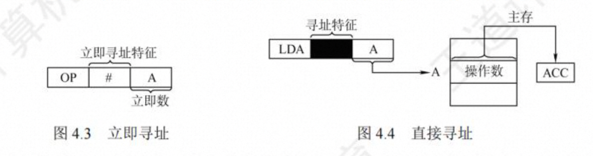

# 第 4 章 指令系统

## 指令系统

### 指令集体系结构

机器指令(简称指令)是指示计算机执行某种操作的命令。一台计算机的所有指令的集合构成该机的指令系统，也称指令集。

ISA 规定的内容 主要包括:

1. 指令格式，指令寻址方式，操作类型，以及每种操作对应的操作数的相应规定。

2. 操作数的类型，操作数寻址方式，以及是按大端方式还是按小端方式存放。

3. 程序可访问的寄存器编号、个数和位数，存储空间的大小和编址方式。

4. 指令执行过程的控制方式等，包括程序计数器、条件码定义等。

### 指令的基本格式

| 操作码 | 地址码字段 |

- 操作码：指出该指令应执行什么操作以及具有何种功能。
- 地址码：给出被操作的信息(指令或数据)的地址，包括参加运算的一个或多个操作数的地址、运算结果的保存地址、程序的转移地址、被调用子程序的入口地址等
- 指令字长：是指一条指令所包含的二进制代码的位数，其取决于操作码的长度、地址码的长度 和地址码的个数。把指令长度等于机器字长的指令称为单字长指令，指令长度等于半个机器 字长的指令称为半字长指令，指令长度等于两个机器字长的指令称 双字长指令。

在一个指令系统中，若所有指令的长度都是相等的，则称为定长指令字结构。定字长指令的执行速度快，控制简单。若各种指令的长度随指令功能而异，则称为变长指令字结构。然而，因为主在一般是按字节编址的，所以指令字长通常为字节的整数背。

常见指令格式：

1. 零地址指令
2. 一地址指令
3. 二地址指令
4. 三地址指令
5. 四地址指令

### 定长操作码指令格式

定长操作码指令在指令字的最高位部分分配固定的若干位(定长)表示操作码。一般 n 位操作码字段的指令系统量大能够表示 2^n 条指令。

### 扩展操作码指令格式

变长操作码 方法是扩展操作码，它使操作码 的长度随地址码的减少而增加，不同地址数的指令可具有不同长度的操作码，从而在满足需要的前提下，有效地缩短指令字长


### 指令地址码的个数

一条指令中必须明确地(显示)或隐含地包含以下信息。

(1)操作码。指定操作类型，如移位、加、减、乘、除、传送等

(2)源操作数或其地址。指出一个或多个源操作数或其所在地址，可能是主(虚)存地址，寄存器编号或 I/O 端口，也可以在指令中直接给出一个立即数。

(3)结果的地址。结果所存放的地址，可以是主存地址、寄存器编号或 I/O 端口。

(4)下一条指令地址。一般隐含在 PC 中，指令按顺序执行时，只要自动将 PC 的值加上指令的长度，就可以得出下一条指令的地址，如果遇到转移指令，则需要由指令给出转移到的目标地址。

### 指令格式设计原则

(1)指令应尽量短。降低开销

(2)要有足够的操作码位数。向后兼容

(3)操作码的编码必须有唯一的解释。

(4)指令长度应是字节的整数倍。指令存放在内存中，而内存往往按字节编址，指令的长度为字节的整数倍，便于指令的读取和指令地址的计算。

(5)合理选择地址字段的个数。

(6)指令应尽量规整。


### 操作类型

1. 算术和逻辑运算指令

加(ADD)、减(SUB)、比较(CMP)、乘(MUL)、除(DIV)、与(AND)、或(OR)、取反(NOT)、取负(NEG)、异或(XOR)、加 1(INC)、减 1(DEC)等。

2. 移位指令

算术移位、逻辑移位、循环移位、半字交换。

算术左移：操作数的各位依次向左移，低位补零。有些机器将最高位移入进位标志 CF 位，这样可以通过判断符号标志和进位标志是否相等就可以判断是否发生了溢出。

算术右移：各位依次向右移，高位补符号。有些机器将最低位移入进位标志位。

逻辑左移：同算术左移。

逻辑右移：各位依次向右移，高位补零。

小循环左移：最高位移入进位标志位，同时也移入最低位。

小循环右移：最低位移入进位标志位，同时也移入最高位。

大循环左移：最高位移入进位标志位，而进位标志位移入最低位。

大循环右移：最低位移入进位标志位，而进位标志位移入最高位。

3. 传送指令

传送指令通常有寄存器之间的传送 MOV、从内存单元读取数据到 CPU 寄存器 LOAD、从 CPU 寄存器写数据到内存单元 STORE 等。 4. 串指令

串指令是对字符串进行操作的指令。如串传送，串比较，检索和传送出转换等指令。

5. 顺序控制指令

顺序控制指令用来控制程序执行的顺序。有条件转移 BRANCH、无条件转移 JMP、跳步 SKIP、调用 CALL、返回 RET 等指令。顺序控制类指令的功能通过将转移目标地址送到 PC 中来实现。无条件转移指令在任何情况下都执行转移操作，而条件转移指令(分支指令)仅仅在特定条件满足时才执行转移操作。
调用指令也称为转子指令，和转移指令的根本区别在于执行调用指令时必须保存下一条指令的地址（返回地址）。调用指令用于子程序调用(即过程调用或函数调用)，当子程序执行结束时，根据返回地址回到主程序继续执行；而转移指令则不返回执行，因而无法保存返回地址。返回指令的功能是在子程序执行完毕时，将事先保存的返回地址送到 PC，这样处理器就能回到原来的主程序继续执行。

6. CPU 控制指令

   停机、开中断、关中断、系统模式切换以及进入特殊处理程序等指令。大多数机器将这类指令划为“特权”指令(也称为管态指令)，只能在内核代码执行时使用。

7. 输入输出指令

   这类指令用户完成 CPU 与外部设备交换数据或传送控制指令及状态信息。

## 指令的寻址方式

**寻址方式是指寻找指令或操作数有效地址的方式，即确定本条指令的数据地址及下一条待执行指令的地址的方法**。寻址方式分为**指令寻址**和**数据寻址**两大类。

### 指令寻址和数据寻址

**寻找下一条将要执行的指令地址称为指令寻址；寻找本条指令的数据地址称为数据寻址。**

1. **指令寻址**

指令寻址方式有两种：一种是顺序寻址，一种是跳跃寻址方式。

顺序寻址：通过程序计数器 PC 加 1（1 一条指令的长度），自动形成下一条指令的地址。

跳跃寻址：由本条指令给出下一条指令地址的计算方式。由于可能受到状态寄存器的控制，跳跃的方式分为绝对转移（地址码直接给出转移目标地址）和相对转移（地址码指出转移目标地址相对于当前 PC 的偏移量），由于 CPU 总是根据 PC 的内容去贮存取指令，因此转移指令执行结果就是修改 PC 值，下一条指令仍然通过 PC 给出。

通常把指令中给出的操作数所在的存储单元的地址称为有效地址，存储单元地址可能是主存物理地址，也可能是虚拟地址。

2. **数据寻址**

数据寻址是指如何在指令中表示 一个操作数的地址，或怎样计算出操作数的地址。数据寻址 的方式较多，为区别各种方式，通常在指令字中设置 一个寻址特征字段，用来指明属于哪种寻址 方式(其位数决定了寻址方式的种类)

| 操作码 | 寻址特征 | 形式地址 |
| ------ | -------- | -------- |

指令中的地址码字段并不代表操作数的真实地址，这种地址称为**形式地址(A)**。形式地址结合寻址方式，可以计算出操作数在存储器中的真实地址，这种地址称为**有效地址(EA)**。

- 若为立即寻址，则形式地址的位数决定了操作数的范围。
- 若为直接寻址，则形式地址的位数决定 了可寻址的范围。
- 若为寄存器寻址，则形式地址的位数决定了通用寄存器的最大数量。
- 若为寄存器间接寻址，则寄存器的位数决定了可寻址的范围

> (A)表示地址为 A 的数值，A 既可以是寄存器编号，又可以是内存地址。

### 常见的数据寻址方式

1. **隐含寻址**

这种类型的指令不明显地给出操作数的地址，而是隐含操作数的地址。例如，单地址的指令 格式就隐含约定第 二个操作数由累加器(ACC)提供，指令中只明显指出第一个操作数的地址。因此，累加器(ACC)对单地址指令格式来说是隐含寻址

优点是有利于缩短指令字长:缺点是需增加存储操作数或隐含地址的硬件。

2. **立即(树数)寻址**

指令字中的地址字段指出的不是操作数的地址，而是操作数本身，也称立即数，采用补码表 示。

3. **直接寻址**

指令中给出的地址码是操作数的有效地址，这种地址称为直接地址或绝对地址。



优点是简单，不需要专门计算操作数的地址，指令在执行阶段仅需访存一次:缺点是 A 的位数限制了该指令操作数的寻址范围，操作数的地址不易修改。

4. **间接寻址**

指令中给出的地址码是存放操作数有效地址的主存单元地址。


5. **寄存器寻址**

   指令中给出的地址码是操作数所在的寄存器编号，操作数在寄存器中。

   优点：

   (1)寄存器数量远小于内存单元数，故寄存器编号和存储地址短，因而寄存器寻址方式的指令较短。

   (2)操作数已在 CPU 中，不用访存，因而指令执行的速度快。

6. **寄存器间接寻址**

   指令中给出的地址码是一个寄存器编号，该寄存器中存放的是操作数的有效地址。指令长度和寄存器寻址指令差不多，但由于要访存，所以寄存器间接寻址指令的执行时间比寄存器寻址指令的执行时间更长。
   

7. **相对寻址**

相对寻址是把 PC 的内容加上指令格式中的形式地址 A 而形成操作数的有效地址，即 EA=(PC)+A，其中 A 是相对于当前 PC 值的偏移量，可正可负，补码表示

优点是操作数的地址不是固定的 ，它随 PC 值的变化而变化，且与指令地址之间总是相差一 个固定的偏移量，因此便于程序浮动。相对寻址广泛应用王转移損令。


相对寻址方式可用来实现公共子程序的浮动或实现相对转移。

8. **基址寻址**

基址寻址方式下，指令中的地址码字段 A 给出一个偏移量，基准地址可以明显或隐含地由基址寄存器 B 给出。

操作数有效地址 EA = (B)+A


基址寄存器是**面向操作系统**的，其内容由操作系统或管理程序确定，主要用于解决程序逻辑 空间与存储器物理空间的无关性。在程序执行过程中，基址寄存器的内容不变(作 基地址)， 形式地址可变(作为偏移量)。采用通用寄存器作为基址寄存器时，可由用户决定哪个寄存器作 为基址寄存器，但其内容仍由操作系统确定。

基址寻址的优点是可以扩大寻址范围(基址寄存器的位数大于形式地址 A 的位数);用户不必考虑自己的程序存于主存的具体位置，因此有利于多道程序设计，并可用于编制浮动程序，但偏移量(形式地址 A)的位数较短。

变址、基址和相对 3 中寻址方式，都是将某个寄存器的内容与一个形式地址相加来生成操作数的有效地址。统称为偏移寻址。

9. **变址寻址**

变址寻址方式主要是用于对线性表之类的**数组元素**进行方便的访问。

采用变址寻址方式时，指令中的地址码字段 A 给出的是一个基准地址，**例如数组的起始地址，而数组元素相对于基准地址的偏移量在指令中明显或隐含地由变址寄存器 I 给出，这样变址寄存器(简称变址器)的内容实际上就相当于数组元素的下标，每个元素的有效地址为基准地址加变址寄存器的内容**，即操作数的有效地址 EA = (I) + A 其中 I 表示变址寄存器 I 的内容

显然，变址寻址与基址寻址的有效地址形成过程极为相似。但从本质上讲，两者有较大区别。 **基址寻址面向系统**，主要用于为多道程序或数据分配存储空间，因此基址寄存器的内容通常由操作系统或管理程序确定，在程序的执行过程中其值不可变 ，而指令字中的 A 是可变的。变址寻址**立足于用户**，主要用于处理**数组**问题，在变址寻址中，变址寄存器的内容由用户设定，在程序执 行过程中其值可变，而指令字中的 A 是不可变的。

10. **堆栈寻址**

堆栈是存储器(或寄存器组)中一块特定的、按后进先出(LIFO)原则管理的存储区，该存储区中读/写单元的地址是用一个特定寄存器给出的，该寄存器称为堆栈指针(SP)。堆栈可分为硬堆栈和软堆栈两种。寄存器堆栈也称硬堆栈，硬堆栈的成本较高，不适合做大容量的堆栈。而从主存中划出一段区域来做堆栈是最合算且最常用的方法，这种堆栈称为软堆栈
如果某指令的操作数的有效地址或转移目标地址位于该指令所在位置的钱、后某个固定位置上，则该操作数或转移目标可用相对寻址方式。采用相对寻址方式时，指令中的地址码字段 A 给出一个偏移量，基准地址隐含由 PC 给出，即操作数有效地址或目标地址 EA=(PC)+A

在采用堆栈结构的计算机中，大部分指令表面上都表现为无操作数指令的形式，因为操作数地址都隐含使用了 SP。因此在读/写堆栈的前后都伴有自动完成对 SP 的加减操作


### 标志信息的生成和使用

常用的条件转移指令：


CF = Count 异或 Sub

## 程序的机器级代码展示

考察 x86 汇编指令

### 常用汇编指令介绍

1. **相关寄存器**


2. **汇编指令格式**

AT&T 格式和 Intel 格式（掌握 Intel 格式）


3. **常用指令**

数据传输指令、算数和逻辑运算指令和控制流指令

#### 数据传送指令

（1）**mov 指令**

将第二个操作数(寄存器的内容、内存中的内容或常数值)复制到第一个操作数(寄存器或内存)。

```c++
mov <reg> , <reg>
mov <mem> , <mem>

mov eax, ebx.  // 将ebx值复制到eax
mov byte ptr [var], 5 // 将5保存到var值指示的内存地址的一字节中
```

双操作数不能都是内存，即 mov 指令不能直接将内存复制到内存，需进行中间转换，从内存到寄存器再到内存。

（2）**push 指令**

将操作数压入内存的栈，常用于函数调用。ESP 是栈顶，入栈前先将 ESP 值减 4（栈增长方向与内存地址增长方向相反），然后将将操作数压入 ESP 指示的地址

```c++
push <reg32>
push <mem>
push <con32>

push eax // 将eax值入栈
push [var] // 将var指示的内存地址的4字节入栈
```

（3）**pop 指令**

pop 指令执行的是出栈工作，出栈前先将 ESP 指示的地址中的内容出栈，然后将 ESP 值加 4

```c++
pop eax // 弹出栈顶元素送到eax
pop 【ebx】 // 弹出栈顶元素送到ebx指示的内存地址的4字节中

```

#### 算数和逻辑指令

（1）**add/sub 指令**

add 指令将两个操作数相加，相加的结果保存到第一个操作数中。sub 指令用于两个操作数相减，相减的结果保存到第一个操作数中。

```c++
add<reg>，<reg> / sub<reg>，regy
add<reg>，smem> / sub<reg>，mem
add‹mem>,<reg> / sub‹mem>,<reg>
add‹reg>,‹con> / sub<reg>,‹con>
add‹mem>,‹con> / sub‹mem>,<con>

sub eax , 10  // eax <- eax - 10
add byte ptr [var], 10 // 10 与var指示的内存地址一字节相加，并将结果保存到var指示的内存地址字节中

```

（2）**inc/dec 指令**

inc 、dec 指令分别表示将操作数自加 1、自減 1。

（3）**imul 指令**

有符号整数乘法指令，有两种格式:1 两个操作数，将两个操作数相乘，将结果保存在第一个操作数中，第一个操作数必须为寄存器;2 三个操作数，将第 二个和 第三个操作数相乘，将结果保存在第一个操作数中，第一个操作数必须为寄存器

（4）**idiv 指令**

有符号整数除法指令，它只有一个操作数，即除数，而被除数则为 e dx"cax 中 的内容(共 64 位)，操作结果有两部分:商和余数，商送到 eax，余数则送到 edx

（5）**and/or/xor 指令**

and 、or、xor 指令分别是逻辑与、逻辑或、逻辑异或操作指令，用于操作数的位操作，操作结果放在第一个操作数中

（6）**not 指令**

位翻转指令，将操作数中的每一位翻转，即 0->1、1->0

（7）**neg 指令**

取负指令

（8）**shl/shr 指令**

逻辑移位指令，shl 为逻辑左移，shr 为逻辑右移，第一个操作数表示被操作数，第二个操作数指示移位的位数

#### 控制流指令

（1）**jmp 指令**

jmp 指令控制 IP 转移到 label 所指示的地址（从 label 中取出指令执行）

```c++
jmp <label>

jmp begin  // 跳转到begin标记的指令执行
```

（2）**jcondition 指令**

条件转移指令 依据 CPU 状态字中的一系列条件状态转移。CPU 状态字中包括中指示最后一个算数运算结果是否为 0 等。

```c++
je <label> (jump when equal)
jz <label> (jump when last result was zero)
jne <label> (jump when not equal)
jg <label> (jump when greater than)
jge <label> (jump when greater than or equal to)
jl <label> (jump when less than)
jle <label> (jump when less than or equal to)

cmp eax , ebx
jle done // 若eax值 <= ebx值 则跳转done 执行，否则执行下一条

```

（3）**cmp/test 指令**

cmp 指令的功能相当于 sub 指令，用于比较两个操作数的值。test 指令的 功能相当于 and 指令，对两个操作数进行逐位与运算。与 sub 和 and 指令不同的是，这两 类指令都不保存操作结果，仅根据运算结果设置 CPU 状态字中的条件码。

cmp 和 test 指令通常和 jcondition 指令搭配使用，举例

```c++
cmp dword ptr [var] , 10 // 将var指示的主存地址的4字节内容，与10相比较
jne loop                 // 若相等则继续顺序执行；否则跳转到loop处执行
test eax , eax           // 测试test是否为零
jz xxxx                  // 为零则置标志位ZF为1，则跳转到xxx出执行

```

（4）**call/ret 指令**

分别用于实现子程序(过程、函数等)的调用及返回`

```c++
call <label>
ret
```

call 指令首先将当前执行指令地址入栈，然后无条件转移到由标签指示的指令。与其他简单的跳转指令不同，call 指令保存调用之前的地址信息(当 call 指令结束后，返回调用之前的地址)。ret 指令实现子程序的返回机制，ret 指令弹出栈中保存的指令地址，然后无条件转移到保存的指令地址执行。call 和 ret 是程序(函数)调用中最关键的两条指令

### 选择语句的机器级表示

常见的选择结构语句有 if-then、if-then-else 等。编译器通过条件码 (标志位)设置指令和各 类转移指令来实现程序中的选择结构语句。条件码描述了最近的算术或逻辑运算操作的属性，可 以检测这些寄存器来执行条件分支指令，最常用的条件码有 CF、ZF、SF 和 OF。

常见的算术逻辑运算指令(add,sub,imul,or,and,shl,inc,dec,not,sal 等)会设置条件码，还有 cmp 和 test 指令只设置条件码而不改变任何其他寄存器

```c
int get_cont(int *p1 , int *p2){
   if(p1 > p2){
      return *p2;
   }
   else{
      return *p1;
   }
}
```

已知 p1 和 p2 对应的实参已被压入调用函数的栈帧，它们对应的存储地址分别为`R[ebp]+8、R[ebp]+12`(EBP 指向当前栈帧底部)，返回结果存放在 EAX 中。对应的汇编代码:

```c++
mov eax , dword ptr [ebp+8]. // R[eax] <- M[R[ebp] + 8], 即R[eax] = p1
mov edx , dword ptr [ebp+12] // R[edx] <- M[R[ebp] + 8], 即R[edx] = p2
cmp eax , edx                // 比较p1和p2，即根据p1-p2的结果置标志
jbe .L1                      // 若p1<=p2 ， 则转标记L1处执行 jbe? <= less than or equal to
mov eax , dword ptr [edx]    // R[eax]<-M[R[edx]].  R[eax] = M[p2]
jmp .L2                      // 无条件跳转至标记L2执行
.L1:
mov eax , dword ptr [eax]    // R[eax] <- M[R[eax]] 即R[eax] = M[p1]
.L2;
```

PI 和 p2 是指针型参数，所以在 32 位机中的长度是 dwordptr，比较指令 cmp 的两个操作数都 应来自寄存器，因此应先将 p1 和 p2 对应的实参从栈中取到通用寄存器，比较指令执行后得到各个 条件码，然后根据各条件码值的组合选择执行不同的指令，因此需要用到条件转移指令

### 循环语句的机器级表达

常见的循环语句`do while`,`while`,`for`。汇编指令中没有对应的指令，可以用条件测试和跳转组合起来实现效果，大多数编译器都将这三种循环结构都转为`do-while`形式来产生机器代码。在循环结构中，通常使用条件转移指令来判断循环条件的结束。

下面是一个用 for 循环写的自然数求和的函数：

```c
int sum_for(int n){
   int i;
   int result = 0;
   for (i=1;i<=n;i++){
      result +=i;
   }
   return result;
}
```

这段代码中的 for 循环的不同组成部分：

```c++
init_expr      i=1
test_expr      i<=n
update_expr    i++
body_statement result += i
```

将这个函数翻译为 goto 语句代码后，得到其过程体的汇编代码：

```asm
mov ecx , dword ptr [ebp+8]    # R[ecx] <- M[R[ebp]+8] 即R[ecxx] = n
mov eax , 0                    # R[eax] <- 0  即result=0
mov edx , 1                    # R[edx] <- 1  即i=1
cmp edx , ecx                  # Compare R[edx]:R[ecx] 即比较i：n
jg  .L2                        # If greater，则跳转到L2执行
.L1:                           # loop:
add eax , edx                  # R[eax] <- R[eax] + R[edx]，即result += 1
add edx , 1                    # R[edx] <- R[edx] + 1 即i++
cmp edx , ecx                  # Compare R[edx]:R[ecx] 即比较i：n
jle .L1                        # If less or equal，则跳转到L1执行
.L2:
```

已知 n 对应的实参已被压入调用函数的栈帧，其对应的存储地址为`R[ebp]+8` ，过程`nsum_for`中 的局部变量 i 和 result 被分别分配到寄存器 EDX 和 EAX 中，返回参数在 EAX 中。

### 过程调用的机器级表示

前面提到的`call/ret`指令主要用于过程调用，它们都是属于一种无条件转移指令。

假定过程 P 调用过程 Q，过程调用的执行步骤如下：

（1）P 将入口参数（实参）放到 Q 能访问到的地方。

（2）P 将返回地址存到特定的地方，然后将控制转移到 Q。

（3）Q 保存 P 的现场（通用寄存器的内容），并为自己的非静态局部变量分配空间。

（4）执行过程 Q。

（5）Q 恢复 P 的现场，将返回结果放到 P 能访问到的地方，并释放局部变量所占空间

（6）Q 取出返回地址，将控制转移到 P。

步骤 2 是 call 指令实现的，步骤 6 是 ret 指令返回到过程 P。在上述步骤中，需要为入口参数、返回地址、过程 P 的现场、过程 Q 的局部变量、返回结果找到存放空间。

用户可见的寄存器数量有限，调用者和被调用者需要共享寄存器，若直接覆盖对方的寄存器，则会导致程序出错，故有一下规范：寄存器 EAX、ECX 和 EDX 是调用者保存寄存器，当 P 调用 Q 时，若 Q 需要用到这些寄存器，则由 P 将这些寄存器的内容保存到栈中，并在返回后由 P 恢复它们的值。寄存器 EBX、ESI、EDI 是被调用者保存寄存器，当 P 调用时，Q 必须先将这些寄存器的内容保存在栈中才能使用它们，并在返回 P 之前先恢复它们的值。

每个过程都有自己的栈区，称为栈帧，因此，一个栈由若干栈帧组成，寄存器 EBP 指示栈帧的起始位置，寄存器 ESP 指示栈顶，栈从高地址向低地址增长。过程执行时，ESP 会随着数据的入栈而动态变化，而 EBP 固定不变。当前栈帧的范围在 EBP 和 ESP 指向的区域之间。

```c
int add(int x ,int y){
   return x + y;
}
int caller(){
   int temp1 = 125;
   int temp2 = 80;
   int sum = add(temp1 , temp2);
   return sum;
}
```

经过 GCC 编译后，caller 过程独赢的代码如下：

```asm
caller:
    push ebp
    mov ebp , esp
    sub esp , 24                 # GCC为caller的参数分配了24字节的空间
    mov [ebp - 12] , 125         # M[R[ebp - 12]] <- 125 即temp1 = 125
    mov [ebp - 8]  , 80          # M[R[ebp -8]]  <- 80  即temp2 = 80
    mov eax,dword ptr [ebp -8]   # R[eax] <- M[R[ebp] -8], 即R[eax]=temp2
    mov [esp + 4] ,eax           # M[R[esp + 4]] <- R[eax], 即temp2入栈
    mov eax,dword ptr [ebp -12]  # R[eax] <- M[R[ebp] -12], 即R[eax]=temp1
    mov [esp] ,eax               # M[R[esp + 4]] <- R[eax], 即temp1入栈
    call add                     # 调用add，将返回结果保存在eax中
    mov  [ebp-4],eax             #M[R[ebp]-4] <- R[eax]     即add返回值送sum
    mov eax,dword ptr [ebp -4]   # R[eax] <- M[R[ebp]-4]    即sum作为返回值
    leave
    ret
```

图 4.12 给出了 caller 栈帧的状态，假定 caller 被过程 P 调用。执行第 4 行的指令后，ESP 所指的位置如图中所示，可以看出 GCC 为 caller 的参数分配了 24 字节的空间。从汇编代码中可以看出，caller 中只使用了调用者保存寄存器 EAX，没有使用任何被调用者保存寄存器，因此在 caller 栈帧中无须保存除 EBP 外的任何寄存器的值;caller 有三个局部变量 templ、temp2 和 sum，皆被分配在栈帧中;在用 call 指令调用 add 函数之前，caller 先将入又参数从右向左依次将 temp2 和 templ 的值(即 80 和 125)保存到栈中。在执行 call 指令时再把返回地址压入栈中。此外，在最初进入 caller 时，还将 EBP 的值压入了栈，因此 caller 的栈帧中用到的空间占 4+12+8+4=28 字节。但是，caller 的栈帧共有 4+24+4=32 字节，其中浪费了 4 字节的空间(未使用)。这是因为 GCC 为保证数据的严格对齐而规定每个函数的栈帧大小必须是 16 字节的倍数

call 指令执行后，add 函数的返回参数存放在 EAX 中，因此 call 指令后面的两条指令中，指令`“mov[ebp-4]，eax”`将 add 的结果存入 sum 变量的存储空间，该变量的地址为`R[ebp]-4`;指令`“movcax,dwordptr[ebp-4]”`将 sum 变量的值作为返回值送到寄存器 EAX 中。


#### 高级语言于机器级代码之间的对应


#### 常见的 x86 汇编指令


#### AT&T 格式和 Interl 格式


#### 选择语句的机器级表示


#### 循环语句的机器级表示


#### Call 和 Ret 指令（函数调用的机器级表示）

#### 指令系统设计风格

1.按操作数位置指定风格来分
1） 累加器型指令系统
总是把其中一个操作数隐含在累加器(一般用 AC 表示)中，指令执行的结果也总是送到累加器中。
2） 栈型指令系统
JAVA 虚拟机采用的是栈型指令系统。FILO。操作数总是来自栈顶。通常是零地址或异地址指令。
3）通用寄存器型指令系统
使用通用寄存器而不是累加寄存器。其指令的操作数可以是立即数，或来自通用寄存器(R)，或来自存储单元(S)。
4）load/Store 型指令系统
也是通过使用通用寄存器来来存放运算过程中的临时数据。只有取数指令和存数指令才可以访问存储器，运算类指令不能访存。

2.指令格式的复杂程度来分
1）CISC 风格指令系统(complex Instruction Set Computer )
特点：
（1）指令系统复杂。指令多，寻址方式多，指令格式多。
（2）指令周期长。绝大多数指令需要多个时钟周期才能完成。
（3）指令周期差距大。各种指令都能访问存储器，使得简单指令和复杂指令所用的时钟周期数相差很大，不利于指令流水线。
（4）采用微程序控制。
（5）难以进行编译优化。

2）RISC 风格指令系统 (Reduced Instruction Set Computer)
（1）指令数目少，只包含使用频度高的简单指令。
（2）指令格式规整。寻址方式少，指令格式少，指令长度一致
（3）采用 Load/Store 型指令设计风格。
（4）采用流水线方式执行指令。
（5）采用大量通用寄存器。
（6）采用硬连线控制器。
（7）采用优化的编译系统。
