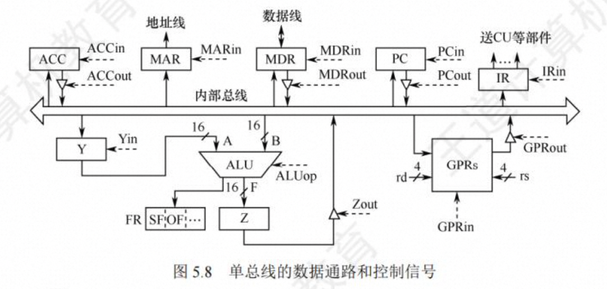

# 第 5 章 中央处理器

## CPU 的功能和基本结构

### CPU 的功能

中央处理器 (CPU)由运算器和控制器组成。其中，控制器的功能是负责协调并控制计算机 各部件执行程序的指令序列;运算器的功能是对数据进行加工。CPU 的具体功能包括:

1. 指令控制。完成取指令(也称取指)、分析指令和执行指令的操作，即程序的顺序控制。

2. 操作控制。产生完成一条指令所需的操作信号，把各种操作信号送到相应的部件，从而 控制这些部件按指令的要求正确执行。

3. 时间控制。严格控制各种操作信号的出现时间、持续时间及出现的时间顺序。

4. 数据加工。对数据进行算术和逻辑运算。

5. 中断处理。对运行过程中出现的异常情况和中断请求进行处理。

CPU 由数据通路和控制部件两大部分组成。

数据通路：将指令执行过程中数据所经过的路径，包括路径上的部件称为数据通路。ALU、通用寄存器、状态寄存器、cache、MMU、浮点运算逻辑、异常和中断处理逻辑等都是指令执行过程中数据流经的部件，都属于数据通路的一部分。通常将数据通路中专门进行数据运算的部件称为执行部件或功能部件。

控制部件：数据通路由控制部件进行控制。控制部件根据每条指令功能的不同生成对数据通路的控制信号，并正确控制指令的执行过程。

CPU 基本组成原理图：


（1）程序计数器（PC）：又称指令计数器或指令指针（IP），用来存放指令的地址。顺序执行 pc+1，需要改变执行顺序的时，由转移类指令形成转移地址送到 PC，作为下一条指令地址。

（2）指令寄存器（IR）：用以存放现行指令。上文提到，每条指令总是先从存储器去除后才能在 CPU 中执行，指令取出后存放在指令寄存器中，以便送指令译码器进行译码。

（3）指令译码器。对指令寄存器中的操作码部分进行分析解释，产生相应的译码信号，提供给操作控制信号形成部件。

（4）脉冲源及起停控制线路。脉冲源产生一定频率的脉冲信号作为整个机器的时钟脉冲，是 CPU 时序的基准信号。启停线路在需要时能保证可靠地开放或封锁时钟脉冲，控制时序信号的发生与停止，并实现对机器的启动与停机。

（5）时序信号产生部件。以时钟脉冲为基础，产生不同指令对应的周期、节拍、工作脉冲等信号、实现机器指令执行过程的时许控制。

（6）操作控制信号形成部件。综合时序信号、指令译码信号和执行部件反馈的状态标志等，形成不同指令所需要的操作控制信号序列。

（7）总线控制逻辑。实现对总线传输的控制，包括数据、地址信息和缓冲与三态控制。

（8）中断机构。实现对异常情况和某些外部中断请求的处理。

### CPU 的基本结构

在计算机系统中，CPU 主要由运算器和控制器两大部分组成**也可将 CPU 分为数据通路(见 5.3 节)和控制部件两大组成部分**

1.**运算器**

运算器主要由算术逻辑单元(ALU)、暂存寄存器、累加寄存器(ACC)、通用寄存器组(GPRs)、程序状态字寄存器(PSW)、移位寄存器、计数器(CT)等组成。其主要功能是根据控制器送来的命令，对数据执行算术运算(加、减、乘、除)、逻辑运算(与、或、非、异或、移位、求补等)或条件测试(用于设置 ZF、SF、OF 和 CF 等标志位，作为条件转移的判断条件)

2.**控制器**

控制器主要由程序计数器(PC)、指令寄存器(IR)、指令译码器(ID)、存储器地址寄存器(MAR)、存储器数据寄存器(MDR)、时序电路和微操作信号发生器等组成。其主要功能是执行指令，每条指令的执行是由控制器发出的一组微操作实现的。

控制器的工作原理是，根据指令操作码、指令的执行步骤(微命令序列)和条件信号来形成当前计算机各部件要用到的控制信号。计算机整机各硬件系统在这些控制信号的控制下协同运行，产生预期的执行结果。控制器是整个系统的指挥中枢，在控制器的控制下，运算器、存储器和输入/输出设备等功能部件构成一个有机的整体，根据指令的要求指挥全机协调工作

### CPU 的寄存器

一类是用户可见 寄存器，可对这类寄存器编程，以通过使用这类寄存器减少对 主存储器的访问次数，如通用寄存 器组(含基址/变址寄存器)、程序状态字寄存器、程序计数器 、累加寄存器、移位寄存器;另一 类是用户不可见寄存器，对用户是透明的，不可对这类寄存器编程，它们被控制部件使用，以控制 CPU 的操作，如存储器地址寄存器、存储器数据寄存器、指令寄存器、暂存寄存器。

1.  **运算器中的寄存器**

1.  运算器中的寄存器

1) 通用寄存器组(GPRs)。用于存放操作数(包括源操作数、目的操作数及中间结果)和各种地址信息等，如 AX、BX、CX、DX、SP 等。在指令中要指定寄存器的编号，才能明确是对哪个寄存器进行访问。SP 是堆栈指针，用于指示栈顶的地址。

2) 累加寄存器(ACC)。它是一个通用寄存器，用于暂时存放 ALU 运算的结果。

3) 移位寄存器(SR)。不但可用来存放操作数，而且在控制信号的作用下，寄存器中的数据可根据需要向左或向右移位。

4) 暂存寄存器。用于暂存从数据总线或通用寄存器送来的操作数，以便在取出下一个操作数时将其同时送入 ALU。暂存寄存器对应用程序员是透明的(不可见)。

5) 程序状态字寄存器(PSW)。保留由算术/逻辑运算指令或测试指令的运行结果而建立的各种状态信息，如溢出标志(OF)、符号标志(SF)、零标志(ZF)、进位标志(CF)等。每个标志位通常由一位触发器来保存，这些标志位组合在一起称为程序状态字。

2.**控制器中的寄存器**

1. 程序计数器(PC)。用于指出欲执行指令在主存储器中的存放地址。若 PC 和主存储器均按字节编址，则 PC 的位数等于主存储器地址位数。CPU 根据 PC 的内容从主存储器中取指令，然后送入指令寄存器。指令通常是顺序执行的，因此 PC 具有自动加 1 的功能(这里的“1”是指一条指令的字节数);当遇到转移类指令时，PC 的新值由指令计算得到。

2. 指令寄存器(IR)。用于保存当前正在执行的指令，IR 的位数等于指令字长。

3. 存储器地址寄存器(MAR)。用于存放要访问的主存储器单元的地址，MAR 的位数等于主存储器地址线数，它反映了最多可寻址的存储单元的个数。

4. 存储器数据寄存器(MDR)。用于存放向主存储器写入的信息或从主存储器读出的信息，MDR 的位数等于存储字长。当 CPU 和主存储器交换信息时，都要用到 MAR 和 MDR


## CPU 执行过程


### 指令周期

指令按顺序存放在内存连续单元中，指令地址由 PC 给出。CPU 每取出并执行一条指令所需的全部时间称为**指令周期**，不同指令的指令周期可能不同。 指令周期通常可用若干机器周期来表示，每个指令周期内的机器周期数可以不等。

一个完整的指令周期包括取指、间址、执行和中断

CPU 执行一条指令的大致过程如下：

（1）取指令并计算下一条指令地址。

（2）对指令操作码译码。

（3）计算源操作数地址并取源操作数。

（4）数据操作。

（5）目的操作数地址计算并存结果。

每条指令指令的功能总是由以下 4 种基本操作来实现。

（1）读取某个存储单元内容（可能是指令或操作数或操作数地址），并将其装入某个寄存器。

（2）把一个数据从某个寄存器存入给定的寄存器单元中。

（3）把一个数据从某个寄存器送到另一个寄存器或者 ALU 输入端。

（4）进行某种算术运算或逻辑运算，将结果送入某个寄存器。

当 CPU 执行指令时，首先进入取指周期，从 PC 指出的主存单元中取出指令，送至指令寄 存器，同时 PC 加“ 1” 以作为下一条指令的地址。当遇到转移指令等改变执行顺序的指令时，在 PC 加“1” 后会重新计算并更新 PC 值。然后判断是否有间接寻址，如果有，那么进入间址 周期以获取操作数的有效地址。之后进入执行周期，完成取操作数、执行运算和存操作数的任务。执行周期结束后，如果 CP U 检测到中断请求，则进入中断周期，此时需要关中断、保存断 点、修改 PC 值为中断服务程序的入又地址，并转向中断服务程序。


寄存器传送语言（RTL）

（1）用 R[r] 表示寄存器堆中寄存器 r 的内容

（2）用 M[addr] 表示读取存储单元 addr 的内容。

（3）传送方向用〈- 表示，传送源在右，传送目的在左。

（4）程序计数器 PC 直接用 PC 表示内容。


### 指令周期的数据流

1. 取指周期

取指周期的任务是根据 PC 中的内容从主存中取出指令代码并存放在 IR 中。

2. 间址周期

间址周期的任务是取操作数有效地址

3. 执行周期

执行周期的任务是取操作数，并根据 IR 中的指令字的操作码通过 ALU 操作产生执行结果。 不同指令的执行周期操作不同，因此没有统一的数据流向

4. 中断周期

中断周期的任务是处理中断请求。

### 指令执行方案

1. 单周期处理器

单周期处理器对所有指令都选用相同的执行时间来完成。此时每条指令都在 一个时钟周期内完成(即 CPI= 1)，指令之间串行执行，即下一条指令只能在前一条指令执行结束后才能启动。因此，指令周期取决于**执行时间最长**的指令的执行时间。对于那些本来可以在更短时间内完成的 指令，仍要使用这个较长的周期来完成，会降低整个系统的运行速度。

2. 多周期处理器

多周期处理器对不同类型的指令选用不同的执行步骤。指令需要几个周期就为其分配几个周 期，因此可选用不同个数的时钟周期来完成不同指令的执行过程(即 CPI >1)，不再要求所有指 令占用相同的执行时间。多指令周期方案中指令之间仍是串行执行

3. 流水线处理器

流水线处理器采用指令之间并行执行的方案，其追求的目标是力争在每个时钟周期完成 一条 指令的执行过程(只在理想情况下才能达到该效果，此时 CPI= 1)。这种方案通过在每个时钟周 期启动 一条指令，尽量让多条指令同时运行，但各自处在不同的执行步骤中

## 数据通路的功能和基本结构

CPU 可视为数据通路和控制部件两大部分组成

### 数据通路的功能

数据在指令执行过程中所经过的路径，包括路径上的部件，称为**数据通路**，ALU、通用寄存器 、状态寄存器、异常和中断处理逻辑等都是指令执行时数据流经的部件，都属于数据通路的一部分。数据通路描述了信息从哪里开始，中间经过哪些部件，最后被传送到哪里。数据通路由**控制部件**控制，控制部件根据每条指令功能的不同，生成对数据通路的控制信号。

### 数据通路的组成

组成数据通路的元件主要分为**组合逻辑元件**和**时序逻辑元件**两类。

1. **组合逻辑元件（操作元件）**

任何时刻产生的输出仅取决于**当前的输入**。**组合电路不含存储信息的记忆单元**，也不受时钟信号的控制，输出与输入之间无反馈通路，信号是单向传输的。数据通路中常用的组合逻辑元件有**加法器、算术逻辑单元(ALU)、译码器、多路选择器、三态门**等

2. **时序逻辑（状态元件）**

任何时刻的输出不仅与该时刻的输入有关，还与该时刻以前的输入有关，因而时序电路**必然包含存储信号的记忆单元** 。此外 ，时序电路必须在时钟节拍下工作。各类寄存器和存储器，**如通用寄存器组、程序计数器、状态/移位/暂存/锁存寄存器等**，都属于时序逻辑元件。

### 数据通路的基本结构

1. **数据通路与时序控制**

1）早期计算的三级时序系统

机器周期、节拍和脉冲三级时序对数据通路进行定时控制。

2）现代计算机的时钟信号

整个数据通路中的定时信号就是时钟，**一个时钟周期就是一个节拍**。

2. **CPU 内部总线方式**

将 ALU 及所有寄存器都连接到一条内部公共总线上，称为单总线结构的数据通路。这种结 构比较简单，但数据传输存在较多的冲突现象，性能较低。此总线在 CPU 内部，注意不要把它与 连接 CPU、存储器和外设的系统总线相混淆。


> 单周期处理器(CPI=1)不能采用单总线方式，因为单总线将所有寄存器都连接到一条公共总线上，一个时钟内只允许一次操作，无法完成一条指令的所有操作。

3. **CPU 内部总线方式**

CPU 内部有两条或更多的总线时，构成双总线结构或多总线结构。将所有寄存器的输入端和 输出端都连接到多条公共通路上，相比之下单总线中 一个时钟内只允许传送 一个数据，因而指令执行效率很低，因此采用多总线方式，同时在多个总线上传送不同的数据，提高效率。

4. **专用数据通路方式**

根据指令执行过程中的数据和地址的流动方向安排连接电路 ，避免使用共享的总线，性能较高，但硬件量大

> 内部总线是指同一部件，如 CPU 内部连接各寄存器及运算部件之间的总线;系统总线 是指同一台计算机系统的各部件，如 CPU、内存和各类 1/ O 接又间互相连接的总线

## 数据通路的操作举例

通用寄存器对程序员是可见的 而 CPU 临时存储数据的寄存器对程序员不可见。
单总线 CPU 结构中，完成指令执行的 4 种基本操作

1. **在通用寄存器之间传送数据**

在寄存器和总线之间有两个控制信号:Rin 和 Rout。当 Rin 有效时，控制将总线上的信息存 到寄存器 R 中;当 Rout 有效时，控制将寄存器 R 的内容送至总线

2. **从主存读取数据**

从主存中读取的信息可能是数据或指令，现以 CPU 从 主存中取指令为例，说明数据在单总线数据通路中的传送过程

```c++
(PC) ->MAR.                      // PCout 和MARi n 有效，现行指令地址一MAR
MEM (MAR) ->MDR, (PC) +1-PC      // MDRin有效，cU发出读命令，取出指令后PC+1
(MDR) →IR                        // MDRout 和IRin有效，现行指令一IR
```

3. **数据写入主存**

将寄存器 RI 的内容写入寄存器 R2 所指的主存单元，

```c++
(R1)-> MDR           // R1out和MDRin有效
(R2)-> MAR           // R2out和MARin有效
MDR->MEM(MAR)        // MDRout有效，CU发出写命令
```

4. **执行算数或逻辑运算**

在单总线数据通路中，每一时刻总线上只有一个数据有效。由于 ALU 是一个没有存储功能的组合逻辑元件，在其执行运算时必须保持两个输入端同时有效，因此先将一个操作数经内部总线送入暂存器 Y 保存，Y 的内容在 ALU 的左输入端始终有效，再将另一个操作数经内部总线直接送到 ALU 的右输入端。此外，ALU 的输出端也不能直接与总线相连，否则其输出会通过总线反馈到输入端，影响运算结果，因此将运算结果暂存在暂存器 Z 中。

```c++
(R1) ->Y                   // R1out 和Yin有效，操作数一>Y
(ACC)+ (Y)-> Z             // ACCout 和ALUi n有效，CU向ALU发出加命令，结果一>2
(Z) → ACC                  // Z o u t 和 A C C i n 有 效 ， 结 果 一>A C C
```

5. **修改程序计数器的值**

转移指令通过修改程序计数器 PC 的值来达到转跳的目的。假设转移指令 JMP addr, addr 內 目标转移地址，实现将 IR 中的地址字段写入 PC，完成该操作的流程及控制信号为

```c++
Ad(IR) -> PC
```

### 数据通路的设计

理想存储器有一个 32 位数据输入端 DataIn；一个 32 位数据输出端 DataOut；还有一个读写公用的地址输入端 Address。控制信号有一个写使能信号 WE，写操作受时钟信号 Clk 的控制。

1. **算术逻辑部件的设计**


2. **取指令部件的设计**

每条指令的第一步都是去指令并计算下一条指令地址的功能。

3. **R-型指令的数据通路**

4. **立即数运算指令的数据通路**

5. **Load/Store 指令的数据通路**

6. **分支指令的数据通路**

7. **无条件转移指令的数据通路**

8. **综合 11 条指令的完整数据通路**

### 控制逻辑单元的设计

控制单元只要包含指令译码器，其输入的是指令操作码 op，输出的是控制信号。控制单元设计过程如下：

（1）根据每条指令的功能，分析控制信号的取值，并在表中列出。

（2）根据列出的指令和控制信号的关系，写出每个控制信号的逻辑表达式。

1. **控制信号取值分析**

2. **控制单元设计**

### 时钟周期的确定

计算机性能（即程序执行速度）由 3 个关键因素决定：指令树木、时钟周期和 CPI。其中指令数目由编译器和指令集决定，而时钟周期和 CPI 由处理器的设计与实现决定。

#### 硬连线路控制器设计

硬连线路控制器速度快，适合简单或规整的指令系统，例如 MIPS 指令集。但是，由于它是一个多输入/多输出的巨大逻辑网络，对于复杂指令系统来说，则对应的硬连线路控制器结构庞杂，实现困难，维护不易，扩充和修改指令相当困难。

### 微程序控制器设计

复杂指令采用微程序方式来设计控制器
基本思想：仿照程序设计方法，将每条指令的执行过程用一个微程序来表示，每个微程序由若干微指令组成，每条为指令相当于有限状态机中的一个状态。所有指令对应的微程序都存放在爱一个 ROM 中，这个 ROM 称为控制存储器，简称控存。在微程序控制器下执行指令，CPU 从控存中取出每条指令对应的微程序，在时钟的控制下，按照一定的顺序执行微程序中的每条指令。通常一个时钟周期执行一条微指令。

#### 微程序控制器的结构

微操作：一条指令的功能通过执行一系列基本操作来完成，这些基本操作称为微操作。
每个微操作在相应控制信号的控制下执行，这些控制信号在微程序中称为微命令。

#### 微指令编码

1.直接控制法 2.字段直接编码法 3.字段间接编码法 4.最少（最短、垂直）编码法

#### 微指令地址的确定

1.计数器法

2.断定法


#### 微程序控制单元的设计


### 异常和中断

#### 基本概念

1. 内部异常
   ˙ 指由处理器内部异常引起的意外事件。分为硬故障中断和程序性异常。故障中断是由硬连线路出现异常引起的，如电源掉电，存储器线路错等。程序性异常也称为软中断，是由 CPU 执行某条指令而引起的发生在处理器内部的异常事件，也称为例外。如整除 0、溢出、断点、单步跟踪、访问超时、非法操作码、栈溢出、缺页、地址越界等。
   内部异常分为故障、自陷和终止。
   1）故障
   也称为失效，它是在引起故障后的指令启动后，执行结束前被剪检测到的一类异常事件。
   2）自陷
   自陷也称为陷阱或陷入，与故障等其他意外发生的异常事件不同，是预先安排的一种“异常”时间，就像预先设定的“陷阱”一样，首先通过某种方式将 CPU 设定位处于某个特定状态，在程序执行过程中，一旦某条指令的执行发生了相应状态所满足的条件，则 CPU 调用特定的程序进行相应的处理。
   通常的做法是：事先在程序中用一条特殊指令或通过某种方式设定特殊控制标志来认为设置一个“陷阱”，当执行到被设置了“陷阱”的指令时，CPU 在执行完自陷指令后，自动根据不同“陷阱”类型进行相应的处理，然后返回到自陷指令的下一条指令执行。注意，当自陷指令是转移指令时，并不能返回到下一条指令执行，而是返回到转移目标指令执行。
   系统调用指令、条件自陷指令都属于陷阱指令，执行到这些指令时，无条件或有条件地自动调出操作系统内核程序进行执行。
   3）终止
   如果在执行指令过程中发生了使机器无法继续执行的硬件故障，如电源掉线、线路故障等，则程序将无法继续执行，只好终止，此时，调出中断服务程序来重启系统。这种异常与故障和自陷不同，不是由特定指令产生的，而是随机发生的。
2. 外部中断
   程序执行过程中，若外设完成任务或发生呕血特殊事件（如打印机缺纸，定时采样计数时间到，键盘缓冲满等），会向 CPU 发生中断请求，要求 CPU 对这些情况进行处理，通常，每条指令执行完后，CPU 都会主动查询有没有中断请求，有的话，则下一条指令地址作为断点保存，然后转到相应的中断服务程序执行，结束后回到断电继续执行。
   这种事件与执行的指令无关，由 CPU 外部的 I/O 发出，所以，称为 I/O 中断或外部中断，需要通过外部中断请求线向 CPU 请求。

CPU 内部事件称为异常，而将外部中断事件称为中断。

### 异常处理过程

保存断点和程序状态，识别异常事件并转异常处理。

1. 保存断点和程序状态
   大多数处理器将断点保存在栈中，也可以保存在特定的寄存器中。
   因为异常处理后可能还要回到原被中断的程序继续执行，所以，被中断时原程序的状态（如产生的各种标志信息、允许自陷标志等）都必须保存起来。通常为每个正在运行程序的状态信息存放在一个专门的寄存器中，这个专门寄存器统称为程序状态字寄存器（PSWR），存放在 PSWR 中的信息称为程序状态字（PSW）
2. 识别异常事件并转异常处理
   在调出异常处理程序前，必须知道发生了什么异常。一般来说，内部异常事件和外部中断源的识别方式不同，大多数处理器会将两者分开来处理。内部异常事件的识别大多采用软件识别方式，而外部中断源则可以采用软件识别或硬件识别方式。

软件识别方式：CPU 设置一个异常状态寄存器，用于记录异常原因。操作系统使用一个统一的异常查询程序，该程序按一定的优先级顺序查询异常状态寄存器，先查询到的异常先被处理。

由于外部中断的发生与 CPU 正在执行的指令没有必然联系，相对于指令来说，外部中断是随机的，与当前执行指令无关的，所以并不能根据指令执行过程中的某些现象来判断是否发生了中断请求。因此，对于外部中断，只能在每条指令执行完后，取下一条指令之前取查询是否有中断请求。通常 CPU 通过采样对应的中断请求引脚线来进行查询

#### 带异常处理的处理器设计
