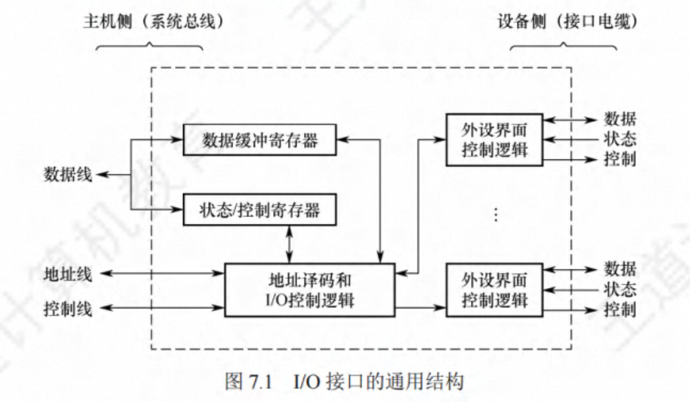

# 第 7 章 输入/输出系统

## I/O 接口

I/O 接口(也称 I/O 控制器)是主机和外设之间的交接界面，通过接口可以实现主机和外设之间的信息交换

### I/O 接口的功能

1. **进行地址译码和设备选择**。CPU 送来选择外设的地址码后，接口必须对地址进行译码以 产生设备选择信息，使主机能和指定外设交换信息。

2. **实现主机和外设的通信联络控制**。解决主机与外设时序配合问题，协调不同 工作速度的 外设和主机之间交换信息，以保证整个计算机系统能统一、协调地工作。

3. **实现数据缓冲**。CPU 与外设之间的速度往往不匹配，为消除速度差异，接口必须设置数 据缓冲寄存器，用于数据的暂存，以避免因速度不 一致而丢失数据。

4. **信号格式的转换**。外设与主机两者的电平、数据格式都可能存在差异，接口应提供主机与外设的信号格式的转换功能，如电平转换、并/串或串/并转换、模/数或数/模转换等。

5. **传送控制命令和状态信息**。CPU 要启动某外设时，通过接口中的命令寄存器向外设发出启动命令;外设准备就绪时，则将“准备好”状态信息送回接口中的状态寄存器，并反馈给 CPU。外设向 CPU 提出中断请求时，CPU 也应有相应的响应信号反馈给外设

### I/O 接口的基本结构

> I/O 端口与 CPU 交换的内容

I/O 接口在主机侧通过 1/O 总线与内存、CPU 相连。数据缓冲寄存器用来暂存与 CPU 或内存之间传送的数据信息，状态寄存器用来记录接口和设备的状态信息，控制寄存器用来保存 CPU 对外设的控制信息。状态寄存器和控制寄存器在传送方向上是相反的，在访问时间上也是错开的，因此可将它们合二为 一

> I/O 接口的数据线上传输的内容

I/O 接口中的数据线传送的是**读/写数据、状态信息、控制信息和中断类型号**。地址线传送的是要访问 I/O 接口中的**寄存器的地址**。控制线传送的是**读/ 写控制信号**，以确认是读寄存器还是写寄存器，此外控制线还会传送**中断请求和响应信号、仲裁信号和握手信号**。

数据缓冲寄存器、状态/控制寄存器的访问操作是通过相应的指令来完成的，通常称这类指 令为 I/O 指令，I/O 指令只能在操作系统内核的底层 I/O 软件中使用，它们是一种特权指令。

### I/O 接口的类型

从不同的角度看，I/O 接口可以分为不同的类型。

1. 按数据传送方式(外设和接口 一侧)，可分 并行接口(一字节或 一个字的所有位同时传 送)和串行接口(一位 一位地有序传送)，接口要完成数据格式的转换。

2. 按主机访问 I/ O 设备的控制方式，可分为程序查询接口、中断接口和 DMA 接口等。

3. 按功能选择的灵活性，可分为可编程接口(通过编程改变接口功能)和不可编程接口。

### I/O 端口及其编址

I/O 端口是指 I/0 接口电路中可被 CPU 直接访问的寄存器，主要有数据端口、状态端口和控 制端口。

> 端口和接口是两个不同的概念，端口是指接口电路中可以进行读/写的寄存器。

I/O 端口要想能够被 CPU 访问，就必须要对各个端口进行编址，每个端口对应一个端口地址。而对 I/O 端口的编址方式有与存储器独立编址和统一编址两种。

1. 独立编址

独立编址也称 I/O 映射方式，是指对所有的 I/O 端口单独进行编址。I/O 端口的地址空间与主存地址空间是两个独立的地址空间，它们的范围可以重叠，相同地址可能属于不同的地址空间。因此需设置专门的 I/O 指令来表明访问的是 I/O 地址空间，I/O 指令的地址码给出 1/O 端口号。

2. 统一编址

统一编址也称存储器映射方式，是指把主存地址空间分出一部分给 I/O 端口进行编址，I/0 端口和主存单元在同一地址空间的不同分段中，根据地址范围就能区分访问的是 I/O 端口还是主存单元，因此无须设置专门的 I/O 指令，用统一的访存指令就可访问 1/O 端口。
