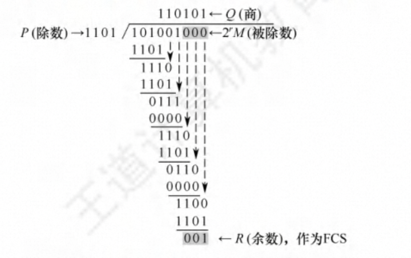

# 第 3 章 数据链路层

## 数据链路层的功能

有三个基本问题则是共同的，即封装成帧、透明传输和差错检测。

数据链路层使用的信道主要有两种:

1️⃣ 点对点信道，使用一对一的通信方式。PPP协议则是目前使用最广泛的点对点协议。

2️⃣ 广播信道，这种信道上连接的主机很多，使用 一对多的广播通信方式。采用共享广播信 道的有线局域网普遍使用CSMA/CD协议，而无线局域网则使用CSMA/CA协议。

1. 数据链路层所处的地位

链路、数据链路、帧

2. 链路管理

数据链路层连接的建立、维持和释放过程称力链路管理

3. 封装成帧与透明传输

4. 为网络层提供服务

5. 流量控制

6. 差错检测

## 组帧

发送方依据一定的规则将网络层递交的分组封装成帧(也称组帧)。组帧主要解决帧定界、帧同步、透明传输等问题。

### 字符计数法

字符计数法是指在帧首部使用一个计数字段来记录该帧所含的字节数(包括计数字段自身所占用的1个字节)

### 字节填充法

控制字符SOH放在帧的最前面，表示帧的开始，控制字符EOT表示帧的结束。在特殊字符之前填充一个转义字符ESC来加以区

### 零比特填充法

使用一个特定的比特串01111110来标志一帧的开始和结束，每遇到5个连续的“1”，就自动在其后插入一个“0”。

### 违规编码法

在物理层进行比特编码时，常采用违规编码法。例如，曼彻斯特编码方法将数据比特“ 1” 编码成“高-低” 电平对，将数据比特 “0” 编码成“ 低-高” 电平对，而“高-高” 电平对和“低 - 低” 电平对在数据比特中是违规的(即没有采用)，因此可借用这些违规编码序列来定界帧的起 始和终止。  

## 差错控制

### 检错编码

1. **奇偶检验码**

它由n- 1位数据和1位检验位组成，检验位的取值(0或1)将使整个检验码中“1” 的个数为奇数或偶数。

例如，7 位数据1001101 对应的奇检验码 10011011，对应的偶检验码 10011012

2. **循环冗余码**

又由多项式生成位串，原数据补多项式最高次个0 将位串与数据进行逻辑异或运算（同0异1）

> 循环冗余码 (CRC )是具有纠错功能的，只是数 据链路层仅使用 了它的检错功能

### 纠错编码

最常见的纠错编码是*海明码*，其实现原理是在有效信息位中加入几个检验位形成海 明码，并 把海明码的每个二进制位分配到几个奇偶检验组中