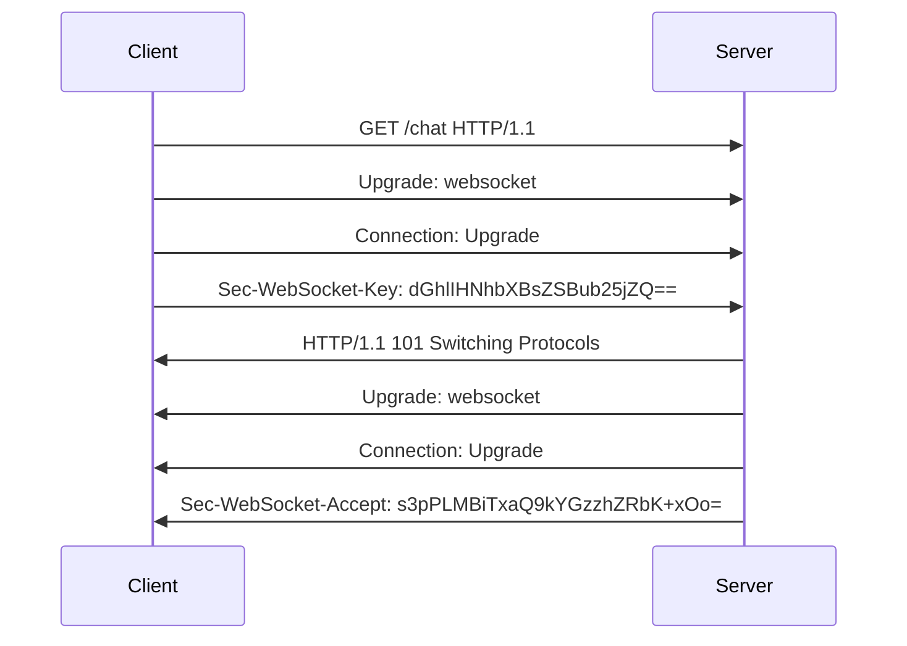
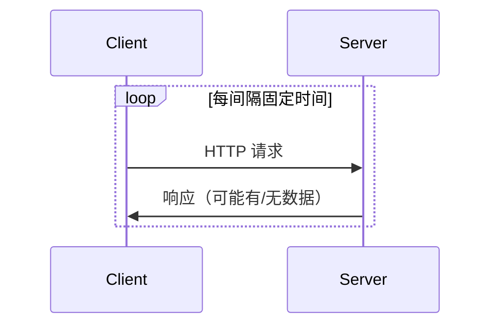
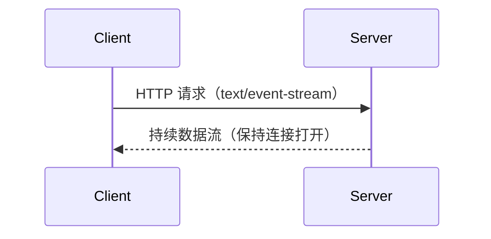

# WebSocket 深度解析

## 核心思想与协议特性

**WebSocket** 是一种基于 TCP 的**全双工通信协议**（RFC 6455 标准），通过单个持久连接实现客户端与服务端的**双向实时数据流动**。与 HTTP 的"一问一答"模式不同，WebSocket 建立连接后，双方可随时主动发送数据。

特点：
1. **持久化连接**：单次握手建立持续连接（HTTP 101 状态码切换协议）
2. **低延迟通信**：消息帧最小仅需 2 字节头部
3. **双向通道**：服务端可主动推送数据
4. **协议升级**：基于 HTTP 握手，后续使用独立帧协议
5. **跨域支持**：同源策略外延，客户端可以与任意服务器通信
6. **协议标识**：ws（如果加密，则为wss）

### 协议背景

在过去，创建需要客户端和服务器之间双向通信的 Web 应用程序（例如即时通讯和游戏应用）时，不得不滥用 HTTP 协议，通过轮询服务器获取更新，同时通过独立的 HTTP 调用发送上行通知 。

这种方式导致了多个问题：

1. 连接资源浪费

服务器必须为每个客户端使用多个不同的 TCP 连接：一个用于向客户端发送信息、每个传入消息都需要新建连接

2. 协议开销大

线路协议开销很大，每个客户端到服务器的消息都需要包含 HTTP 头。

3. 复杂的状态维护

客户端脚本被迫维护从传出连接到传入连接的映射，以跟踪回复。


### 协议视图

客户端发起包含特定Header的HTTP请求client handshake:
```js
 GET /chat HTTP/1.1
        Host: server.example.com
        Upgrade: websocket
        Connection: Upgrade
        Sec-WebSocket-Key: dGhlIHNhbXBsZSBub25jZQ==
        Origin: http://example.com
        Sec-WebSocket-Protocol: chat, superchat
        Sec-WebSocket-Version: 13
```

服务器验证请求后返回协议切换响应server handshake:
```js
  HTTP/1.1 101 Switching Protocols
        Upgrade: websocket
        Connection: Upgrade
        Sec-WebSocket-Accept: s3pPLMBiTxaQ9kYGzzhZRbK+xOo=
        Sec-WebSocket-Protocol: chat
```
**关键Header说明：**
 - `Upgrade: websocket`：声明协议升级类型
 - `Connection: Upgrade`：指示需要升级连接
 - `Sec-WebSocket-Key`：16字节随机Base64编码值（重要安全凭证）
 - `Sec-WebSocket-Version`：指定协议版本（必须为13）
 - `Sec-WebSocket-Protocol`：可选子协议协商

### 握手流程



## 通信机制对比

### 1. 轮询（Polling）

特点：

 - 实现简单但效率低下
 - 典型延迟 = 轮询间隔时间
 - 高并发场景下服务器压力大

### 2. SSE（Server-Sent Events）

