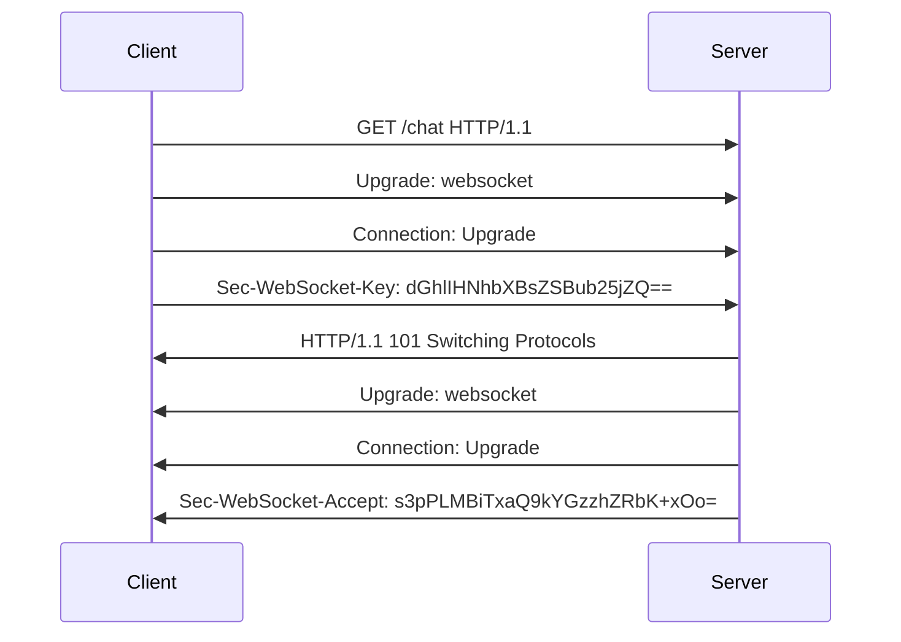
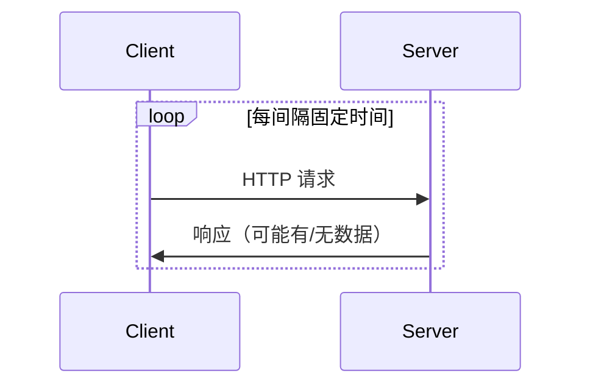
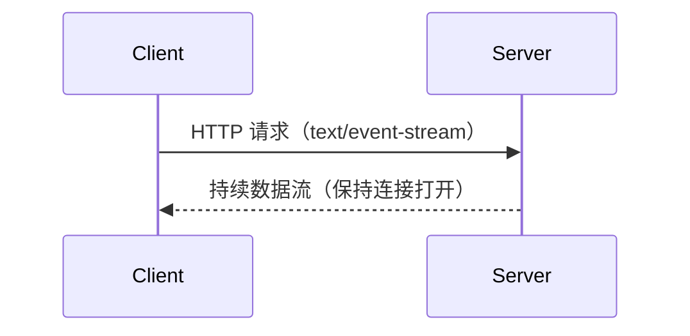

# WebSocket 深度解析

## 核心思想与协议特性

**WebSocket** 是一种基于 TCP 的**全双工通信协议**（RFC 6455 标准），通过单个持久连接实现客户端与服务端的**双向实时数据流动**。与 HTTP 的"一问一答"模式不同，WebSocket 建立连接后，双方可随时主动发送数据。

特点：
1. **持久化连接**：单次握手建立持续连接（HTTP 101 状态码切换协议）
2. **低延迟通信**：消息帧最小仅需 2 字节头部
3. **双向通道**：服务端可主动推送数据
4. **协议升级**：基于 HTTP 握手，后续使用独立帧协议
5. **跨域支持**：同源策略外延，客户端可以与任意服务器通信
6. **协议标识**：ws（如果加密，则为wss）

### 协议背景

在过去，创建需要客户端和服务器之间双向通信的 Web 应用程序（例如即时通讯和游戏应用）时，不得不滥用 HTTP 协议，通过轮询服务器获取更新，同时通过独立的 HTTP 调用发送上行通知 。

这种方式导致了多个问题：

1. 连接资源浪费

服务器必须为每个客户端使用多个不同的 TCP 连接：一个用于向客户端发送信息、每个传入消息都需要新建连接

2. 协议开销大

线路协议开销很大，每个客户端到服务器的消息都需要包含 HTTP 头。

3. 复杂的状态维护

客户端脚本被迫维护从传出连接到传入连接的映射，以跟踪回复。


### 协议视图

客户端发起包含特定Header的HTTP请求client handshake:
```js
 GET /chat HTTP/1.1
        Host: server.example.com
        Upgrade: websocket
        Connection: Upgrade
        Sec-WebSocket-Key: dGhlIHNhbXBsZSBub25jZQ==
        Origin: http://example.com
        Sec-WebSocket-Protocol: chat, superchat
        Sec-WebSocket-Version: 13
```

服务器验证请求后返回协议切换响应server handshake:
```js
  HTTP/1.1 101 Switching Protocols
        Upgrade: websocket
        Connection: Upgrade
        Sec-WebSocket-Accept: s3pPLMBiTxaQ9kYGzzhZRbK+xOo=
        Sec-WebSocket-Protocol: chat
```
**关键Header说明：**
 - `Upgrade: websocket`：声明协议升级类型
 - `Connection: Upgrade`：指示需要升级连接
 - `Sec-WebSocket-Key`：16字节随机Base64编码值（重要安全凭证）
 - `Sec-WebSocket-Version`：指定协议版本（必须为13）
 - `Sec-WebSocket-Protocol`：可选子协议协商

### 握手流程



## 具体实现

### 基础类型
```ts
// src/core/websocket/types.ts

/**
 * 消息类型枚举
 */
export enum MessageType {
  HEARTBEAT = 'HEARTBEAT',     // 心跳消息
  ACK = 'ACK',                 // 确认消息
  DATA = 'DATA',               // 数据消息
  RECONNECT = 'RECONNECT'      // 重连消息
}

/**
 * 消息状态枚举
 */
export enum MessageStatus {
  PENDING = 'PENDING',         // 待发送
  SENT = 'SENT',              // 已发送
  DELIVERED = 'DELIVERED',     // 已送达
  FAILED = 'FAILED'           // 发送失败
}

/**
 * 消息接口
 */
export interface Message {
  id: string;                  // 消息ID
  type: MessageType;           // 消息类型
  data?: any;                  // 消息数据
  timestamp: number;           // 时间戳
  retry?: number;             // 重试次数
}

/**
 * 消息队列项接口
 */
export interface QueueItem {
  message: Message;
  status: MessageStatus;
  timestamp: number;
  retries: number;
}

/**
 * WebSocket配置接口
 */
export interface WSConfig {
  url: string;                 // WebSocket连接地址
  heartbeatInterval: number;   // 心跳间隔(ms)
  reconnectInterval: number;   // 重连间隔(ms)
  maxRetries: number;         // 最大重试次数
  ackTimeout: number;         // ACK超时时间(ms)
}

```

### 消息队列

```ts
// src/core/websocket/MessageQueue.ts

/**
 * 消息队列管理
 */
export class MessageQueue {
  private queue: Map<string, QueueItem> = new Map();
  private persistentStorage: Storage;

  constructor() {
    this.persistentStorage = window.localStorage;
    this.loadPersistedQueue();
  }

  /**
   * 添加消息到队列
   */
  add(message: Message): void {
    const queueItem: QueueItem = {
      message,
      status: MessageStatus.PENDING,
      timestamp: Date.now(),
      retries: 0
    };
    this.queue.set(message.id, queueItem);
    this.persistQueue();
  }

  /**
   * 更新消息状态
   */
  updateStatus(messageId: string, status: MessageStatus): void {
    const item = this.queue.get(messageId);
    if (item) {
      item.status = status;
      if (status === MessageStatus.DELIVERED) {
        this.queue.delete(messageId);
      }
      this.persistQueue();
    }
  }

  /**
   * 获取待发送的消息
   */
  getPendingMessages(): QueueItem[] {
    return Array.from(this.queue.values())
      .filter(item => item.status === MessageStatus.PENDING);
  }

  /**
   * 持久化队列
   */
  private persistQueue(): void {
    const data = Array.from(this.queue.entries());
    this.persistentStorage.setItem('messageQueue', JSON.stringify(data));
  }

  /**
   * 加载持久化的队列
   */
  private loadPersistedQueue(): void {
    const data = this.persistentStorage.getItem('messageQueue');
    if (data) {
      const queue = new Map<string, QueueItem>(JSON.parse(data));
      this.queue = queue;
    }
  }
}

```

### ws链接

```ts
// src/core/websocket/ReliableWebSocket.ts

export class ReliableWebSocket extends EventEmitter {
  private ws: WebSocket | null = null;
  private messageQueue: MessageQueue;
  private heartbeatTimer: NodeJS.Timeout | null = null;
  private reconnectTimer: NodeJS.Timeout | null = null;
  private ackTimeouts: Map<string, NodeJS.Timeout> = new Map();
  private connected: boolean = false;
  private connecting: boolean = false;

  constructor(private config: WSConfig) {
    super();
    this.messageQueue = new MessageQueue();
    this.connect();
  }

  /**
   * 建立WebSocket连接
   */
  private connect(): void {
    if (this.connected || this.connecting) return;

    this.connecting = true;
    this.ws = new WebSocket(this.config.url);

    this.ws.onopen = this.handleOpen.bind(this);
    this.ws.onclose = this.handleClose.bind(this);
    this.ws.onmessage = this.handleMessage.bind(this);
    this.ws.onerror = this.handleError.bind(this);
  }

  /**
   * 连接建立处理
   */
  private handleOpen(): void {
    this.connected = true;
    this.connecting = false;
    
    // 开始心跳
    this.startHeartbeat();
    
    // 重发未确认的消息
    this.resendPendingMessages();
    
    this.emit('connected');
  }

  /**
   * 连接关闭处理
   */
  private handleClose(): void {
    this.connected = false;
    this.connecting = false;
    this.stopHeartbeat();
    this.scheduleReconnect();
    this.emit('disconnected');
  }

  /**
   * 消息处理
   */
  private handleMessage(event: MessageEvent): void {
    try {
      const message: Message = JSON.parse(event.data);
      
      switch (message.type) {
        case MessageType.ACK:
          this.handleAck(message);
          break;
        case MessageType.HEARTBEAT:
          this.handleHeartbeat(message);
          break;
        case MessageType.DATA:
          this.handleData(message);
          break;
      }
    } catch (error) {
      console.error('Failed to parse message:', error);
    }
  }

  /**
   * 错误处理
   */
  private handleError(error: Event): void {
    console.error('WebSocket error:', error);
    this.emit('error', error);
  }

  /**
   * 发送消息
   */
  public send(data: any): string {
    const message: Message = {
      id: this.generateId(),
      type: MessageType.DATA,
      data,
      timestamp: Date.now()
    };

    this.messageQueue.add(message);

    if (this.connected) {
      this.sendMessage(message);
    }

    return message.id;
  }

  /**
   * 发送消息并设置ACK超时
   */
  private sendMessage(message: Message): void {
    if (!this.ws || this.ws.readyState !== WebSocket.OPEN) return;

    try {
      this.ws.send(JSON.stringify(message));
      this.messageQueue.updateStatus(message.id, MessageStatus.SENT);
      this.setAckTimeout(message);
    } catch (error) {
      console.error('Failed to send message:', error);
      this.messageQueue.updateStatus(message.id, MessageStatus.FAILED);
    }
  }

  /**
   * 设置ACK超时处理
   */
  private setAckTimeout(message: Message): void {
    const timeout = setTimeout(() => {
      if (this.messageQueue.getPendingMessages().find(m => m.message.id === message.id)) {
        this.handleMessageTimeout(message);
      }
    }, this.config.ackTimeout);

    this.ackTimeouts.set(message.id, timeout);
  }

  /**
   * 处理消息超时
   */
  private handleMessageTimeout(message: Message): void {
    const queueItem = this.messageQueue.getPendingMessages()
      .find(m => m.message.id === message.id);

    if (queueItem && queueItem.retries < this.config.maxRetries) {
      queueItem.retries++;
      this.sendMessage(message);
    } else {
      this.messageQueue.updateStatus(message.id, MessageStatus.FAILED);
      this.emit('messageFailed', message);
    }
  }

  /**
   * 处理ACK消息
   */
  private handleAck(ackMessage: Message): void {
    const messageId = ackMessage.data.messageId;
    const timeout = this.ackTimeouts.get(messageId);
    
    if (timeout) {
      clearTimeout(timeout);
      this.ackTimeouts.delete(messageId);
    }

    this.messageQueue.updateStatus(messageId, MessageStatus.DELIVERED);
    this.emit('messageDelivered', messageId);
  }

  /**
   * 开始心跳
   */
  private startHeartbeat(): void {
    this.heartbeatTimer = setInterval(() => {
      if (this.connected) {
        this.sendHeartbeat();
      }
    }, this.config.heartbeatInterval);
  }

  /**
   * 停止心跳
   */
  private stopHeartbeat(): void {
    if (this.heartbeatTimer) {
      clearInterval(this.heartbeatTimer);
      this.heartbeatTimer = null;
    }
  }

  /**
   * 发送心跳消息
   */
  private sendHeartbeat(): void {
    const heartbeat: Message = {
      id: this.generateId(),
      type: MessageType.HEARTBEAT,
      timestamp: Date.now()
    };

    this.sendMessage(heartbeat);
  }

  /**
   * 处理心跳响应
   */
  private handleHeartbeat(message: Message): void {
    // 发送心跳ACK
    const ack: Message = {
      id: this.generateId(),
      type: MessageType.ACK,
      data: { messageId: message.id },
      timestamp: Date.now()
    };

    this.sendMessage(ack);
  }

  /**
   * 处理数据消息
   */
  private handleData(message: Message): void {
    // 发送数据消息ACK
    const ack: Message = {
      id: this.generateId(),
      type: MessageType.ACK,
      data: { messageId: message.id },
      timestamp: Date.now()
    };

    this.sendMessage(ack);
    this.emit('message', message.data);
  }

  /**
   * 安排重连
   */
  private scheduleReconnect(): void {
    if (this.reconnectTimer) return;

    this.reconnectTimer = setTimeout(() => {
      this.reconnectTimer = null;
      this.connect();
    }, this.config.reconnectInterval);
  }

  /**
   * 重发待处理消息
   */
  private resendPendingMessages(): void {
    const pendingMessages = this.messageQueue.getPendingMessages();
    pendingMessages.forEach(item => {
      this.sendMessage(item.message);
    });
  }

  /**
   * 生成唯一消息ID
   */
  private generateId(): string {
    return `${Date.now()}-${Math.random().toString(36).substr(2, 9)}`;
  }

  /**
   * 关闭连接
   */
  public close(): void {
    this.stopHeartbeat();
    if (this.reconnectTimer) {
      clearTimeout(this.reconnectTimer);
      this.reconnectTimer = null;
    }
    if (this.ws) {
      this.ws.close();
    }
  }
}

```

## 通信机制对比

### 1. 轮询（Polling）

特点：

 - 实现简单但效率低下
 - 典型延迟 = 轮询间隔时间
 - 高并发场景下服务器压力大

### 2. SSE（Server-Sent Events）

