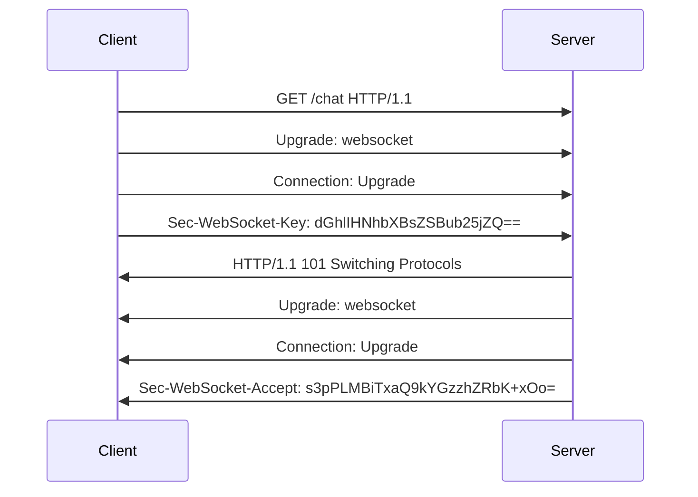
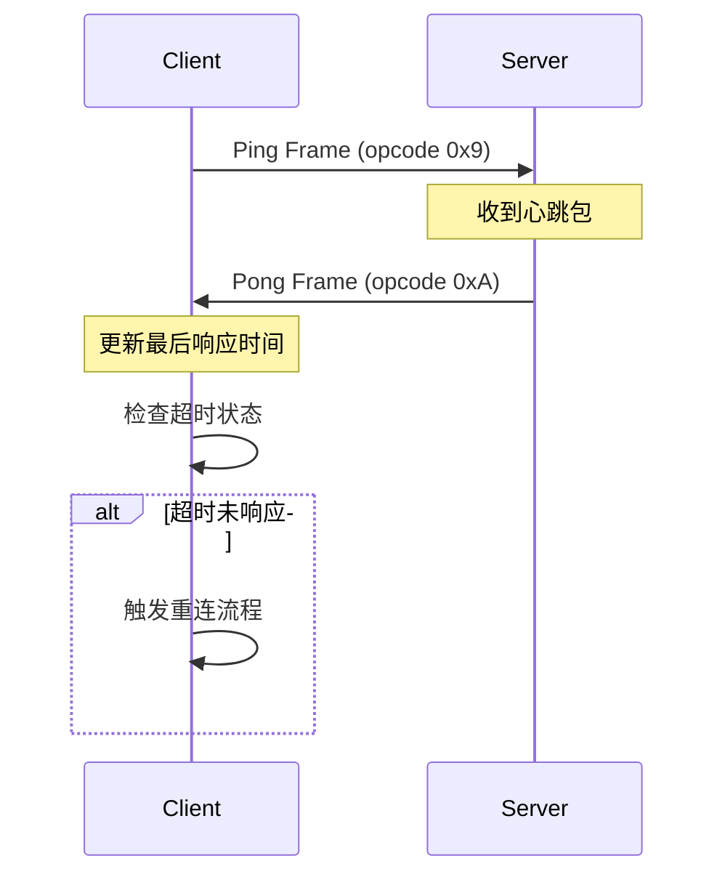
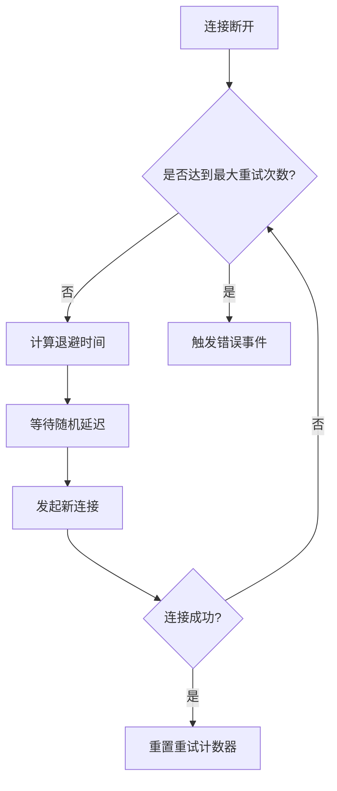
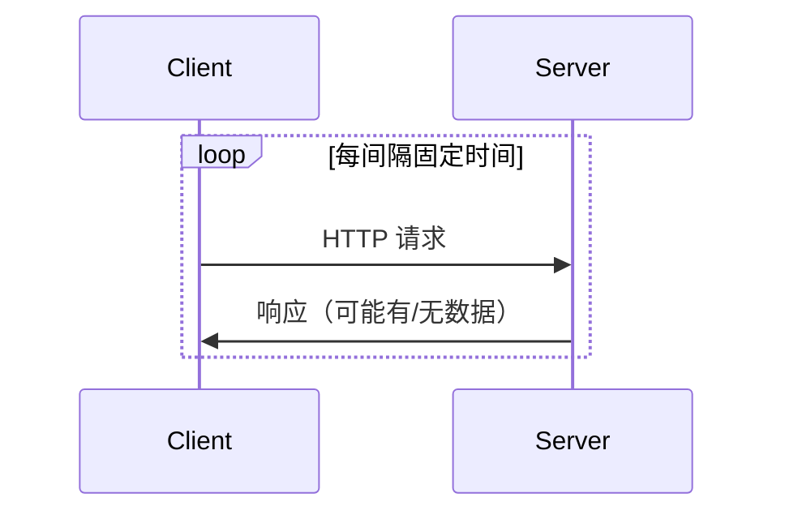
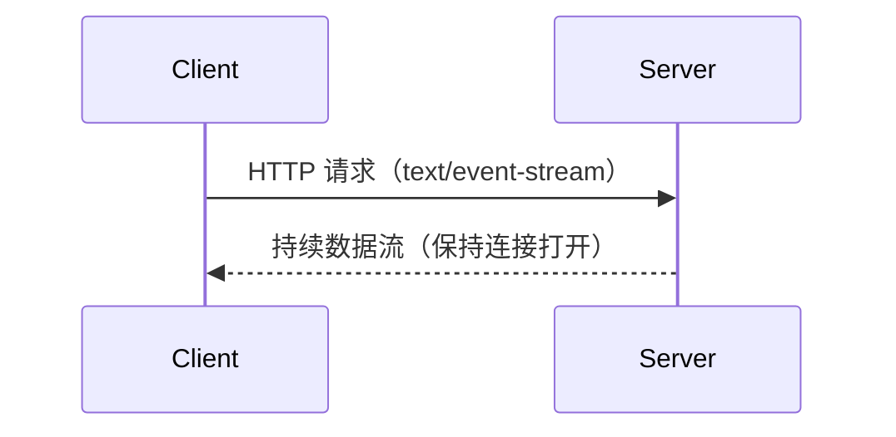

# WebSocket 深度解析

## 核心思想与协议特性

**WebSocket** 是一种基于 TCP 的**全双工通信协议**（RFC 6455 标准），通过单个持久连接实现客户端与服务端的**双向实时数据流动**。与 HTTP 的"一问一答"模式不同，WebSocket 建立连接后，双方可随时主动发送数据。

特点：
1. **持久化连接**：单次握手建立持续连接（HTTP 101 状态码切换协议）
2. **低延迟通信**：消息帧最小仅需 2 字节头部
3. **双向通道**：服务端可主动推送数据
4. **协议升级**：基于 HTTP 握手，后续使用独立帧协议
5. **跨域支持**：同源策略外延，客户端可以与任意服务器通信
6. **协议标识**：ws（如果加密，则为wss）

### 协议背景

在过去，创建需要客户端和服务器之间双向通信的 Web 应用程序（例如即时通讯和游戏应用）时，不得不滥用 HTTP 协议，通过轮询服务器获取更新，同时通过独立的 HTTP 调用发送上行通知 。

这种方式导致了多个问题：

1. 连接资源浪费

服务器必须为每个客户端使用多个不同的 TCP 连接：一个用于向客户端发送信息、每个传入消息都需要新建连接

2. 协议开销大

线路协议开销很大，每个客户端到服务器的消息都需要包含 HTTP 头。

3. 复杂的状态维护

客户端脚本被迫维护从传出连接到传入连接的映射，以跟踪回复。


### 协议视图

客户端发起包含特定Header的HTTP请求client handshake:
```js
 GET /chat HTTP/1.1
        Host: server.example.com
        Upgrade: websocket
        Connection: Upgrade
        Sec-WebSocket-Key: dGhlIHNhbXBsZSBub25jZQ==
        Origin: http://example.com
        Sec-WebSocket-Protocol: chat, superchat
        Sec-WebSocket-Version: 13
```

服务器验证请求后返回协议切换响应server handshake:
```js
  HTTP/1.1 101 Switching Protocols
        Upgrade: websocket
        Connection: Upgrade
        Sec-WebSocket-Accept: s3pPLMBiTxaQ9kYGzzhZRbK+xOo=
        Sec-WebSocket-Protocol: chat
```
**关键Header说明：**
 - `Upgrade: websocket`：声明协议升级类型
 - `Connection: Upgrade`：指示需要升级连接
 - `Sec-WebSocket-Key`：16字节随机Base64编码值（重要安全凭证）
 - `Sec-WebSocket-Version`：指定协议版本（必须为13）
 - `Sec-WebSocket-Protocol`：可选子协议协商

### 握手流程



### 心跳机制

**目的：保持长连接活性，检测连接状态，避免因网络波动或服务器超时导致断开。**

**核心思路： 客户端定时发送心跳消息，服务端响应心跳消息，超时未收到响应则认为连接断开。**

实现流程：

(1) 启动心跳
- 建立连接后启动心跳定时器
- 定时发送 ping 消息
- 启动 pong 等待定时器

(2) 接收响应
- 收到 pong 响应
- 清除 pong 等待定时器
- 重置心跳定时器

(3) 超时处理
- pong 等待超时
- 标记连接断开
- 触发重连机制



**实现方式：**

1. WebSocket 内建机制

```ts
// 浏览器 WebSocket 实现
- 浏览器会自动处理底层的 ping/pong 帧
- 对开发者不可见
- 无法直接控制心跳间隔

// Node.js ws 库
const WebSocket = require('ws');
const ws = new WebSocket('ws://example.com');

// 可以直接使用 ping/pong
ws.ping();
ws.on('pong', () => {
  console.log('received pong');
});

```

2. 自定义心跳

常见情况下需要自己实现心跳的原因：
- 检测连接状态、保持连接活跃、自定义业务逻辑
- 自定义心跳间隔、自定义超时处理、重连策略控制

```ts
// 方式二：应用层心跳(推荐)
class WS {
  constructor() {
    this.ws = new WebSocket('ws://example.com');
    this.startHeartbeat();
  }

  startHeartbeat() {
    this.pingInterval = setInterval(() => {
      this.send({ type: 'ping' });
    }, 30000);
  }
}
```


### 自动重连

**目的：在连接断开时自动重连，避免客户端断开连接后无法接收服务端推送消息。**

**核心思路：检测到连接断开时自动重连，判断是否达到最大重试次数，根据[退避算法](/algorithm/退避算法)控制重试间隔。**


```ts
// 使用退避算法
private scheduleReconnect(): void {
  if (this.reconnectAttempts >= this.config.maxRetries) {
    this.emit('reconnectFailed');
    return;
  }

  const backoff = new ExponentialBackoff({
    baseInterval: this.config.reconnectInterval,
    maxInterval: 30000,
    jitter: 0.3
  });

  const delay = backoff.getNextDelay();
  this.reconnectTimer = setTimeout(() => {
    this.reconnectAttempts++;
    this.connect();
  }, delay);
}
```

### 离线队列

**目的：在连接断开时将未发送的消息存储到离线队列中，在连接恢复时重新发送。**

1. 核心思路
- 断线时缓存待发送消息
- 重连成功后按序补发
- 消息持久化（存储到本地或数据库）和去重

2. 队列处理流程

(1) 消息入队
- 检查连接状态
- 在线直接发送
- 离线加入队列

(2) 队列管理
- 队列长度控制
- 消息过期清理
- 本地持久化

(3) 重连后处理
- 加载持久化消息
- 按序重发消息
- 更新发送状态

```mermaid
sequenceDiagram
    participant App
    participant Queue
    participant WebSocket
    
    App->>Queue: 发送消息
    Note over Queue: 存储到pending状态
    alt 连接正常
        Queue->>WebSocket: 立即发送
        WebSocket-->>Queue: 更新为sent状态
    else 连接断开
        Queue->>Queue: 持久化存储
    end
    
    WebSocket-->>App: 消息确认
    Queue->>Queue: 删除已确认消息
    
    Note over WebSocket: 连接恢复时
    WebSocket->>Queue: 获取待发消息
    loop 重发消息
        Queue->>WebSocket: 发送消息
        WebSocket-->>Queue: 更新状态
    end
 ```

## 具体实现

### 基础类型types
```ts
// src/core/websocket/types.ts

/**
 * WebSocket事件类型枚举
 */
export enum WSEventType {
  CONNECTED = 'CONNECTED',         // 连接成功
  DISCONNECTED = 'DISCONNECTED',   // 连接断开
  RECONNECTING = 'RECONNECTING',   // 重连中
  RECONNECTED = 'RECONNECTED',     // 重连成功
  RECONNECT_FAILED = 'RECONNECT_FAILED', // 重连失败
  ERROR = 'ERROR',                 // 错误
  MESSAGE = 'MESSAGE'              // 收到消息
}

/**
 * 消息类型枚举
 */
export enum MessageType {
  PING = 'PING',           // 心跳请求
  PONG = 'PONG',          // 心跳响应
  ACK = 'ACK',            // 消息确认
  DATA = 'DATA',          // 业务数据
  SYSTEM = 'SYSTEM'       // 系统消息
}

/**
 * 消息状态枚举
 */
export enum MessageStatus {
  PENDING = 'PENDING',     // 待发送
  SENT = 'SENT',          // 已发送
  DELIVERED = 'DELIVERED', // 已送达
  FAILED = 'FAILED'       // 发送失败
}

/**
 * 基础消息接口
 */
export interface BaseMessage {
  id: string;             // 消息唯一标识
  type: MessageType;      // 消息类型
  timestamp: number;      // 消息时间戳
}

/**
 * 心跳消息接口
 */
export interface HeartbeatMessage extends BaseMessage {
  type: MessageType.PING | MessageType.PONG;
}

/**
 * 确认消息接口
 */
export interface AckMessage extends BaseMessage {
  type: MessageType.ACK;
  messageId: string;      // 被确认的消息ID
}

/**
 * 数据消息接口
 */
export interface DataMessage extends BaseMessage {
  type: MessageType.DATA;
  data: any;             // 消息数据
  needAck?: boolean;     // 是否需要确认
}

/**
 * 系统消息接口
 */
export interface SystemMessage extends BaseMessage {
  type: MessageType.SYSTEM;
  code: string;          // 系统消息代码
  data?: any;           // 系统消息数据
}

/**
 * 消息类型联合
 */
export type Message = HeartbeatMessage | AckMessage | DataMessage | SystemMessage;

/**
 * 消息队列项接口
 */
export interface QueueItem {
  message: Message;       // 消息内容
  status: MessageStatus;  // 消息状态
  timestamp: number;      // 入队时间戳
  retries: number;       // 重试次数
  maxRetries?: number;   // 最大重试次数
  ackTimeout?: number;   // 确认超时时间
}

/**
 * 心跳配置接口
 */
export interface HeartbeatConfig {
  interval: number;      // 心跳间隔(ms)
  timeout: number;       // 心跳超时时间(ms)
}

/**
 * 重连配置接口
 */
export interface ReconnectConfig {
  baseInterval: number;  // 基础重连间隔(ms)
  maxInterval: number;   // 最大重连间隔(ms)
  maxRetries: number;    // 最大重试次数
  jitter: number;       // 随机抖动因子(0-1)
}

/**
 * 消息队列配置接口
 */
export interface MessageQueueConfig {
  maxSize: number;       // 队列最大容量
  maxRetries: number;    // 消息最大重试次数
  ackTimeout: number;    // 消息确认超时时间(ms)
  persistence: boolean;  // 是否持久化
}

/**
 * WebSocket客户端配置接口
 */
export interface WebSocketConfig {
  url: string;                    // WebSocket连接地址
  heartbeat: HeartbeatConfig;    // 心跳配置
  reconnect: ReconnectConfig;    // 重连配置
  queue: MessageQueueConfig;     // 队列配置
  protocols?: string | string[]; // WebSocket协议
}

/**
 * WebSocket事件处理器接口
 */
export interface WSEventHandlers {
  onConnected?: () => void;
  onDisconnected?: () => void;
  onReconnecting?: () => void;
  onReconnected?: () => void;
  onReconnectFailed?: () => void;
  onError?: (error: Error) => void;
  onMessage?: (message: Message) => void;
}

/**
 * WebSocket状态枚举
 */
export enum WSReadyState {
  CONNECTING = 0,    // 连接中
  OPEN = 1,         // 已连接
  CLOSING = 2,      // 关闭中
  CLOSED = 3        // 已关闭
}

/**
 * WebSocket错误类型
 */
export class WSError extends Error {
  constructor(
    message: string,
    public code: string,
    public data?: any
  ) {
    super(message);
    this.name = 'WSError';
  }
}

/**
 * 重试策略接口
 */
export interface RetryStrategy {
  canRetry(retryCount: number): boolean;
  nextDelay(retryCount: number): number;
}

/**
 * 消息存储接口
 */
export interface MessageStorage {
  save(messages: QueueItem[]): void;
  load(): QueueItem[];
  clear(): void;
}
```

### 消息队列MessageQueue

```ts
// src/core/websocket/MessageQueue.ts

/**
 * 消息队列管理类
 * 负责管理消息的添加、状态更新、持久化存储和获取待发送消息。
 */
export class MessageQueue {
  private queue: Map<string, QueueItem> = new Map(); // 存储消息队列的映射
  private persistentStorage: Storage; // 持久化存储对象

  /**
   * 构造函数
   * 初始化消息队列并加载持久化的消息队列数据。
   */
  constructor() {
    this.persistentStorage = window.localStorage; // 使用 localStorage 作为持久化存储
    this.loadPersistedQueue(); // 加载持久化的消息队列
  }

  /**
   * 向队列中添加新消息
   * @param message - 要添加的消息对象
   */
  add(message: Message): void {
    const queueItem: QueueItem = {
      message,
      status: MessageStatus.PENDING, // 设置初始状态为 PENDING
      timestamp: Date.now(), // 记录添加时间戳
      retries: 0 // 初始重试次数为 0
    };
    this.queue.set(message.id, queueItem); // 将消息添加到队列中
    this.persistQueue(); // 持久化消息队列
  }

  /**
   * 更新特定消息的状态
   * @param messageId - 要更新状态的消息 ID
   * @param status - 新的消息状态
   */
  updateStatus(messageId: string, status: MessageStatus): void {
    const item = this.queue.get(messageId); // 获取消息项
    if (item) {
      item.status = status; // 更新消息状态
      if (status === MessageStatus.DELIVERED) {
        this.queue.delete(messageId); // 如果状态为 DELIVERED，则从队列中移除
      }
      this.persistQueue(); // 持久化更新后的消息队列
    }
  }

  /**
   * 获取所有待发送的消息
   * @returns 返回待发送的消息项数组
   */
  getPendingMessages(): QueueItem[] {
    return Array.from(this.queue.values())
      .filter(item => item.status === MessageStatus.PENDING); // 过滤出状态为 PENDING 的消息
  }

  /**
   * 持久化当前消息队列
   * 将消息队列数据存储到持久化存储中
   */
  private persistQueue(): void {
    const data = Array.from(this.queue.entries()); // 将队列转换为数组形式
    this.persistentStorage.setItem('messageQueue', JSON.stringify(data)); // 存储为 JSON 字符串
  }

  /**
   * 加载持久化的消息队列
   * 从持久化存储中恢复消息队列数据
   */
  private loadPersistedQueue(): void {
    const data = this.persistentStorage.getItem('messageQueue'); // 获取存储的数据
    if (data) {
      const queue = new Map<string, QueueItem>(JSON.parse(data)); // 解析并重建队列
      this.queue = queue; // 更新当前队列
    }
  }
}

```

### 心跳管理HeartbeatManager

```ts
// src/core/websocket/HeartbeatManager.ts

import { HeartbeatConfig, HeartbeatMessage, MessageType } from './types';

/**
 * 心跳管理配置接口
 */
interface HeartbeatConfig {
  interval: number;  // 心跳间隔时间(ms)
  timeout: number;   // 心跳超时时间(ms)
}

/**
 * WebSocket心跳管理类
 * 负责维护WebSocket连接的心跳机制，包括定时发送心跳包和处理心跳响应
 */
export class HeartbeatManager {
  /** 心跳定时器 */
  private heartbeatTimer?: NodeJS.Timeout;
  
  /** 心跳响应超时定时器 */
  private pongTimeout?: NodeJS.Timeout;
  
  /** 心跳状态标志 */
  private isAlive: boolean = false;

  /**
   * 构造函数
   * @param config - 心跳配置
   * @param sendMessage - 发送消息的回调函数
   * @param onTimeout - 心跳超时的回调函数
   */
  constructor(
    private readonly config: HeartbeatConfig,
    private readonly sendMessage: (message: HeartbeatMessage) => void,
    private readonly onTimeout: () => void
  ) {}

  /**
   * 启动心跳机制
   * 设置定时器，按照配置的间隔时间发送心跳包
   */
  public start(): void {
    // 设置存活标志
    this.isAlive = true;

    // 清理可能存在的旧定时器
    this.cleanup();

    // 设置新的心跳定时器
    this.heartbeatTimer = setInterval(() => {
      this.sendHeartbeat();
    }, this.config.interval);

    // 立即发送一次心跳
    this.sendHeartbeat();
  }

  /**
   * 停止心跳机制
   * 清理所有定时器并重置状态
   */
  public stop(): void {
    this.isAlive = false;
    this.cleanup();
  }

  /**
   * 发送心跳包
   * 发送PING消息并启动超时检测
   * @private
   */
  private sendHeartbeat(): void {
    // 检查心跳状态
    if (!this.isAlive) return;

    // 发送心跳包
    this.sendMessage({
      id: this.generateId(),
      type: MessageType.PING,
      timestamp: Date.now()
    });
    
    // 设置超时检测
    this.pongTimeout = setTimeout(() => {
      console.log('Heartbeat timeout detected');
      this.onTimeout();
    }, this.config.timeout);
  }

  /**
   * 处理心跳响应
   * 清除超时定时器，表示成功收到PONG响应
   */
  public handlePong(): void {
    if (this.pongTimeout) {
      clearTimeout(this.pongTimeout);
      this.pongTimeout = undefined;
    }
  }

  /**
   * 清理所有定时器
   * @private
   */
  private cleanup(): void {
    // 清理心跳定时器
    if (this.heartbeatTimer) {
      clearInterval(this.heartbeatTimer);
      this.heartbeatTimer = undefined;
    }

    // 清理超时定时器
    if (this.pongTimeout) {
      clearTimeout(this.pongTimeout);
      this.pongTimeout = undefined;
    }
  }

  /**
   * 生成唯一的心跳消息ID
   * @private
   * @returns 心跳消息ID
   */
  private generateId(): string {
    return `heartbeat_${Date.now()}_${Math.random().toString(36).substr(2, 9)}`;
  }

  /**
   * 获取当前心跳状态
   * @returns 是否存活
   */
  public isActive(): boolean {
    return this.isAlive;
  }

  /**
   * 重置心跳机制
   * 停止当前心跳并重新启动
   */
  public reset(): void {
    this.stop();
    this.start();
  }

  /**
   * 更新心跳配置
   * @param config - 新的心跳配置
   */
  public updateConfig(config: Partial<HeartbeatConfig>): void {
    this.config = { ...this.config, ...config };
    if (this.isAlive) {
      this.reset();
    }
  }
}

/**
 * 使用示例:
 * 
 * const heartbeat = new HeartbeatManager(
 *   { interval: 30000, timeout: 5000 },
 *   (message) => ws.send(JSON.stringify(message)),
 *   () => ws.close()
 * );
 * 
 * // 启动心跳
 * heartbeat.start();
 * 
 * // 处理PONG响应
 * ws.onmessage = (event) => {
 *   const data = JSON.parse(event.data);
 *   if (data.type === MessageType.PONG) {
 *     heartbeat.handlePong();
 *   }
 * };
 * 
 * // 停止心跳
 * heartbeat.stop();
 */

```

### 重连管理ReconnectManager
```ts
// src/core/websocket/ReconnectManager.ts

import { ExponentialBackoff } from '../backoff/ExponentialBackoff';

/**
 * 重连配置接口
 */
interface ReconnectConfig {
  baseInterval: number;  // 基础重连间隔时间(ms)
  maxInterval: number;   // 最大重连间隔时间(ms)
  maxRetries: number;    // 最大重试次数
  jitter: number;       // 随机抖动因子(0-1之间)
}

/**
 * WebSocket重连管理类
 * 负责在连接断开时进行自动重连，使用指数退避算法控制重连间隔
 */
export class ReconnectManager {
  /** 指数退避算法实例 */
  private backoff: ExponentialBackoff;
  
  /** 当前重试次数 */
  private retryCount: number = 0;
  
  /** 重连定时器 */
  private retryTimer?: NodeJS.Timeout;
  
  /** 是否正在重连中 */
  private isReconnecting: boolean = false;

  /**
   * 构造函数
   * @param config - 重连配置
   * @param onRetry - 重试回调函数，在每次重试时调用
   * @param onFailed - 重连失败回调函数，在达到最大重试次数时调用
   */
  constructor(
    private readonly config: ReconnectConfig,
    private readonly onRetry: () => void,
    private readonly onFailed: () => void
  ) {
    // 初始化指数退避算法实例
    this.backoff = new ExponentialBackoff(config);
  }

  /**
   * 开始重连流程
   * 使用指数退避算法计算下一次重连延迟时间
   */
  public start(): void {
    // 防止重复启动重连
    if (this.isReconnecting) {
      console.log('Reconnection already in progress');
      return;
    }

    // 检查是否可以继续重试
    if (!this.backoff.canRetry(this.retryCount)) {
      console.log('Maximum retry attempts reached');
      this.handleFailed();
      return;
    }

    // 设置重连状态
    this.isReconnecting = true;

    // 计算下一次重连延迟
    const delay = this.backoff.nextDelay(this.retryCount);
    
    console.log(`Reconnecting in ${delay}ms... (attempt ${this.retryCount + 1}/${this.config.maxRetries})`);

    // 设置重连定时器
    this.retryTimer = setTimeout(() => {
      // 增加重试计数
      this.retryCount++;
      // 执行重连回调
      this.onRetry();
    }, delay);
  }

  /**
   * 重置重连状态
   * 清除定时器并重置计数器，通常在连接成功后调用
   */
  public reset(): void {
    // 重置重试计数
    this.retryCount = 0;
    // 重置重连状态
    this.isReconnecting = false;
    
    // 清除重连定时器
    if (this.retryTimer) {
      clearTimeout(this.retryTimer);
      this.retryTimer = undefined;
    }
  }

  /**
   * 处理重连失败
   * 重置状态并触发失败回调
   * @private
   */
  private handleFailed(): void {
    this.isReconnecting = false;
    this.onFailed();
  }

  /**
   * 获取当前重试次数
   * @returns 当前重试次数
   */
  public getRetryCount(): number {
    return this.retryCount;
  }

  /**
   * 检查是否正在重连中
   * @returns 是否正在重连
   */
  public isRetrying(): boolean {
    return this.isReconnecting;
  }

  /**
   * 强制停止重连
   */
  public stop(): void {
    this.reset();
  }

  /**
   * 更新重连配置
   * @param config - 新的重连配置
   */
  public updateConfig(config: Partial<ReconnectConfig>): void {
    this.config = { ...this.config, ...config };
    this.backoff = new ExponentialBackoff(this.config);
  }
}

/**
 * 使用示例:
 * 
 * const reconnectManager = new ReconnectManager(
 *   {
 *     baseInterval: 1000,   // 初始重连延迟1秒
 *     maxInterval: 30000,   // 最大重连延迟30秒
 *     maxRetries: 5,        // 最多重试5次
 *     jitter: 0.1          // 10%的随机抖动
 *   },
 *   () => {
 *     // 重试回调
 *     ws.connect();
 *   },
 *   () => {
 *     // 失败回调
 *     console.log('Reconnection failed after maximum attempts');
 *   }
 * );
 * 
 * // 开始重连
 * reconnectManager.start();
 * 
 * // 连接成功后重置状态
 * reconnectManager.reset();
 * 
 * // 停止重连
 * reconnectManager.stop();
 */

```

### WebSocket客户端
```ts
// src/core/websocket/WebSocketClient.ts

import { EventEmitter } from 'events';
import { MessageQueue } from './MessageQueue';
import { HeartbeatManager } from './HeartbeatManager';
import { ReconnectManager } from './ReconnectManager';
import { 
  WebSocketConfig, 
  Message, 
  MessageStatus, 
  WSEventType 
} from './types';

/**
 * WebSocket 客户端类
 * 统一管理 WebSocket 连接、心跳检测、自动重连和消息队列
 * @extends EventEmitter
 */
export class WebSocketClient extends EventEmitter {
  /** WebSocket 实例 */
  private ws: WebSocket | null = null;
  
  /** 连接状态标志 */
  private isAlive: boolean = false;
  
  /** 消息队列管理器 */
  private messageQueue: MessageQueue;
  
  /** 心跳管理器 */
  private heartbeatManager: HeartbeatManager;
  
  /** 重连管理器 */
  private reconnectManager: ReconnectManager;

  /**
   * 构造函数
   * @param config - WebSocket 配置项
   */
  constructor(private readonly config: WebSocketConfig) {
    super();
    
    // 初始化消息队列管理器
    this.messageQueue = new MessageQueue();
    
    // 初始化心跳管理器
    this.heartbeatManager = new HeartbeatManager(
      config.heartbeat,
      this.send.bind(this),
      this.handleHeartbeatTimeout.bind(this)
    );
    
    // 初始化重连管理器
    this.reconnectManager = new ReconnectManager(
      config.reconnect,
      this.connect.bind(this),
      () => this.emit(WSEventType.RECONNECT_FAILED)
    );

    // 建立初始连接
    this.connect();
  }

  /**
   * 建立 WebSocket 连接
   * @private
   */
  private connect(): void {
    try {
      this.ws = new WebSocket(this.config.url, this.config.protocols);
      this.bindEvents();
    } catch (error) {
      console.error('WebSocket connection error:', error);
      this.handleConnectionError(error);
    }
  }

  /**
   * 绑定 WebSocket 事件处理器
   * @private
   */
  private bindEvents(): void {
    if (!this.ws) return;

    // 连接成功事件
    this.ws.onopen = () => {
      this.isAlive = true;
      this.onConnected();
      this.emit(WSEventType.CONNECTED);
    };

    // 连接关闭事件
    this.ws.onclose = (event) => {
      this.isAlive = false;
      this.onDisconnected();
      this.emit(WSEventType.DISCONNECTED, event);
    };

    // 消息接收事件
    this.ws.onmessage = (event) => {
      this.handleMessage(event.data);
    };

    // 错误事件
    this.ws.onerror = (error) => {
      this.handleConnectionError(error);
      this.emit(WSEventType.ERROR, error);
    };
  }

  /**
   * 连接成功后的处理
   * @private
   */
  private onConnected(): void {
    // 重置重连状态
    this.reconnectManager.reset();
    // 启动心跳检测
    this.heartbeatManager.start();
    // 处理离线消息队列
    this.processPendingMessages();
  }

  /**
   * 连接断开后的处理
   * @private
   */
  private onDisconnected(): void {
    // 停止心跳检测
    this.heartbeatManager.stop();
    // 开始重连
    this.reconnectManager.start();
  }

  /**
   * 处理心跳超时
   * @private
   */
  private handleHeartbeatTimeout(): void {
    console.log('Heartbeat timeout, closing connection');
    this.ws?.close();
  }

  /**
   * 处理连接错误
   * @param error - 错误信息
   * @private
   */
  private handleConnectionError(error: any): void {
    this.isAlive = false;
    this.reconnectManager.start();
  }

  /**
   * 处理接收到的消息
   * @param data - 接收到的原始消息数据
   * @private
   */
  private handleMessage(data: string): void {
    try {
      const message = JSON.parse(data);
      
      // 处理心跳响应
      if (message.type === 'pong') {
        this.heartbeatManager.handlePong();
        return;
      }

      // 处理消息确认
      if (message.type === 'ack') {
        this.messageQueue.updateStatus(message.messageId, MessageStatus.DELIVERED);
        return;
      }

      // 触发消息事件
      this.emit(WSEventType.MESSAGE, message);
    } catch (error) {
      console.error('Failed to parse message:', error);
    }
  }

  /**
   * 处理离线消息队列
   * 重新发送所有待发送的消息
   * @private
   */
  private processPendingMessages(): void {
    const pendingMessages = this.messageQueue.getPendingMessages();
    pendingMessages.forEach(item => this.send(item.message));
  }

  /**
   * 发送消息
   * 如果连接断开，消息会被加入离线队列
   * @param message - 要发送的消息
   * @public
   */
  public send(message: Message): void {
    // 检查连接状态
    if (!this.isAlive) {
      this.messageQueue.add(message);
      return;
    }

    try {
      this.ws?.send(JSON.stringify(message));
    } catch (error) {
      console.error('Failed to send message:', error);
      this.messageQueue.add(message);
    }
  }

  /**
   * 手动触发重连
   * @public
   */
  public reconnectNow(): void {
    this.reconnectManager.reset();
    this.reconnectManager.start();
  }

  /**
   * 关闭 WebSocket 连接
   * 清理所有相关资源
   * @public
   */
  public close(): void {
    // 停止心跳检测
    this.heartbeatManager.stop();
    // 停止重连
    this.reconnectManager.reset();
    
    // 关闭连接
    if (this.ws) {
      this.ws.close();
      this.ws = null;
    }
  }

  /**
   * 获取连接状态
   * @returns 当前连接是否存活
   * @public
   */
  public isConnected(): boolean {
    return this.isAlive;
  }

  /**
   * 获取消息队列状态
   * @returns 待发送的消息数量
   * @public
   */
  public getPendingCount(): number {
    return this.messageQueue.getPendingMessages().length;
  }
}

/**
 * 使用示例:
 * 
 * const wsClient = new WebSocketClient({
 *   url: 'ws://example.com',
 *   protocols: ['v1'],
 *   heartbeat: {
 *     interval: 30000,
 *     timeout: 5000
 *   },
 *   reconnect: {
 *     baseInterval: 1000,
 *     maxInterval: 30000,
 *     maxRetries: 5,
 *     jitter: 0.1
 *   }
 * });
 * 
 * wsClient.on(WSEventType.CONNECTED, () => {
 *   console.log('Connected to server');
 * });
 * 
 * wsClient.on(WSEventType.MESSAGE, (message) => {
 *   console.log('Received:', message);
 * });
 * 
 * wsClient.send({
 *   id: 'msg1',
 *   type: 'chat',
 *   data: 'Hello'
 * });
 */

```


## 通信机制对比

### 1. 轮询（Polling）

特点：

 - 实现简单但效率低下
 - 典型延迟 = 轮询间隔时间
 - 高并发场景下服务器压力大

### 2. SSE（Server-Sent Events）

